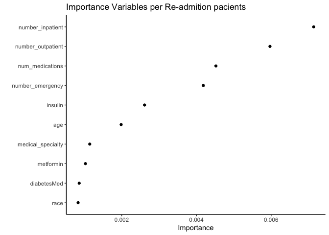
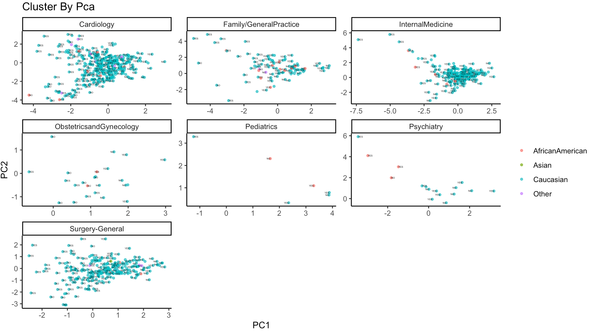
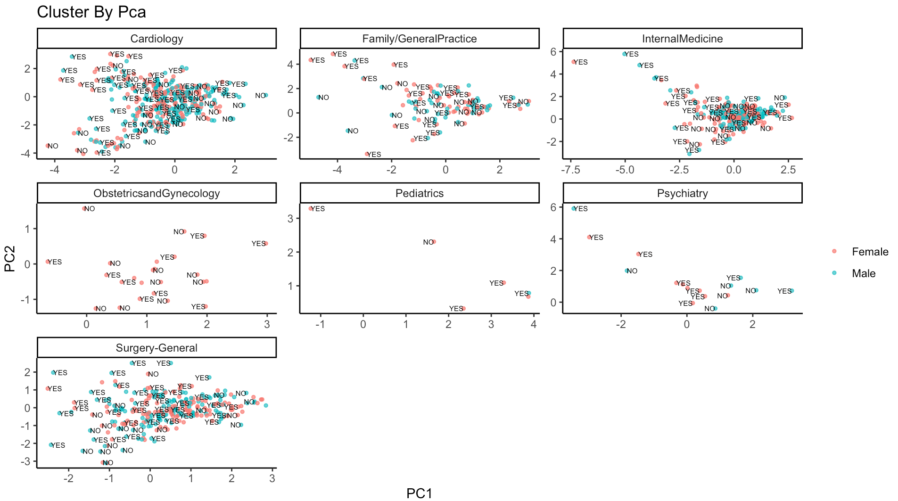
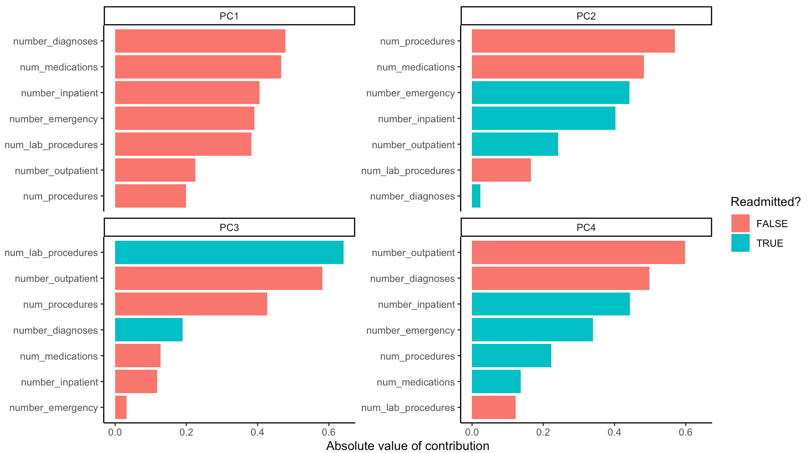

\fancyhf{}
\cfoot{\textbf{Globant}} 
\fancyfoot[LE,RO]{\thepage} 
 \vspace*{0.5in} 
\centering


\begin{Large} 
Informe Ejecutivo Prueba Senior Data Scientist
 \end{Large} 
 
\vspace*{1in} 
 \begin{Large} 
 \textbf{GLOBANT\\ 
 Unidad de Ciencia de Datos\\
 Daniel Jiménez M.\\
 SEPTIEMBRE - 2020\\
 COLOMBIA\\
} 
\end{Large} 


```{r setup, include=FALSE}
knitr::opts_chunk$set(echo = FALSE, cache = FALSE, message = FALSE,warning = FALSE)
```
\newpage
\raggedright
\clearpage
\tableofcontents{}
\addtocontents{toc}{~\hfill\textbf{Página}\par} 

\newpage
## Introducción

\justifying

El presente documento hace parte de la ficha `ejecutiva` de la prueba de selección para la vacante de **Senior Data Scientist**, si desea ver el desarrollo Técnico, por favor haga click **[aquí](https://github.com/carlosjimenez88M/Globant/blob/master/code/EDA-and-Models.md)**[^1],acá encontrará una ficha tipo git document en Inglés, con los códigos para que puedan evaluar y observar el desarollo que implemente, por lo tanto en la medida de lo posible no se hará uso de un lenguaje `Devops`, pero en está introducción si haré mención de lo siguiente: todo lo presentado a nivel de Exploración y Desarrollo de Insigths, esta sustentado bajo herramientas como : estadística y machine learning aplicado, modelamiento matemático, y un framework muy usado en ciencias sociales *-updown-*, donde a través de comparaciones es que se desarrollan las preguntas más oportunas de un tema, del cual se desconoce, como es el caso de este set de datos.

Dicho lo anterior, partiré al revés en el desarrollo de Insigths, con un modelo de Machine Learning para identificar las variables que explican los resultados de  pacientes re-hospitalizados, con y sin diabetes.


[^1]: El documento presentado, es desarrollado con Markdown, por lo cual los hipervinculos estaran documentados dentro de las palabras. 

\newpage

## Feature Engineering e Importancia de las variables.

La importancia de las variables, se basa en un modelo en el entendimiento de cuales son las variables que generan información en este caso la reincidencia de pacientes hospitalizados bajo la premisa que muchos de ellos son pacientes de diabetes, por lo tanto en el siguiente gráfico se basa en esta premisa.




La anterior gráfico muestra que la re-incidencia de los pacientes tiene poco que ver con el tema de la diabetes (más este es el estudio de caso), pero, independiente a ellos, la raza, la edad y el genero, generan poca información sobre las re-adminsiones de pacientes, pero son factores que combinados con las variables que desde ahora se les llamara :*importantes*, si dan una vista del comportamiento clusterizado de dicho problema, como se verá a continuación.

**Observación especial:** Los cluster aquí presentados son desarrollados a través de de PCA's, la cual es una técnica que captura la camyor cantidad de información a través de heuristicas estadísticas.




Este gráfico representa a través del cluster Raza - Tipo de Medicina, en que casos se presentan casos reincidentes de hospitalización.

Mientras que en el caso del genero parece ser que la re-admisión es más frecuente en las mujeres (independiente a su edad), en los casos de visitas al medico especializadas y el número de medicinas o tratamientos sometidas.



Para finalizar esta parte un insight a destacar es el desarrollo de los cluster a través de unas variables fijas, las cuales denotaron en que casos se presentan re-adimisiones dado un número de características, notesé que el número de pacientes hospitalizados es un feature que se mantiene, dado que la correlación del mismo con las otras variables es indudablemente robusto.


## Insigths basado en hallazgos

En esta sección desarrollo más la idea de los hallazgos de relevancia desarrollados en el punto anterior.

Una de las inquietudes importante a responder es ¿A través de la raza y el genero que tipo de enfermedades son causantes de reincidencia en terminos de hospitalización?

```{r,echo = FALSE, cache = FALSE, message = FALSE,warning = FALSE}
library(tidyverse)
library(tidymodels)
library(tidytext)
library(skimr)
library(scales)
library(ggrepel)
library(skimr)
library(vip)
theme_set(theme_classic())

```{r, echo=FALSE, cache=FALSE, warning=FALSE, message=FALSE}
data<-read.csv('../input/dataset_diabetes/diabetic_data.csv')
data<-data%>%
  mutate_if(is.character,as.factor)

top_medial_specialty<-data%>%
  filter(medical_specialty!='?')%>%
  count(medical_specialty,sort = TRUE)%>%
  top_n(10)

data%>%
  filter(diabetesMed=='Yes')%>%
  group_by(race,gender,medical_specialty)%>%
  count(sort = TRUE)%>%
  filter(race!='?',
         medical_specialty!='?',
         gender!='Unknown/Invalid',
         medical_specialty %in% top_medial_specialty$medical_specialty)%>%
  ungroup()%>%
  mutate(race=reorder_within(race,n,medical_specialty))%>%
  ggplot(aes(race,n,fill=gender))+
  geom_bar(stat = 'identity')+
  scale_x_reordered()+
  coord_flip()+
  facet_wrap(~medical_specialty,scales = 'free')+
  theme(strip.text = element_text(size=4))+
  theme(axis.text.x = element_text(angle = 90, vjust = 0.5, hjust=1))+
  labs(title = 'Relation Between Medical Specialty per Gender - Race',
       subtitle = 'Top 10 in Medical Specialty',
       x='',
       y='Total',
       fill='Gender')
```

Unos puntos importantes a mencionar :

* En todos los casos, la raza Caucásica es la más re- incidente dada cualquier tipo de especialidad médica;
* Los Asiaticos son los menos re-incidentes;
* Se evidenvia que las mujeres son las que más tienden a sufrir re-admisiones cuando la diabetes es positiva.
* Los hombres caucásicos son más re incidentes en el caso de tener atencedentes con :
  + Cardiología;
  + Nefrología;
  + Radiología.
  
```{r, echo=FALSE, cache=FALSE, warning=FALSE, message=FALSE}
data<-data%>%
  mutate(diag_1=str_replace_all(diag_1,"[?]",'0'),
    diag_2=str_replace_all(diag_2,"[?]",'0'),
    diag_3=str_replace_all(diag_3,"[?]",'0'),
    weight=str_replace_all(weight,'[?]','0'))%>%
  filter(medical_specialty!='?',
         race!='?')%>%
  mutate(readmitted=if_else(readmitted=='NO','NO','YES'))
data_select<-data%>%
 filter(weight!='0')%>%
  select(race:weight,medical_specialty,num_lab_procedures:number_inpatient,number_diagnoses,metformin:readmitted)
```

Ahora exploro a través de un gráfico de importancia, que tipo de enfermedades son aquellas de generan mayor probabilidad de ser re-incidente o no en el caso de presentar diabetes y teniendo presente el rango de edad. Para el caso de las mujeres los hallazgos fueron los siguientes:

```{r, echo=FALSE, cache=FALSE, warning=FALSE, message=FALSE}
data_select%>%
  filter(diabetesMed=='Yes')%>%
  group_by(race,gender,age,weight,medical_specialty,readmitted)%>%
  count(sort=TRUE)%>%
  filter(race=='Caucasian',
         gender=='Female',
         medical_specialty %in% top_medial_specialty$medical_specialty)%>%
  group_by(medical_specialty)%>%
  #top_n(20,n)%>%
  distinct(medical_specialty,age,.keep_all = TRUE)%>%
  ggplot(aes(n,
             age,
             size=weight,
             color=factor(medical_specialty)))+
  geom_point()+
  geom_text_repel(aes(label=medical_specialty),force = TRUE)+
  guides(color=FALSE)+
  facet_wrap(~readmitted, scales = 'free_x')+
  theme(axis.text.x = element_text(angle = 90, vjust = 0.5, hjust=1))+
  labs(title = 'Relation Medical Traitment - Readmition',
       subtitle = 'Female Case',
       y='',
       x='Total')
```
Lo importante a destacar es lo siguiente:

* A menor edad, los efectos de medicina general (tratamientos) generan poco o nulo proceso de re-admisión;
* Los factores cardilógicos son bajos detonadores de re-incidencias;
* A mayor edad y en especial a partir se los 30 años (rango), la medicina interna, general, y cirugías, todas las mujeres son propensas a re-incidir en hospitalizaciones dado el factor de diabetes.

En el caso de los hombres el resultado es el siguiente:

```{r, echo=FALSE, cache=FALSE, warning=FALSE, message=FALSE}
data_select%>%
  filter(diabetesMed=='Yes')%>%
  group_by(race,gender,age,weight,medical_specialty,readmitted)%>%
  count(sort=TRUE)%>%
  filter(race=='Caucasian',
         gender!='Female',
         medical_specialty %in% top_medial_specialty$medical_specialty)%>%
  group_by(medical_specialty)%>%
  #top_n(20,n)%>%
  distinct(medical_specialty,age,.keep_all = TRUE)%>%
  ggplot(aes(n,
             age,
             size=weight,
             color=factor(medical_specialty)))+
  geom_point()+
  geom_text_repel(aes(label=medical_specialty),force = TRUE)+
  guides(color=FALSE)+
  facet_wrap(~readmitted, scales = 'free_x')+
  theme(axis.text.x = element_text(angle = 90, vjust = 0.5, hjust=1))+
  labs(title = 'Relation Medical Traitment - Readmition',
       subtitle = 'Male Case',
       y='',
       x='Total')
```
En el caso de los hombres hay poco por decir :

* Entre los 40 y los 80 años, las reincidencias de hospitalización son más frecuentes cuando los pacientes tienen antecedentes de medicina general, cardiología, medicina interna y cirugías.

* Mientras que entre los 30 y 60 años, y con antecedentes de diabetes, es baja la re-incidencia dado los tratamientos de medicina interna y cardiología.


Si lo anterior se mira a través del peso el resultado es el siguiente:

```{r, echo=FALSE, cache=FALSE, warning=FALSE, message=FALSE}
data_select%>%
  filter(diabetesMed=='Yes')%>%
  group_by(race,gender,age,weight,medical_specialty,readmitted)%>%
  count(sort=TRUE)%>%
  filter(race=='Caucasian',
         gender!='Female',
         medical_specialty %in% top_medial_specialty$medical_specialty)%>%
  group_by(medical_specialty)%>%
  #top_n(20,n)%>%
  distinct(medical_specialty,age,.keep_all = TRUE)%>%
  ggplot(aes(n,
             age,
             size=weight,
             color=medical_specialty))+
  geom_point()+
  geom_text_repel(aes(label=medical_specialty),force = TRUE)+
  facet_wrap(~readmitted, scales = 'free_x')+
  theme(axis.text.x = element_text(angle = 90, vjust = 0.5, hjust=1))+
  labs(title = 'Relation Medical Traitment - Readmition',
       subtitle = 'Male Case',
       y='',
       x='Total')
```

Conclusiones practicas:

*  Entre los 20 y los 80, las personas que se encuentren entre 75 y 100 Kilos, son mas propensas a sufrir de reincidencia dada la diabetes,

* Las personas entre 20 y 30 años con este rango de peso (75-100 kilos), son poco propensos a ser readmitidos a pesar de la diabetes.

Para finalizar este segmento voy hacer una síntesis de lo  antes expuesto a través de un gráfico de paletas.

```{r, echo=FALSE, cache=FALSE, warning=FALSE, message=FALSE}
casuas<-data_select%>%
  filter(diabetesMed=='Yes')%>%
  #filter(medical_specialty %in% top_medial_specialty$medical_specialty)%>%
  group_by(race,age,weight,medical_specialty,readmitted)%>%
  count(sort=TRUE)%>%
  filter(n>4,
         race=='Caucasian',
         readmitted=='YES')%>%
  distinct(medical_specialty,age,.keep_all = TRUE)%>%
  group_by(medical_specialty,age)%>%
  summarize(avg_readmition = mean(n))%>%
  mutate(age=reorder_within(age,avg_readmition,medical_specialty))%>%
  mutate(mean_medial=mean(avg_readmition))%>%
  ungroup()
casuas%>%
  ggplot(aes(avg_readmition,age,color=medical_specialty))+
  geom_vline(data = casuas,mapping = aes(xintercept=mean_medial))+
  geom_errorbar(aes(xmin=mean_medial,xmax=avg_readmition),width= 0,linetype='dashed')+
  geom_point(aes(size=avg_readmition),show.legend = FALSE)+
  scale_y_reordered()+
  facet_wrap(~medical_specialty,scales = 'free')
```

* Los efectos del peso y la edad son detonadores más probables para re-admisión dada la diabetes en el caso de cardiología, medicina interna y cirugías;

* El efecto de la edad en y el peso en medicina general es poco o nulo;

* La tasa de re-admisión en el caso de cardiología es baja hasta los 60 años, de ahi en adelante explota.

Una forma de validar lo anterior, agregando la raza, es la siguiente:

```{r, echo=FALSE, cache=FALSE, warning=FALSE, message=FALSE}
data_select%>%
  filter(diabetesMed=='Yes')%>%
  filter(readmitted=='YES')%>%
  group_by(medical_specialty,race,age)%>%
  count(sort=TRUE)%>%
  summarize(avg_readmitted=mean(n))%>%
  arrange(desc(avg_readmitted))%>%
  ungroup()%>%
  mutate(medical_specialty=reorder_within(medical_specialty,avg_readmitted,race))%>%
  ggplot(aes(avg_readmitted,medical_specialty,color=age))+
  geom_point(aes(size=avg_readmitted))+
  scale_y_reordered()+
  facet_wrap(~race, scales = 'free',nrow = 3)
```


Notesé que los Caucásicos, independiente a la edad son los más propensos a sufrir de re-admisiones. Si se evalua este caso por edad, los resultados detallados son los siguientes


```{r, echo=FALSE, cache=FALSE, warning=FALSE, message=FALSE}
data_select%>%
  filter(diabetesMed=='Yes')%>%
  filter(readmitted!='YES')%>%
  group_by(medical_specialty,race,age)%>%
  count(sort=TRUE)%>%
  filter(n>2,
         age!='[20-30)')%>%
  summarize(avg_readmitted=mean(n))%>%
  arrange(desc(avg_readmitted))%>%
  ungroup()%>%
  mutate(medical_specialty=reorder_within(medical_specialty,avg_readmitted,age))%>%
  ggplot(aes(avg_readmitted,medical_specialty,color=medical_specialty))+
  geom_point(aes(size=avg_readmitted))+
  scale_y_reordered()+
  guides(color=FALSE,
         size=FALSE)+
  facet_wrap(~age, scales = 'free',nrow = 3)
```

Lo anterior indica que los caucásicos entre los 40 y los 60 años son los más propensos a sufir de re-admisión dada la diabetes.


```{r, echo=FALSE, cache=FALSE, warning=FALSE, message=FALSE}
data_select%>%
  filter(diabetesMed=='Yes')%>%
  filter(readmitted!='YES',
         race=='Caucasian')%>%
  group_by(medical_specialty,race,weight)%>%
  count(sort=TRUE)%>%
  filter(n>2)%>%
  summarize(avg_readmitted=mean(n))%>%
  arrange(desc(avg_readmitted))%>%
  ungroup()%>%
  mutate(medical_specialty=reorder_within(medical_specialty,avg_readmitted,weight))%>%
  ggplot(aes(avg_readmitted,medical_specialty,color=race))+
  geom_point(aes(size=avg_readmitted))+
  scale_y_reordered()+
  guides(size=FALSE)+
  facet_wrap(~weight, scales = 'free',nrow = 3)
```
Y el gráfico anterior, representan que después de los 75 kilos y hasta los 125, la propensión de re-admisión es extremadamente alta.

Para finalizar este documento, en la ficha técnica se crearon modelos que ayudan a evaluar en que casos las re-admisiones son altamente probables y cuando no, y con base a ello, fue que se presento estos hallazgos.


