Prueba
================

## Import Data Set

Some features and Databases Design

## EDA

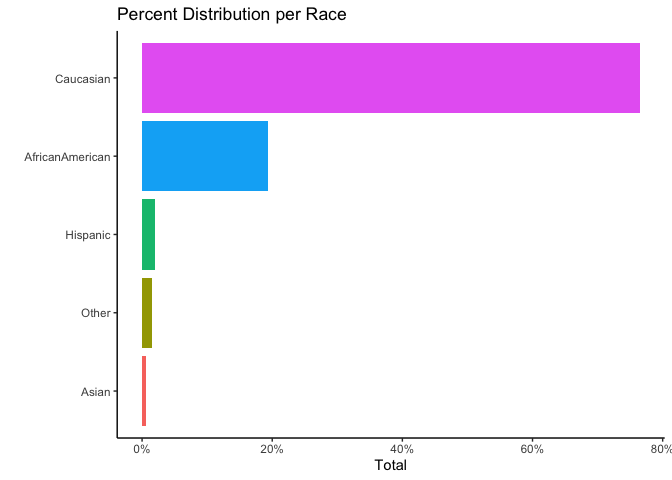<!-- -->

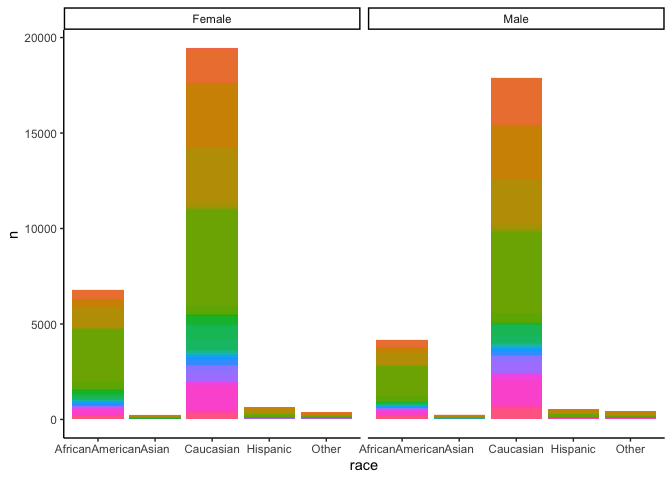<!-- -->

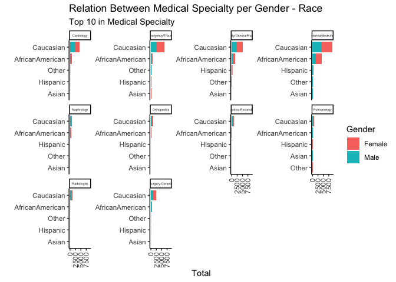<!-- -->

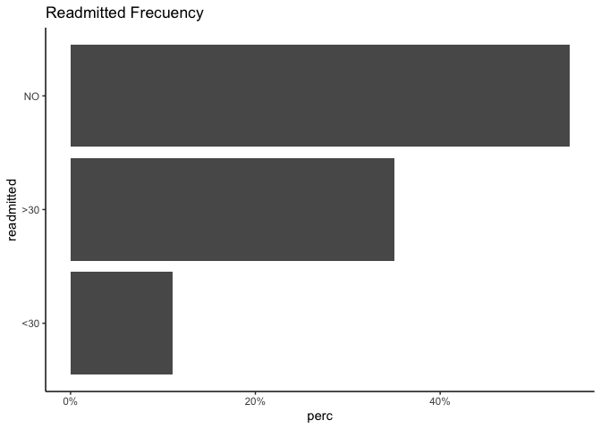<!-- --> This
is the First Feature

    ##              race     n
    ## 1 AfricanAmerican 10942
    ## 2           Asian   450
    ## 3       Caucasian 37333
    ## 4        Hispanic  1163
    ## 5           Other   839

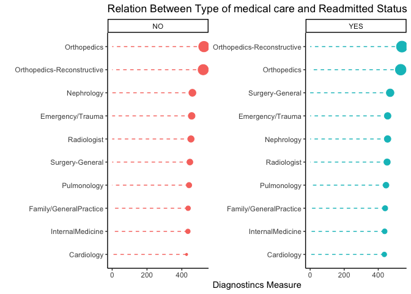<!-- -->

Admission sickness relationships do not represent the pattern on
readmission.

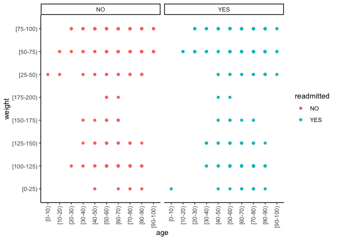<!-- -->

  - Weight-age relationship at readmission positive;

<!-- end list -->

    ## # A tibble: 449 x 7
    ## # Groups:   race, gender, age, weight, medical_specialty, readmitted [449]
    ##    race      gender age     weight    medical_specialty readmitted     n
    ##    <fct>     <fct>  <fct>   <chr>     <fct>             <chr>      <int>
    ##  1 Caucasian Male   [70-80) [75-100)  Cardiology        YES           35
    ##  2 Caucasian Male   [70-80) [75-100)  Surgery-General   YES           31
    ##  3 Caucasian Male   [70-80) [75-100)  InternalMedicine  YES           26
    ##  4 Caucasian Male   [60-70) [75-100)  Cardiology        YES           23
    ##  5 Caucasian Male   [70-80) [75-100)  Cardiology        NO            22
    ##  6 Caucasian Female [70-80) [75-100)  Cardiology        YES           21
    ##  7 Caucasian Female [70-80) [75-100)  Surgery-General   YES           19
    ##  8 Caucasian Male   [60-70) [100-125) Cardiology        YES           19
    ##  9 Caucasian Male   [70-80) [100-125) Cardiology        YES           18
    ## 10 Caucasian Male   [80-90) [75-100)  Cardiology        NO            16
    ## # … with 439 more rows

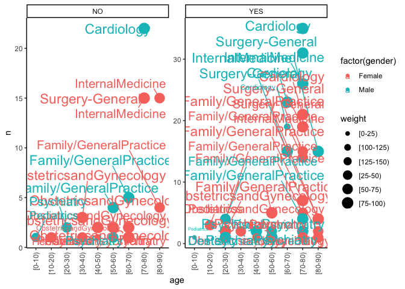<!-- -->

By Gender
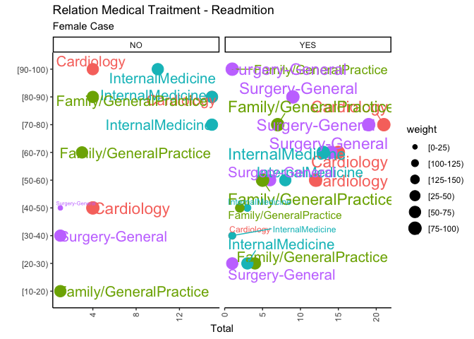<!-- -->

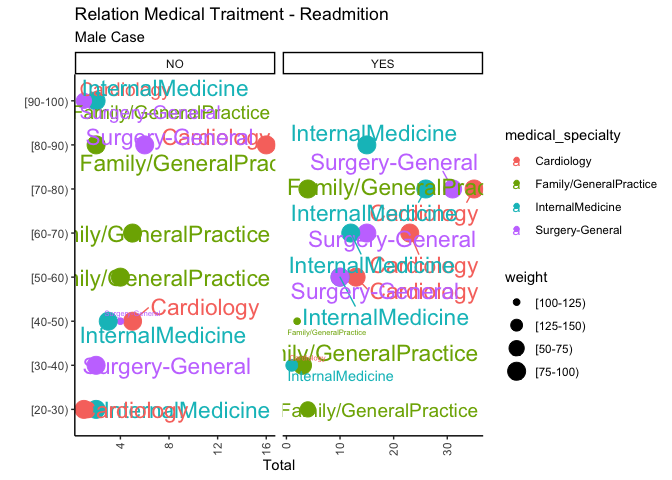<!-- -->

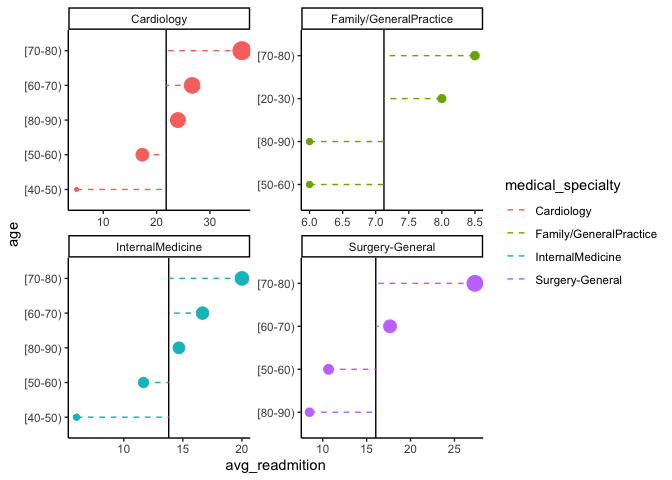<!-- -->

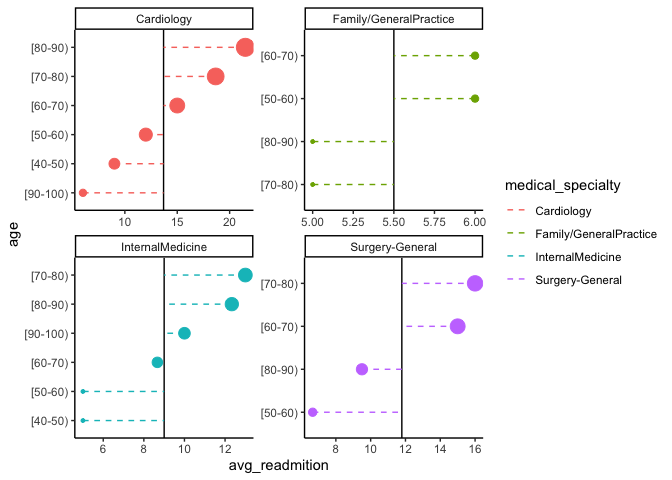<!-- -->

    ##              race    n
    ## 1 AfricanAmerican   51
    ## 2           Asian    1
    ## 3       Caucasian 1496
    ## 4           Other   21

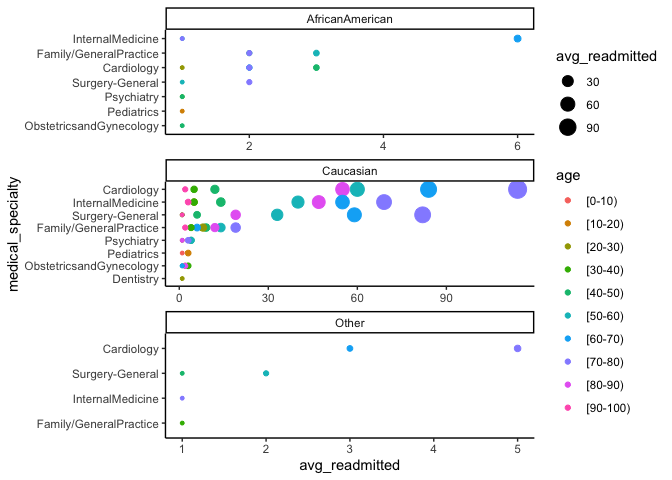<!-- -->
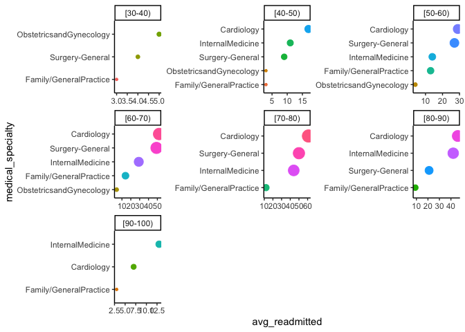<!-- -->

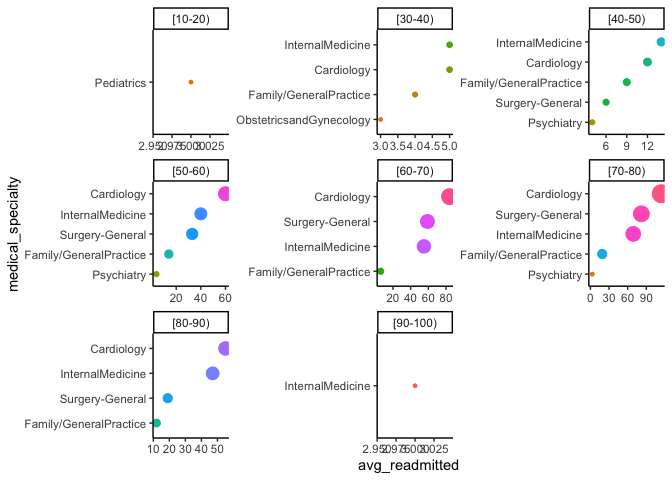<!-- -->

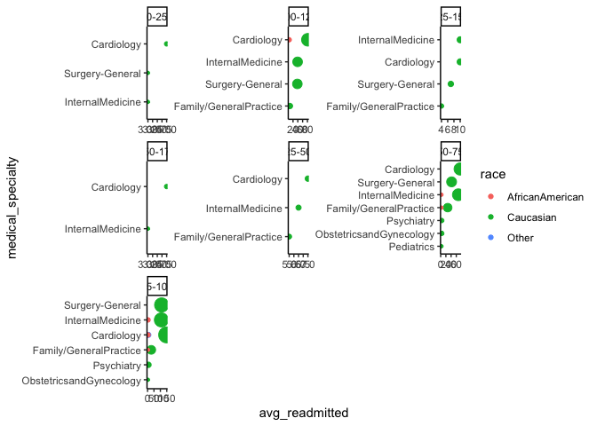<!-- -->

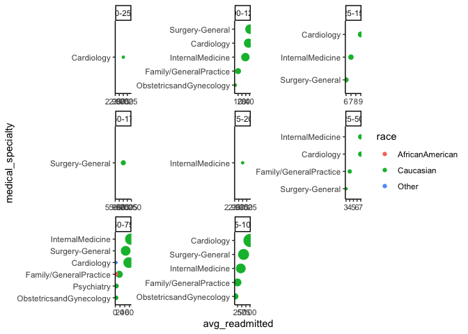<!-- -->

## Build Model and Machine Learning Interpretability

    ## # Tuning results
    ## # 10-fold cross-validation 
    ## # A tibble: 10 x 4
    ##    splits             id     .metrics          .notes          
    ##    <list>             <chr>  <list>            <list>          
    ##  1 <split [1.1K/118]> Fold01 <tibble [20 × 6]> <tibble [0 × 1]>
    ##  2 <split [1.1K/118]> Fold02 <tibble [20 × 6]> <tibble [0 × 1]>
    ##  3 <split [1.1K/118]> Fold03 <tibble [20 × 6]> <tibble [0 × 1]>
    ##  4 <split [1.1K/118]> Fold04 <tibble [20 × 6]> <tibble [0 × 1]>
    ##  5 <split [1.1K/118]> Fold05 <tibble [20 × 6]> <tibble [0 × 1]>
    ##  6 <split [1.1K/118]> Fold06 <tibble [20 × 6]> <tibble [0 × 1]>
    ##  7 <split [1.1K/118]> Fold07 <tibble [20 × 6]> <tibble [0 × 1]>
    ##  8 <split [1.1K/118]> Fold08 <tibble [20 × 6]> <tibble [0 × 1]>
    ##  9 <split [1.1K/117]> Fold09 <tibble [20 × 6]> <tibble [0 × 1]>
    ## 10 <split [1.1K/117]> Fold10 <tibble [20 × 6]> <tibble [0 × 1]>

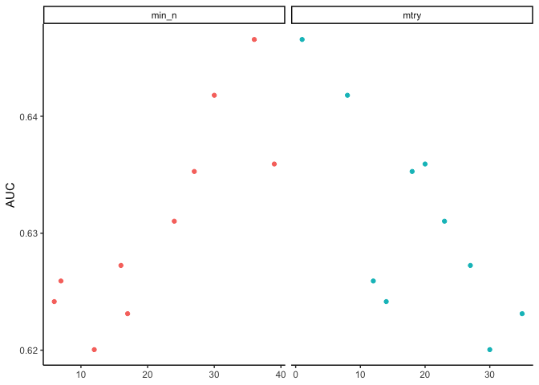<!-- -->

    ## Random Forest Model Specification (classification)
    ## 
    ## Main Arguments:
    ##   mtry = 6
    ##   trees = 1000
    ##   min_n = 35
    ## 
    ## Computational engine: ranger

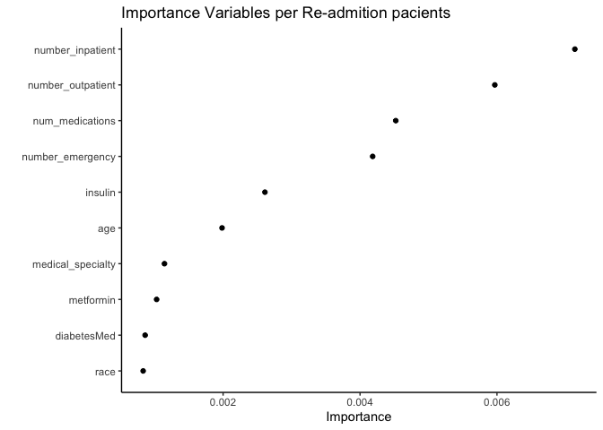<!-- -->

Some Learning :

  - Status change in the conditions not is determinant for Hospitalary -
    recidivism;
  - Number inpatient has to do with the causes of new hospitalizations.
  - Number of medications has a direct and important relationship for
    re-hospitalizations.

<!-- end list -->

    ## # A tibble: 2 x 3
    ##   .metric  .estimator .estimate
    ##   <chr>    <chr>          <dbl>
    ## 1 accuracy binary         0.619
    ## 2 roc_auc  binary         0.669

### Clusters

    ##                 race gender      age    weight       medical_specialty
    ## 1          Caucasian   Male  [50-60)  [75-100)              Cardiology
    ## 2          Caucasian Female  [60-70)    [0-25)              Cardiology
    ## 3          Caucasian Female  [70-80)  [75-100)        InternalMedicine
    ## 4          Caucasian Female  [80-90)   [50-75)              Cardiology
    ## 5          Caucasian   Male  [70-80)  [75-100)              Cardiology
    ## 6          Caucasian   Male  [70-80) [100-125)              Cardiology
    ## 7    AfricanAmerican Female  [60-70)  [75-100)        InternalMedicine
    ## 8          Caucasian Female  [60-70)   [50-75)              Cardiology
    ## 9          Caucasian   Male  [70-80)  [75-100)         Surgery-General
    ## 10         Caucasian   Male  [50-60)  [75-100)              Cardiology
    ## 11         Caucasian   Male  [70-80)  [75-100)        InternalMedicine
    ## 12         Caucasian Female  [70-80)   [50-75)        InternalMedicine
    ## 13         Caucasian   Male  [70-80)  [75-100)        InternalMedicine
    ## 14         Caucasian   Male  [60-70)  [75-100)              Cardiology
    ## 15         Caucasian Female  [40-50)    [0-25)         Surgery-General
    ## 16         Caucasian Female  [60-70)  [75-100)              Cardiology
    ## 17         Caucasian   Male  [80-90)   [50-75)        InternalMedicine
    ## 18         Caucasian   Male  [50-60)  [75-100)        InternalMedicine
    ## 19         Caucasian Female  [40-50)  [75-100)              Cardiology
    ## 20         Caucasian   Male  [70-80)   [50-75)         Surgery-General
    ## 21         Caucasian   Male  [70-80)  [75-100)        InternalMedicine
    ## 22         Caucasian   Male  [60-70) [125-150)              Cardiology
    ## 23         Caucasian   Male  [70-80)  [75-100)        InternalMedicine
    ## 24         Caucasian   Male  [70-80)  [75-100)         Surgery-General
    ## 25         Caucasian Female  [30-40)   [50-75)        InternalMedicine
    ## 26         Caucasian   Male  [60-70)  [75-100)        InternalMedicine
    ## 27         Caucasian Female  [60-70)   [50-75)              Cardiology
    ## 28         Caucasian Female  [70-80)  [75-100)              Cardiology
    ## 29         Caucasian   Male  [40-50)  [75-100)        InternalMedicine
    ## 30         Caucasian Female  [80-90)   [25-50)        InternalMedicine
    ## 31         Caucasian Female  [80-90)   [25-50)              Cardiology
    ## 32         Caucasian Female  [70-80)  [75-100)              Cardiology
    ## 33         Caucasian   Male  [60-70)  [75-100)              Cardiology
    ## 34             Other Female  [50-60)   [50-75)         Surgery-General
    ## 35         Caucasian   Male  [80-90)   [50-75)        InternalMedicine
    ## 36         Caucasian Female  [70-80)  [75-100)        InternalMedicine
    ## 37         Caucasian Female  [50-60)   [25-50)  Family/GeneralPractice
    ## 38         Caucasian Female  [80-90)  [75-100)        InternalMedicine
    ## 39         Caucasian Female  [50-60)    [0-25)  Family/GeneralPractice
    ## 40         Caucasian Female  [70-80)    [0-25)        InternalMedicine
    ## 41         Caucasian   Male  [70-80)  [75-100)  Family/GeneralPractice
    ## 42         Caucasian   Male  [50-60)  [75-100)        InternalMedicine
    ## 43         Caucasian Female  [70-80)   [25-50)              Cardiology
    ## 44         Caucasian Female  [60-70)  [75-100)              Cardiology
    ## 45         Caucasian   Male  [30-40)  [75-100)              Cardiology
    ## 46         Caucasian   Male  [70-80) [100-125)        InternalMedicine
    ## 47         Caucasian Female  [70-80)   [50-75)        InternalMedicine
    ## 48         Caucasian   Male  [50-60)  [75-100)              Cardiology
    ## 49         Caucasian Female  [50-60)   [50-75)        InternalMedicine
    ## 50         Caucasian Female  [60-70) [100-125)        InternalMedicine
    ## 51         Caucasian   Male  [80-90)  [75-100)        InternalMedicine
    ## 52         Caucasian   Male  [60-70) [100-125)              Cardiology
    ## 53         Caucasian Female  [70-80) [100-125)              Cardiology
    ## 54         Caucasian   Male  [60-70)   [25-50)              Cardiology
    ## 55         Caucasian   Male  [60-70)  [75-100)        InternalMedicine
    ## 56         Caucasian   Male  [60-70)   [50-75)              Cardiology
    ## 57         Caucasian   Male  [70-80)  [75-100)         Surgery-General
    ## 58         Caucasian Female  [50-60)  [75-100)  Family/GeneralPractice
    ## 59         Caucasian   Male  [60-70)   [50-75)         Surgery-General
    ## 60         Caucasian Female  [60-70) [100-125)              Cardiology
    ## 61         Caucasian   Male [90-100)   [50-75)              Cardiology
    ## 62         Caucasian Female  [70-80)  [75-100)  Family/GeneralPractice
    ## 63         Caucasian   Male  [80-90)  [75-100)              Cardiology
    ## 64         Caucasian Female  [70-80)  [75-100)  Family/GeneralPractice
    ## 65         Caucasian Female  [80-90)   [50-75)  Family/GeneralPractice
    ## 66         Caucasian   Male  [50-60) [100-125)              Cardiology
    ## 67         Caucasian Female  [70-80) [100-125)              Cardiology
    ## 68         Caucasian   Male  [60-70)  [75-100)              Cardiology
    ## 69         Caucasian Female  [60-70)   [50-75)         Surgery-General
    ## 70         Caucasian   Male  [70-80)  [75-100)              Cardiology
    ## 71         Caucasian   Male  [80-90)   [50-75)              Cardiology
    ## 72         Caucasian   Male  [70-80)   [50-75)         Surgery-General
    ## 73         Caucasian Female  [50-60) [150-175)              Cardiology
    ## 74         Caucasian   Male  [70-80)  [75-100)         Surgery-General
    ## 75         Caucasian Female  [80-90)   [50-75)              Cardiology
    ## 76         Caucasian Female  [70-80)  [75-100)         Surgery-General
    ## 77         Caucasian Female  [70-80)   [50-75)  Family/GeneralPractice
    ## 78         Caucasian Female  [80-90)   [50-75)        InternalMedicine
    ## 79         Caucasian Female  [60-70)   [50-75)              Cardiology
    ## 80         Caucasian   Male  [80-90)  [75-100)         Surgery-General
    ## 81         Caucasian   Male  [70-80)  [75-100)         Surgery-General
    ## 82         Caucasian Female  [10-20)   [50-75)              Pediatrics
    ## 83         Caucasian   Male  [70-80) [125-150)              Cardiology
    ## 84         Caucasian Female  [70-80)  [75-100)  Family/GeneralPractice
    ## 85         Caucasian   Male  [60-70)  [75-100)        InternalMedicine
    ## 86         Caucasian   Male  [70-80)    [0-25)        InternalMedicine
    ## 87         Caucasian   Male  [30-40)   [50-75)  Family/GeneralPractice
    ## 88         Caucasian   Male  [50-60)   [50-75)              Cardiology
    ## 89         Caucasian Female  [70-80)  [75-100)              Cardiology
    ## 90         Caucasian   Male  [50-60) [100-125)              Cardiology
    ## 91         Caucasian   Male  [70-80)  [75-100)              Cardiology
    ## 92         Caucasian Female  [70-80)   [50-75)        InternalMedicine
    ## 93         Caucasian   Male  [50-60) [100-125)         Surgery-General
    ## 94   AfricanAmerican   Male  [50-60) [100-125)              Cardiology
    ## 95         Caucasian   Male  [60-70)    [0-25)         Surgery-General
    ## 96         Caucasian   Male  [60-70) [125-150)         Surgery-General
    ## 97         Caucasian   Male  [70-80) [100-125)         Surgery-General
    ## 98         Caucasian Female  [40-50)  [75-100)        InternalMedicine
    ## 99         Caucasian Female  [50-60) [100-125)         Surgery-General
    ## 100        Caucasian   Male  [70-80)    [0-25)              Cardiology
    ## 101        Caucasian   Male  [70-80)  [75-100)         Surgery-General
    ## 102        Caucasian Female  [80-90)   [50-75)        InternalMedicine
    ## 103        Caucasian   Male  [40-50)  [75-100)              Cardiology
    ## 104        Caucasian Female  [70-80)   [50-75)        InternalMedicine
    ## 105        Caucasian Female  [80-90)  [75-100)  Family/GeneralPractice
    ## 106        Caucasian   Male  [50-60)  [75-100)              Cardiology
    ## 107        Caucasian Female  [70-80) [100-125)              Cardiology
    ## 108        Caucasian   Male  [50-60)  [75-100)         Surgery-General
    ## 109        Caucasian Female  [70-80)   [50-75)         Surgery-General
    ## 110        Caucasian   Male  [80-90)   [50-75)              Cardiology
    ## 111        Caucasian   Male  [60-70) [100-125)  Family/GeneralPractice
    ## 112  AfricanAmerican Female  [40-50)   [50-75)  Family/GeneralPractice
    ## 113        Caucasian Female  [60-70)   [50-75)              Cardiology
    ## 114        Caucasian Female  [80-90)  [75-100)              Cardiology
    ## 115        Caucasian   Male  [60-70) [100-125)              Cardiology
    ## 116        Caucasian Female  [30-40)  [75-100) ObstetricsandGynecology
    ## 117        Caucasian   Male  [70-80)  [75-100)  Family/GeneralPractice
    ## 118        Caucasian   Male  [70-80)  [75-100)         Surgery-General
    ## 119        Caucasian   Male  [70-80) [100-125)        InternalMedicine
    ## 120        Caucasian Female  [60-70) [100-125)              Cardiology
    ## 121        Caucasian Female  [50-60)  [75-100)         Surgery-General
    ## 122        Caucasian   Male  [80-90)    [0-25)         Surgery-General
    ## 123        Caucasian   Male  [70-80)  [75-100)        InternalMedicine
    ## 124        Caucasian   Male  [60-70) [100-125)              Cardiology
    ## 125        Caucasian   Male  [50-60)   [50-75)        InternalMedicine
    ## 126        Caucasian   Male  [70-80)   [50-75)              Cardiology
    ## 127        Caucasian   Male  [70-80) [100-125)              Cardiology
    ## 128        Caucasian   Male  [70-80)   [50-75)  Family/GeneralPractice
    ## 129        Caucasian Female  [60-70) [100-125)        InternalMedicine
    ## 130        Caucasian Female  [50-60) [125-150)  Family/GeneralPractice
    ## 131        Caucasian   Male  [50-60) [125-150)              Cardiology
    ## 132        Caucasian Female  [80-90)   [50-75)              Cardiology
    ## 133        Caucasian   Male  [70-80)  [75-100)              Cardiology
    ## 134        Caucasian   Male  [60-70)  [75-100)              Cardiology
    ## 135        Caucasian Female  [20-30)  [75-100) ObstetricsandGynecology
    ## 136        Caucasian Female  [70-80)  [75-100)         Surgery-General
    ## 137        Caucasian Female  [40-50)   [50-75)        InternalMedicine
    ## 138        Caucasian   Male [90-100)   [50-75)         Surgery-General
    ## 139        Caucasian   Male  [60-70) [100-125)        InternalMedicine
    ## 140        Caucasian   Male  [60-70)  [75-100)         Surgery-General
    ## 141        Caucasian   Male  [60-70)  [75-100)         Surgery-General
    ## 142        Caucasian Female  [70-80) [100-125)              Cardiology
    ## 143        Caucasian Female  [80-90)  [75-100)         Surgery-General
    ## 144        Caucasian   Male  [70-80)   [50-75)              Cardiology
    ## 145        Caucasian   Male  [70-80)  [75-100)         Surgery-General
    ## 146        Caucasian Female  [80-90)   [50-75)        InternalMedicine
    ## 147        Caucasian   Male  [70-80) [100-125)  Family/GeneralPractice
    ## 148        Caucasian   Male [90-100)   [50-75)  Family/GeneralPractice
    ## 149        Caucasian Female  [60-70)  [75-100)        InternalMedicine
    ## 150        Caucasian   Male  [60-70)  [75-100)         Surgery-General
    ## 151        Caucasian   Male  [30-40)   [25-50)  Family/GeneralPractice
    ## 152        Caucasian   Male  [50-60)   [25-50)              Cardiology
    ## 153        Caucasian Female  [70-80)   [25-50)              Cardiology
    ## 154        Caucasian   Male  [50-60)   [50-75)              Psychiatry
    ## 155        Caucasian   Male  [40-50) [100-125)              Cardiology
    ## 156        Caucasian   Male  [70-80)  [75-100)         Surgery-General
    ## 157        Caucasian   Male  [60-70) [100-125)         Surgery-General
    ## 158        Caucasian   Male  [80-90)  [75-100)              Cardiology
    ## 159        Caucasian Female  [20-30)   [50-75)        InternalMedicine
    ## 160        Caucasian   Male  [70-80)  [75-100)         Surgery-General
    ## 161        Caucasian Female  [70-80)   [50-75)        InternalMedicine
    ## 162        Caucasian   Male  [80-90)  [75-100)         Surgery-General
    ## 163        Caucasian Female  [70-80)  [75-100)         Surgery-General
    ## 164        Caucasian Female  [70-80)  [75-100)              Cardiology
    ## 165        Caucasian   Male  [70-80)  [75-100)         Surgery-General
    ## 166        Caucasian Female  [60-70)  [75-100) ObstetricsandGynecology
    ## 167        Caucasian Female  [60-70)   [50-75)         Surgery-General
    ## 168        Caucasian Female  [80-90)  [75-100)        InternalMedicine
    ## 169        Caucasian   Male  [80-90)  [75-100)  Family/GeneralPractice
    ## 170        Caucasian Female  [80-90)  [75-100)         Surgery-General
    ## 171        Caucasian   Male  [70-80)  [75-100)              Cardiology
    ## 172        Caucasian   Male  [50-60)   [50-75)              Cardiology
    ## 173        Caucasian Female  [50-60)  [75-100)         Surgery-General
    ## 174        Caucasian   Male  [50-60)  [75-100)         Surgery-General
    ## 175  AfricanAmerican   Male  [40-50)    [0-25)              Cardiology
    ## 176        Caucasian   Male  [70-80)  [75-100)              Cardiology
    ## 177        Caucasian Female  [40-50)   [50-75)        InternalMedicine
    ## 178        Caucasian   Male  [70-80) [100-125)              Cardiology
    ## 179        Caucasian Female  [20-30)   [50-75)  Family/GeneralPractice
    ## 180        Caucasian   Male  [70-80) [100-125)              Cardiology
    ## 181        Caucasian Female  [60-70)  [75-100)         Surgery-General
    ## 182        Caucasian   Male  [60-70)  [75-100)         Surgery-General
    ## 183        Caucasian   Male  [60-70) [100-125)         Surgery-General
    ## 184        Caucasian Female  [60-70)  [75-100)              Psychiatry
    ## 185        Caucasian   Male  [50-60)   [25-50)              Cardiology
    ## 186        Caucasian Female  [60-70)  [75-100)              Cardiology
    ## 187        Caucasian   Male  [70-80)  [75-100)         Surgery-General
    ## 188        Caucasian Female  [20-30)   [50-75)        InternalMedicine
    ## 189        Caucasian   Male  [80-90)  [75-100)        InternalMedicine
    ## 190        Caucasian Female  [70-80)  [75-100)        InternalMedicine
    ## 191        Caucasian Female  [70-80)   [50-75)        InternalMedicine
    ## 192        Caucasian   Male  [50-60)  [75-100)        InternalMedicine
    ## 193  AfricanAmerican   Male  [50-60)   [50-75)  Family/GeneralPractice
    ## 194        Caucasian Female  [70-80)   [50-75)         Surgery-General
    ## 195        Caucasian   Male  [70-80)  [75-100)              Cardiology
    ## 196        Caucasian   Male  [70-80)  [75-100)         Surgery-General
    ## 197        Caucasian   Male  [60-70)  [75-100)              Cardiology
    ## 198        Caucasian Female  [70-80)  [75-100)         Surgery-General
    ## 199        Caucasian   Male  [60-70)  [75-100)         Surgery-General
    ## 200        Caucasian Female  [80-90)  [75-100)  Family/GeneralPractice
    ## 201        Caucasian Female  [50-60)  [75-100)  Family/GeneralPractice
    ## 202        Caucasian   Male  [70-80) [100-125)         Surgery-General
    ## 203        Caucasian   Male  [60-70)  [75-100)              Cardiology
    ## 204        Caucasian Female  [60-70) [100-125)        InternalMedicine
    ## 205        Caucasian Female  [70-80)   [50-75)         Surgery-General
    ## 206        Caucasian Female  [60-70)  [75-100)        InternalMedicine
    ## 207        Caucasian Female [90-100)   [50-75)              Cardiology
    ## 208        Caucasian   Male  [80-90)   [50-75)         Surgery-General
    ## 209        Caucasian   Male  [70-80)  [75-100)        InternalMedicine
    ## 210        Caucasian Female  [80-90)   [50-75)  Family/GeneralPractice
    ## 211  AfricanAmerican Female  [60-70)  [75-100)              Cardiology
    ## 212        Caucasian   Male  [70-80)  [75-100)        InternalMedicine
    ## 213        Caucasian   Male   [0-10)    [0-25)              Pediatrics
    ## 214        Caucasian Female  [80-90)   [50-75)              Psychiatry
    ## 215        Caucasian   Male  [60-70)  [75-100)              Cardiology
    ## 216        Caucasian   Male  [80-90)   [50-75)              Cardiology
    ## 217            Other Female  [70-80)  [75-100)              Cardiology
    ## 218        Caucasian   Male  [60-70) [100-125)              Cardiology
    ## 219        Caucasian   Male  [70-80) [125-150)              Cardiology
    ## 220        Caucasian Female  [60-70)  [75-100)         Surgery-General
    ## 221  AfricanAmerican Female  [20-30)  [75-100)              Cardiology
    ## 222        Caucasian Female  [70-80)   [50-75)         Surgery-General
    ## 223        Caucasian Female  [30-40) [150-175) ObstetricsandGynecology
    ## 224        Caucasian Female  [70-80)  [75-100)              Cardiology
    ## 225        Caucasian   Male  [80-90)  [75-100)              Cardiology
    ## 226        Caucasian   Male  [40-50)   [50-75)  Family/GeneralPractice
    ## 227        Caucasian Female  [80-90)   [50-75)        InternalMedicine
    ## 228        Caucasian   Male  [70-80)  [75-100)         Surgery-General
    ## 229        Caucasian Female  [40-50) [100-125)              Cardiology
    ## 230        Caucasian   Male  [80-90)  [75-100)        InternalMedicine
    ## 231        Caucasian Female  [70-80) [100-125)  Family/GeneralPractice
    ## 232        Caucasian Female  [60-70)   [25-50)        InternalMedicine
    ## 233        Caucasian   Male  [70-80)  [75-100)              Cardiology
    ## 234        Caucasian Female  [70-80)  [75-100)  Family/GeneralPractice
    ## 235        Caucasian Female  [40-50) [100-125)              Psychiatry
    ## 236        Caucasian Female  [80-90)   [50-75)  Family/GeneralPractice
    ## 237        Caucasian Female  [60-70)  [75-100)              Cardiology
    ## 238        Caucasian   Male  [40-50)   [50-75)        InternalMedicine
    ## 239        Caucasian   Male  [50-60)   [25-50)  Family/GeneralPractice
    ## 240        Caucasian   Male  [80-90) [100-125)              Cardiology
    ## 241            Other   Male  [70-80)  [75-100)        InternalMedicine
    ## 242        Caucasian   Male  [70-80)   [50-75)         Surgery-General
    ## 243        Caucasian   Male  [60-70) [100-125)              Cardiology
    ## 244        Caucasian   Male  [60-70)   [25-50)              Cardiology
    ## 245        Caucasian   Male  [60-70)  [75-100)         Surgery-General
    ## 246        Caucasian Female  [80-90)  [75-100)  Family/GeneralPractice
    ## 247        Caucasian   Male  [70-80)  [75-100)              Cardiology
    ## 248        Caucasian Female  [70-80) [100-125)              Cardiology
    ## 249        Caucasian Female  [60-70)  [75-100)              Cardiology
    ## 250        Caucasian Female  [50-60)  [75-100)  Family/GeneralPractice
    ## 251        Caucasian Female  [70-80) [100-125)         Surgery-General
    ## 252        Caucasian Female  [40-50)  [75-100)              Cardiology
    ## 253            Other   Male  [60-70)  [75-100)              Cardiology
    ## 254        Caucasian   Male  [80-90)  [75-100)        InternalMedicine
    ## 255        Caucasian Female  [50-60)   [50-75)              Cardiology
    ## 256        Caucasian   Male  [80-90)  [75-100)              Cardiology
    ## 257        Caucasian Female  [20-30)   [50-75)  Family/GeneralPractice
    ## 258        Caucasian   Male  [80-90)  [75-100)              Cardiology
    ## 259        Caucasian Female  [80-90) [100-125)        InternalMedicine
    ## 260  AfricanAmerican Female  [50-60)  [75-100)              Cardiology
    ## 261        Caucasian Female  [50-60) [125-150)              Cardiology
    ## 262        Caucasian Female  [70-80)   [50-75)        InternalMedicine
    ## 263        Caucasian Female  [60-70)   [50-75)              Cardiology
    ## 264        Caucasian Female  [40-50)  [75-100)         Surgery-General
    ## 265        Caucasian   Male  [60-70)  [75-100)  Family/GeneralPractice
    ## 266        Caucasian Female  [70-80)  [75-100)        InternalMedicine
    ## 267        Caucasian   Male  [80-90)  [75-100)              Cardiology
    ## 268        Caucasian Female  [70-80)   [50-75)              Cardiology
    ## 269        Caucasian   Male  [60-70)  [75-100)              Cardiology
    ## 270        Caucasian Female  [50-60)  [75-100)         Surgery-General
    ## 271        Caucasian   Male  [60-70)  [75-100)              Cardiology
    ## 272        Caucasian   Male  [70-80) [125-150)  Family/GeneralPractice
    ## 273        Caucasian   Male  [80-90) [100-125)        InternalMedicine
    ## 274        Caucasian   Male  [50-60)  [75-100)         Surgery-General
    ## 275        Caucasian   Male  [80-90)  [75-100)              Cardiology
    ## 276        Caucasian   Male  [70-80)  [75-100)         Surgery-General
    ## 277        Caucasian Female  [70-80)  [75-100)         Surgery-General
    ## 278        Caucasian   Male  [70-80) [100-125)         Surgery-General
    ## 279        Caucasian Female  [50-60)  [75-100)              Cardiology
    ## 280        Caucasian   Male  [40-50)  [75-100)              Cardiology
    ## 281        Caucasian   Male  [50-60)  [75-100)         Surgery-General
    ## 282        Caucasian   Male  [70-80)  [75-100)         Surgery-General
    ## 283        Caucasian Female  [70-80)   [50-75)        InternalMedicine
    ## 284  AfricanAmerican Female  [50-60)  [75-100)        InternalMedicine
    ## 285        Caucasian Female [90-100)  [75-100)        InternalMedicine
    ## 286        Caucasian   Male  [70-80)  [75-100)         Surgery-General
    ## 287        Caucasian Female  [60-70)  [75-100)  Family/GeneralPractice
    ## 288        Caucasian Female  [70-80)   [50-75)              Cardiology
    ## 289        Caucasian Female  [70-80)  [75-100)        InternalMedicine
    ## 290        Caucasian Female  [80-90)   [50-75)  Family/GeneralPractice
    ## 291        Caucasian Female  [60-70) [100-125)              Cardiology
    ## 292        Caucasian   Male  [50-60)  [75-100)         Surgery-General
    ## 293  AfricanAmerican Female  [40-50)  [75-100) ObstetricsandGynecology
    ## 294        Caucasian   Male  [30-40) [100-125)              Cardiology
    ## 295        Caucasian Female  [70-80)   [50-75)         Surgery-General
    ## 296        Caucasian   Male  [80-90) [100-125)        InternalMedicine
    ## 297        Caucasian Female  [80-90)   [50-75)         Surgery-General
    ## 298        Caucasian   Male  [60-70)  [75-100)         Surgery-General
    ## 299        Caucasian   Male  [70-80) [100-125)              Cardiology
    ## 300        Caucasian   Male  [20-30)   [50-75)              Psychiatry
    ## 301        Caucasian Female  [80-90)   [50-75)  Family/GeneralPractice
    ## 302        Caucasian   Male  [50-60)  [75-100)  Family/GeneralPractice
    ## 303        Caucasian   Male  [50-60)  [75-100)  Family/GeneralPractice
    ## 304        Caucasian Female  [40-50)   [50-75)              Cardiology
    ## 305        Caucasian Female  [60-70)   [50-75)        InternalMedicine
    ## 306        Caucasian   Male  [80-90)   [50-75)              Cardiology
    ## 307        Caucasian   Male  [80-90)   [50-75)        InternalMedicine
    ## 308        Caucasian Female  [70-80)  [75-100)        InternalMedicine
    ## 309        Caucasian   Male  [60-70) [100-125)         Surgery-General
    ## 310        Caucasian   Male  [30-40)   [50-75)  Family/GeneralPractice
    ## 311        Caucasian Female  [60-70)   [50-75)         Surgery-General
    ## 312        Caucasian Female  [70-80)  [75-100)         Surgery-General
    ## 313        Caucasian Female  [70-80)  [75-100)              Cardiology
    ## 314        Caucasian Female  [80-90)   [50-75)              Cardiology
    ## 315        Caucasian   Male  [80-90)  [75-100)  Family/GeneralPractice
    ## 316        Caucasian   Male  [40-50)   [50-75)              Cardiology
    ## 317        Caucasian Female  [80-90)   [50-75)              Cardiology
    ## 318        Caucasian Female  [70-80)  [75-100)        InternalMedicine
    ## 319        Caucasian Female  [70-80)   [50-75)         Surgery-General
    ## 320        Caucasian   Male  [40-50) [100-125)  Family/GeneralPractice
    ## 321        Caucasian   Male  [50-60) [100-125)         Surgery-General
    ## 322        Caucasian   Male  [50-60) [125-150)         Surgery-General
    ## 323        Caucasian   Male  [40-50) [100-125)              Cardiology
    ## 324  AfricanAmerican Female  [70-80)  [75-100)              Cardiology
    ## 325        Caucasian Female  [50-60)  [75-100)              Cardiology
    ## 326  AfricanAmerican   Male  [70-80)  [75-100)         Surgery-General
    ## 327        Caucasian   Male  [70-80)  [75-100)         Surgery-General
    ## 328        Caucasian Female  [70-80)  [75-100)              Cardiology
    ## 329        Caucasian   Male  [70-80) [100-125)         Surgery-General
    ## 330        Caucasian Female  [60-70)  [75-100)        InternalMedicine
    ## 331        Caucasian Female  [70-80)  [75-100)         Surgery-General
    ## 332        Caucasian   Male  [30-40) [125-150)         Surgery-General
    ## 333        Caucasian   Male  [70-80)   [50-75)              Cardiology
    ## 334        Caucasian Female  [60-70) [100-125)         Surgery-General
    ## 335        Caucasian   Male  [70-80)  [75-100)              Cardiology
    ## 336        Caucasian Female  [80-90)   [50-75)        InternalMedicine
    ## 337        Caucasian   Male  [50-60)  [75-100)              Cardiology
    ## 338        Caucasian   Male  [60-70) [100-125)         Surgery-General
    ## 339        Caucasian Female  [80-90)   [50-75) ObstetricsandGynecology
    ## 340        Caucasian   Male  [80-90)  [75-100)              Cardiology
    ## 341        Caucasian   Male  [70-80)   [50-75)              Cardiology
    ## 342        Caucasian   Male  [70-80) [100-125)         Surgery-General
    ## 343        Caucasian Female  [70-80)   [50-75)              Psychiatry
    ## 344        Caucasian   Male  [70-80) [100-125)              Cardiology
    ## 345        Caucasian   Male  [80-90)  [75-100)        InternalMedicine
    ## 346  AfricanAmerican   Male  [50-60)  [75-100)              Psychiatry
    ## 347        Caucasian Female  [80-90)   [50-75)        InternalMedicine
    ## 348        Caucasian   Male  [50-60)  [75-100)              Cardiology
    ## 349        Caucasian Female  [60-70)   [50-75)  Family/GeneralPractice
    ## 350        Caucasian   Male  [50-60)   [50-75)        InternalMedicine
    ## 351        Caucasian Female  [70-80)   [50-75)              Cardiology
    ## 352  AfricanAmerican   Male  [60-70) [100-125)              Cardiology
    ## 353        Caucasian   Male  [60-70)  [75-100)              Cardiology
    ## 354        Caucasian   Male  [60-70) [100-125)         Surgery-General
    ## 355        Caucasian Female  [80-90)   [50-75)              Cardiology
    ## 356        Caucasian   Male  [70-80)  [75-100)              Cardiology
    ## 357        Caucasian   Male  [70-80) [125-150)        InternalMedicine
    ## 358        Caucasian Female  [70-80)  [75-100)              Cardiology
    ## 359            Other Female  [50-60)   [50-75)         Surgery-General
    ## 360        Caucasian Female  [70-80)  [75-100)              Cardiology
    ## 361        Caucasian   Male  [60-70)   [50-75)        InternalMedicine
    ## 362        Caucasian Female  [50-60)  [75-100)              Psychiatry
    ## 363        Caucasian   Male  [60-70)  [75-100)        InternalMedicine
    ## 364        Caucasian Female  [50-60)  [75-100)  Family/GeneralPractice
    ## 365        Caucasian Female  [80-90)   [25-50)        InternalMedicine
    ## 366        Caucasian Female  [60-70)  [75-100)        InternalMedicine
    ## 367        Caucasian   Male  [60-70) [100-125)  Family/GeneralPractice
    ## 368        Caucasian Female  [70-80)   [50-75)  Family/GeneralPractice
    ## 369        Caucasian   Male  [50-60)   [50-75)              Psychiatry
    ## 370        Caucasian Female  [60-70)  [75-100)  Family/GeneralPractice
    ## 371        Caucasian Female  [60-70)   [50-75)         Surgery-General
    ## 372        Caucasian Female  [70-80)  [75-100)              Cardiology
    ## 373        Caucasian   Male  [70-80)  [75-100)              Cardiology
    ## 374        Caucasian Female  [70-80)   [50-75)  Family/GeneralPractice
    ## 375        Caucasian   Male  [80-90)   [50-75)              Cardiology
    ## 376        Caucasian Female  [20-30)  [75-100) ObstetricsandGynecology
    ## 377        Caucasian   Male  [50-60)  [75-100)  Family/GeneralPractice
    ## 378        Caucasian   Male  [30-40)  [75-100)  Family/GeneralPractice
    ## 379        Caucasian   Male  [50-60)  [75-100)         Surgery-General
    ## 380        Caucasian Female  [70-80)  [75-100)              Cardiology
    ## 381        Caucasian Female  [70-80)   [50-75)              Cardiology
    ## 382        Caucasian   Male  [70-80)  [75-100)              Cardiology
    ## 383        Caucasian   Male  [40-50) [150-175)         Surgery-General
    ## 384        Caucasian Female  [70-80)   [50-75)        InternalMedicine
    ## 385        Caucasian   Male  [70-80)  [75-100)         Surgery-General
    ## 386  AfricanAmerican Female  [30-40)  [75-100)              Psychiatry
    ## 387        Caucasian Female  [50-60)   [50-75)              Cardiology
    ## 388        Caucasian   Male  [60-70)   [50-75)              Cardiology
    ## 389        Caucasian Female  [50-60)   [50-75)         Surgery-General
    ## 390        Caucasian   Male  [70-80)  [75-100)              Cardiology
    ## 391        Caucasian Female  [50-60) [100-125)        InternalMedicine
    ## 392        Caucasian   Male  [70-80) [100-125)              Cardiology
    ## 393        Caucasian Female [90-100)   [50-75)        InternalMedicine
    ## 394        Caucasian   Male [90-100)  [75-100)         Surgery-General
    ## 395        Caucasian Female  [80-90)  [75-100)              Cardiology
    ## 396        Caucasian   Male  [60-70) [100-125)         Surgery-General
    ## 397        Caucasian   Male  [60-70)   [50-75)        InternalMedicine
    ## 398        Caucasian   Male  [40-50) [125-150)              Cardiology
    ## 399        Caucasian Female  [70-80)  [75-100)         Surgery-General
    ## 400        Caucasian   Male  [80-90)   [50-75)  Family/GeneralPractice
    ## 401        Caucasian   Male  [60-70) [100-125)              Cardiology
    ## 402        Caucasian   Male  [40-50)  [75-100)              Psychiatry
    ## 403        Caucasian   Male  [50-60) [100-125)         Surgery-General
    ## 404        Caucasian Female  [70-80)  [75-100)        InternalMedicine
    ## 405        Caucasian   Male  [60-70)   [50-75)              Cardiology
    ## 406        Caucasian   Male  [50-60) [100-125)         Surgery-General
    ## 407        Caucasian   Male  [70-80) [100-125)         Surgery-General
    ## 408        Caucasian Female  [70-80)  [75-100)              Cardiology
    ## 409        Caucasian Female  [60-70)  [75-100)              Cardiology
    ## 410        Caucasian   Male  [40-50) [125-150)              Cardiology
    ## 411        Caucasian Female  [80-90)   [25-50)              Cardiology
    ## 412        Caucasian   Male  [70-80)  [75-100)              Cardiology
    ## 413        Caucasian   Male  [40-50)  [75-100)        InternalMedicine
    ## 414        Caucasian   Male  [70-80) [100-125)              Cardiology
    ## 415        Caucasian Female  [70-80)  [75-100)              Cardiology
    ## 416        Caucasian   Male  [80-90)   [50-75)         Surgery-General
    ## 417        Caucasian Female  [60-70)  [75-100)        InternalMedicine
    ## 418        Caucasian Female  [80-90)  [75-100)              Cardiology
    ## 419        Caucasian Female  [80-90)  [75-100)         Surgery-General
    ## 420        Caucasian Female  [70-80)   [50-75)         Surgery-General
    ## 421        Caucasian   Male  [50-60)  [75-100)        InternalMedicine
    ## 422        Caucasian Female  [70-80) [150-175)        InternalMedicine
    ## 423        Caucasian   Male  [60-70) [100-125)              Cardiology
    ## 424  AfricanAmerican   Male  [50-60)  [75-100)        InternalMedicine
    ## 425        Caucasian Female  [50-60) [100-125)         Surgery-General
    ## 426        Caucasian Female  [80-90)  [75-100)         Surgery-General
    ## 427        Caucasian Female  [50-60) [125-150)        InternalMedicine
    ## 428        Caucasian   Male  [70-80) [100-125)              Cardiology
    ## 429        Caucasian   Male  [60-70) [100-125)         Surgery-General
    ## 430        Caucasian Female  [70-80)   [50-75)         Surgery-General
    ## 431        Caucasian Female  [80-90)  [75-100)        InternalMedicine
    ## 432        Caucasian   Male  [70-80)  [75-100)              Cardiology
    ## 433        Caucasian Female  [50-60) [100-125)              Cardiology
    ## 434        Caucasian Female  [60-70)   [50-75)              Cardiology
    ## 435            Other   Male  [70-80)   [50-75)              Cardiology
    ## 436        Caucasian   Male  [50-60)  [75-100)              Cardiology
    ## 437        Caucasian Female  [80-90)  [75-100)  Family/GeneralPractice
    ## 438        Caucasian Female [90-100)   [50-75)              Cardiology
    ## 439        Caucasian   Male  [60-70)  [75-100)        InternalMedicine
    ## 440        Caucasian Female  [70-80)  [75-100)        InternalMedicine
    ## 441        Caucasian Female  [60-70) [100-125)         Surgery-General
    ## 442        Caucasian Female  [60-70)   [50-75)              Cardiology
    ## 443        Caucasian Female  [80-90)  [75-100)              Cardiology
    ## 444        Caucasian Female  [70-80)  [75-100)         Surgery-General
    ## 445        Caucasian Female  [60-70)  [75-100)              Cardiology
    ## 446        Caucasian   Male  [60-70) [125-150)        InternalMedicine
    ## 447        Caucasian   Male  [60-70) [100-125)         Surgery-General
    ## 448        Caucasian   Male  [70-80)   [50-75)         Surgery-General
    ## 449        Caucasian Female  [80-90)   [25-50)         Surgery-General
    ## 450        Caucasian Female  [40-50) [100-125)        InternalMedicine
    ## 451        Caucasian   Male  [70-80)   [50-75)              Cardiology
    ## 452        Caucasian Female  [70-80)   [50-75)         Surgery-General
    ## 453        Caucasian   Male  [50-60) [125-150)              Cardiology
    ## 454        Caucasian Female [90-100)  [75-100)  Family/GeneralPractice
    ## 455        Caucasian   Male  [60-70) [100-125)              Cardiology
    ## 456        Caucasian   Male  [80-90)  [75-100)              Cardiology
    ## 457        Caucasian   Male  [60-70)  [75-100)  Family/GeneralPractice
    ## 458        Caucasian Female  [70-80)  [75-100)              Cardiology
    ## 459        Caucasian   Male  [70-80)  [75-100)              Cardiology
    ## 460        Caucasian Female  [60-70)  [75-100)        InternalMedicine
    ## 461        Caucasian   Male  [20-30)  [75-100)        InternalMedicine
    ## 462        Caucasian Female  [60-70) [100-125)        InternalMedicine
    ## 463        Caucasian Female  [70-80)  [75-100)         Surgery-General
    ## 464        Caucasian Female  [60-70) [100-125)        InternalMedicine
    ## 465        Caucasian   Male  [50-60) [125-150)              Cardiology
    ## 466        Caucasian   Male  [70-80)  [75-100)         Surgery-General
    ## 467        Caucasian Female  [70-80)   [50-75)  Family/GeneralPractice
    ## 468        Caucasian Female  [40-50) [125-150)  Family/GeneralPractice
    ## 469        Caucasian Female  [80-90)  [75-100)  Family/GeneralPractice
    ## 470        Caucasian   Male  [80-90)  [75-100)              Cardiology
    ## 471            Other Female  [40-50)  [75-100)         Surgery-General
    ## 472        Caucasian Female  [70-80)   [50-75)         Surgery-General
    ## 473        Caucasian Female  [80-90)  [75-100)         Surgery-General
    ## 474        Caucasian Female  [50-60) [100-125) ObstetricsandGynecology
    ## 475        Caucasian   Male  [70-80)  [75-100)        InternalMedicine
    ## 476        Caucasian   Male  [60-70) [150-175)         Surgery-General
    ## 477        Caucasian   Male  [70-80)  [75-100)              Cardiology
    ## 478        Caucasian Female  [50-60)   [50-75)         Surgery-General
    ## 479        Caucasian Female  [70-80)   [50-75)              Cardiology
    ## 480        Caucasian   Male  [60-70)   [50-75)        InternalMedicine
    ## 481        Caucasian   Male  [70-80)  [75-100)        InternalMedicine
    ## 482        Caucasian Female  [60-70) [100-125)        InternalMedicine
    ## 483        Caucasian   Male  [60-70) [100-125)              Cardiology
    ## 484        Caucasian   Male  [50-60) [100-125)         Surgery-General
    ## 485        Caucasian Female  [60-70) [100-125)              Cardiology
    ## 486        Caucasian   Male  [70-80)   [50-75)         Surgery-General
    ## 487        Caucasian Female  [50-60) [100-125)              Cardiology
    ## 488        Caucasian Female  [30-40)   [50-75) ObstetricsandGynecology
    ## 489        Caucasian Female  [60-70)   [50-75)         Surgery-General
    ## 490        Caucasian Female  [40-50) [125-150)              Psychiatry
    ## 491        Caucasian   Male  [60-70)  [75-100)         Surgery-General
    ## 492        Caucasian Female [90-100)   [50-75)        InternalMedicine
    ## 493        Caucasian   Male  [70-80) [125-150)        InternalMedicine
    ## 494            Other Female  [70-80)  [75-100)              Cardiology
    ## 495        Caucasian   Male  [70-80)  [75-100)              Cardiology
    ## 496        Caucasian Female  [60-70)  [75-100)        InternalMedicine
    ## 497        Caucasian Female  [60-70)  [75-100)              Cardiology
    ## 498        Caucasian   Male  [40-50) [175-200)              Cardiology
    ## 499        Caucasian Female  [60-70)  [75-100)        InternalMedicine
    ## 500        Caucasian   Male  [70-80)  [75-100)        InternalMedicine
    ## 501        Caucasian Female  [80-90)   [50-75)              Cardiology
    ## 502        Caucasian   Male  [60-70)  [75-100)        InternalMedicine
    ## 503        Caucasian   Male  [80-90) [100-125)              Cardiology
    ## 504  AfricanAmerican Female  [70-80)  [75-100)        InternalMedicine
    ## 505        Caucasian Female  [50-60)   [25-50)         Surgery-General
    ## 506        Caucasian   Male  [80-90)   [50-75)              Cardiology
    ## 507        Caucasian   Male  [60-70)  [75-100)         Surgery-General
    ## 508        Caucasian   Male  [60-70) [100-125)        InternalMedicine
    ## 509        Caucasian Female  [80-90)   [50-75)              Cardiology
    ## 510        Caucasian   Male  [70-80) [100-125)              Cardiology
    ## 511        Caucasian   Male  [80-90)  [75-100)         Surgery-General
    ## 512        Caucasian Female  [70-80)  [75-100)        InternalMedicine
    ## 513        Caucasian   Male  [80-90)   [50-75)              Cardiology
    ## 514        Caucasian   Male  [70-80)   [50-75)  Family/GeneralPractice
    ## 515        Caucasian   Male  [80-90)   [50-75)         Surgery-General
    ## 516        Caucasian Female  [60-70) [100-125)              Cardiology
    ## 517        Caucasian Female  [60-70)  [75-100)         Surgery-General
    ## 518        Caucasian Female  [70-80) [100-125)              Cardiology
    ## 519        Caucasian Female  [60-70)  [75-100)         Surgery-General
    ## 520        Caucasian Female [90-100)   [50-75)  Family/GeneralPractice
    ## 521        Caucasian Female  [70-80)   [50-75)        InternalMedicine
    ## 522            Other Female  [70-80)  [75-100)              Cardiology
    ## 523        Caucasian   Male  [80-90)  [75-100)              Cardiology
    ## 524        Caucasian   Male  [80-90)  [75-100)        InternalMedicine
    ## 525        Caucasian   Male  [70-80) [100-125)              Cardiology
    ## 526        Caucasian   Male  [70-80)  [75-100)              Cardiology
    ## 527        Caucasian   Male  [40-50)  [75-100)              Cardiology
    ## 528        Caucasian Female [90-100)   [50-75)              Cardiology
    ## 529        Caucasian   Male  [70-80) [100-125)              Cardiology
    ## 530  AfricanAmerican Female  [40-50) [125-150)  Family/GeneralPractice
    ## 531        Caucasian   Male  [60-70) [150-175)              Cardiology
    ## 532        Caucasian   Male  [20-30)   [50-75)              Psychiatry
    ## 533        Caucasian Female  [80-90)   [25-50)        InternalMedicine
    ## 534        Caucasian Female [90-100)   [50-75)              Cardiology
    ## 535        Caucasian   Male  [40-50) [100-125)        InternalMedicine
    ## 536        Caucasian Female  [80-90)   [50-75)              Cardiology
    ## 537        Caucasian   Male  [80-90)  [75-100)        InternalMedicine
    ## 538        Caucasian   Male  [70-80) [100-125)        InternalMedicine
    ## 539        Caucasian Female  [60-70)  [75-100)        InternalMedicine
    ## 540        Caucasian   Male  [40-50)  [75-100)         Surgery-General
    ## 541        Caucasian   Male  [70-80)  [75-100)        InternalMedicine
    ## 542  AfricanAmerican   Male  [50-60)   [50-75)  Family/GeneralPractice
    ## 543        Caucasian Female  [60-70) [100-125)        InternalMedicine
    ## 544        Caucasian   Male  [50-60)   [50-75)         Surgery-General
    ## 545        Caucasian Female  [50-60) [100-125)              Cardiology
    ## 546        Caucasian   Male  [80-90)  [75-100)        InternalMedicine
    ## 547        Caucasian   Male  [50-60)   [50-75)        InternalMedicine
    ## 548        Caucasian   Male  [30-40)  [75-100)              Cardiology
    ## 549        Caucasian Female  [60-70)  [75-100)              Cardiology
    ## 550        Caucasian Female  [60-70) [100-125)              Cardiology
    ## 551        Caucasian Female  [80-90)  [75-100)              Cardiology
    ## 552        Caucasian Female  [70-80)   [50-75)         Surgery-General
    ## 553        Caucasian   Male  [80-90)  [75-100)         Surgery-General
    ## 554        Caucasian   Male  [70-80) [100-125)              Cardiology
    ## 555        Caucasian   Male  [60-70) [100-125)         Surgery-General
    ## 556        Caucasian   Male  [60-70)  [75-100)        InternalMedicine
    ## 557        Caucasian Female  [60-70)   [50-75)              Cardiology
    ## 558        Caucasian Female  [50-60)  [75-100)         Surgery-General
    ## 559        Caucasian Female  [70-80)   [25-50)              Cardiology
    ## 560        Caucasian Female  [70-80)   [50-75)        InternalMedicine
    ## 561        Caucasian   Male  [60-70)  [75-100)              Cardiology
    ## 562        Caucasian Female  [50-60)   [50-75)              Cardiology
    ## 563        Caucasian Female  [60-70)   [50-75)              Psychiatry
    ## 564        Caucasian Female  [50-60)  [75-100)              Cardiology
    ## 565        Caucasian Female  [20-30)   [50-75)  Family/GeneralPractice
    ## 566        Caucasian Female  [50-60) [150-175)              Cardiology
    ## 567        Caucasian Female  [80-90)  [75-100)        InternalMedicine
    ## 568        Caucasian Female  [70-80)   [50-75) ObstetricsandGynecology
    ## 569        Caucasian Female  [40-50) [100-125) ObstetricsandGynecology
    ## 570            Other   Male  [70-80) [100-125)              Cardiology
    ## 571        Caucasian Female  [80-90)   [50-75)              Cardiology
    ## 572        Caucasian   Male  [20-30)  [75-100)              Psychiatry
    ## 573        Caucasian Female  [80-90)   [50-75)        InternalMedicine
    ## 574        Caucasian   Male  [70-80)  [75-100)              Cardiology
    ## 575        Caucasian Female  [40-50) [100-125)        InternalMedicine
    ## 576        Caucasian   Male  [70-80)  [75-100)              Cardiology
    ## 577        Caucasian Female  [50-60) [100-125)        InternalMedicine
    ## 578        Caucasian Female  [60-70)  [75-100)         Surgery-General
    ## 579        Caucasian Female  [70-80)  [75-100)         Surgery-General
    ## 580        Caucasian   Male  [70-80)  [75-100)              Cardiology
    ## 581        Caucasian   Male  [40-50)  [75-100)              Cardiology
    ## 582        Caucasian   Male  [70-80)   [50-75)              Cardiology
    ## 583        Caucasian Female  [40-50)  [75-100)              Cardiology
    ## 584        Caucasian   Male  [40-50) [100-125)         Surgery-General
    ## 585        Caucasian Female  [80-90)  [75-100)         Surgery-General
    ## 586        Caucasian   Male  [60-70) [100-125)         Surgery-General
    ## 587        Caucasian   Male  [70-80)  [75-100)  Family/GeneralPractice
    ## 588        Caucasian Female  [70-80)   [50-75)        InternalMedicine
    ## 589        Caucasian   Male  [70-80) [100-125)              Cardiology
    ## 590  AfricanAmerican   Male  [40-50) [125-150)              Cardiology
    ## 591        Caucasian   Male  [70-80)  [75-100)              Cardiology
    ## 592        Caucasian Female  [50-60)  [75-100)  Family/GeneralPractice
    ## 593  AfricanAmerican Female  [10-20)   [50-75)              Pediatrics
    ## 594        Caucasian   Male  [80-90)  [75-100)              Cardiology
    ## 595        Caucasian Female  [50-60)  [75-100)              Cardiology
    ## 596        Caucasian   Male  [80-90)  [75-100)         Surgery-General
    ## 597        Caucasian Female  [50-60)   [50-75)              Cardiology
    ## 598        Caucasian   Male  [60-70) [100-125)              Cardiology
    ## 599        Caucasian Female  [70-80)   [50-75)              Cardiology
    ## 600        Caucasian   Male  [70-80) [100-125)              Cardiology
    ## 601        Caucasian   Male  [70-80)   [50-75)              Cardiology
    ## 602        Caucasian   Male  [70-80)  [75-100)        InternalMedicine
    ## 603        Caucasian   Male  [60-70) [100-125)         Surgery-General
    ## 604        Caucasian Female  [70-80)   [50-75)        InternalMedicine
    ## 605        Caucasian   Male  [60-70)  [75-100)              Cardiology
    ## 606        Caucasian   Male  [60-70)  [75-100)              Cardiology
    ## 607        Caucasian   Male  [60-70)  [75-100)        InternalMedicine
    ## 608        Caucasian   Male  [70-80) [100-125)              Cardiology
    ## 609        Caucasian Female  [70-80)  [75-100)         Surgery-General
    ## 610        Caucasian   Male  [70-80)  [75-100)         Surgery-General
    ## 611        Caucasian Female  [40-50)  [75-100) ObstetricsandGynecology
    ## 612        Caucasian   Male  [40-50) [125-150)              Cardiology
    ## 613        Caucasian   Male  [60-70)  [75-100)              Cardiology
    ## 614        Caucasian   Male  [80-90)   [50-75)              Cardiology
    ## 615        Caucasian   Male  [50-60)  [75-100)         Surgery-General
    ## 616        Caucasian Female  [80-90)   [50-75)              Cardiology
    ## 617        Caucasian Female  [60-70) [100-125)        InternalMedicine
    ## 618        Caucasian Female  [80-90)   [50-75)        InternalMedicine
    ## 619  AfricanAmerican Female  [40-50) [175-200)              Psychiatry
    ## 620        Caucasian Female  [50-60) [100-125)  Family/GeneralPractice
    ## 621        Caucasian Female  [70-80)  [75-100)         Surgery-General
    ## 622        Caucasian Female  [70-80) [100-125)         Surgery-General
    ## 623        Caucasian Female  [60-70)   [50-75)         Surgery-General
    ## 624        Caucasian Female  [60-70)  [75-100)              Cardiology
    ## 625        Caucasian   Male  [70-80)   [50-75)              Cardiology
    ## 626        Caucasian Female  [80-90)  [75-100)        InternalMedicine
    ## 627        Caucasian Female  [80-90)   [50-75)              Cardiology
    ## 628        Caucasian Female  [50-60)   [50-75)              Cardiology
    ## 629        Caucasian   Male  [60-70)   [50-75)        InternalMedicine
    ## 630        Caucasian Female  [30-40)   [50-75) ObstetricsandGynecology
    ## 631        Caucasian Female  [60-70) [125-150)              Cardiology
    ## 632        Caucasian   Male  [80-90)   [50-75)              Cardiology
    ## 633        Caucasian   Male  [80-90) [100-125)        InternalMedicine
    ## 634        Caucasian   Male  [70-80)  [75-100)              Cardiology
    ## 635        Caucasian Female  [70-80) [100-125)              Cardiology
    ## 636        Caucasian   Male  [60-70) [100-125)        InternalMedicine
    ## 637        Caucasian   Male  [70-80) [100-125)         Surgery-General
    ## 638        Caucasian Female  [70-80)   [50-75)        InternalMedicine
    ## 639        Caucasian   Male  [60-70) [100-125)         Surgery-General
    ## 640        Caucasian Female  [70-80)  [75-100)  Family/GeneralPractice
    ## 641        Caucasian Female  [50-60)   [50-75)        InternalMedicine
    ## 642        Caucasian   Male  [50-60) [125-150)              Cardiology
    ## 643        Caucasian Female  [80-90)   [50-75)         Surgery-General
    ## 644        Caucasian Female  [70-80)  [75-100)  Family/GeneralPractice
    ## 645        Caucasian   Male  [70-80)   [50-75)  Family/GeneralPractice
    ## 646        Caucasian Female  [50-60)   [50-75)         Surgery-General
    ## 647        Caucasian   Male  [70-80)  [75-100)         Surgery-General
    ## 648        Caucasian   Male  [50-60)  [75-100)        InternalMedicine
    ## 649        Caucasian   Male  [70-80) [100-125)         Surgery-General
    ## 650        Caucasian   Male  [70-80)  [75-100)              Cardiology
    ## 651        Caucasian   Male  [70-80)  [75-100)         Surgery-General
    ## 652        Caucasian   Male  [70-80)  [75-100)        InternalMedicine
    ## 653        Caucasian Female  [50-60)   [50-75)        InternalMedicine
    ## 654        Caucasian   Male  [50-60) [100-125)              Cardiology
    ## 655        Caucasian   Male  [60-70)   [50-75)         Surgery-General
    ## 656        Caucasian Female  [50-60) [100-125)         Surgery-General
    ## 657        Caucasian Female  [60-70)   [50-75)              Cardiology
    ## 658        Caucasian Female  [50-60)  [75-100)              Cardiology
    ## 659        Caucasian   Male  [50-60) [100-125)              Cardiology
    ## 660        Caucasian Female  [60-70) [100-125)        InternalMedicine
    ## 661  AfricanAmerican Female  [40-50) [100-125)              Cardiology
    ## 662        Caucasian   Male  [40-50)   [25-50)              Cardiology
    ## 663        Caucasian   Male  [30-40) [125-150)        InternalMedicine
    ## 664        Caucasian   Male  [60-70)   [50-75)         Surgery-General
    ## 665        Caucasian   Male  [60-70) [100-125)        InternalMedicine
    ## 666        Caucasian Female  [80-90)  [75-100)              Cardiology
    ## 667        Caucasian   Male  [80-90)   [50-75)              Cardiology
    ## 668        Caucasian Female  [70-80) [125-150)              Cardiology
    ## 669        Caucasian   Male  [30-40)   [50-75)        InternalMedicine
    ## 670        Caucasian   Male  [50-60) [125-150)              Cardiology
    ## 671        Caucasian   Male  [60-70) [125-150)         Surgery-General
    ## 672        Caucasian Female  [60-70)  [75-100)         Surgery-General
    ## 673        Caucasian   Male  [70-80)  [75-100)        InternalMedicine
    ## 674        Caucasian Female  [10-20)   [50-75)              Pediatrics
    ## 675        Caucasian   Male  [50-60)  [75-100)         Surgery-General
    ## 676        Caucasian Female  [80-90)   [50-75)              Cardiology
    ## 677        Caucasian   Male  [60-70)  [75-100)              Cardiology
    ## 678        Caucasian Female  [50-60) [175-200)        InternalMedicine
    ## 679        Caucasian   Male  [50-60) [100-125)        InternalMedicine
    ## 680        Caucasian Female  [80-90)   [50-75)              Cardiology
    ## 681        Caucasian Female  [70-80)   [50-75)        InternalMedicine
    ## 682        Caucasian Female  [50-60)   [50-75)        InternalMedicine
    ## 683        Caucasian Female  [70-80)  [75-100)              Cardiology
    ## 684        Caucasian   Male  [70-80)  [75-100)         Surgery-General
    ## 685        Caucasian Female  [60-70)   [25-50)        InternalMedicine
    ## 686        Caucasian   Male  [40-50)  [75-100)         Surgery-General
    ## 687        Caucasian Female  [80-90)  [75-100)              Cardiology
    ## 688        Caucasian   Male  [50-60) [125-150)        InternalMedicine
    ## 689        Caucasian   Male  [70-80)  [75-100)         Surgery-General
    ## 690        Caucasian Female  [80-90)   [50-75)        InternalMedicine
    ## 691        Caucasian   Male  [80-90)   [50-75)              Cardiology
    ## 692        Caucasian Female  [70-80) [100-125)              Cardiology
    ## 693        Caucasian Female  [70-80)   [50-75)              Cardiology
    ## 694        Caucasian   Male  [60-70)  [75-100)  Family/GeneralPractice
    ## 695        Caucasian   Male  [50-60)   [50-75)        InternalMedicine
    ## 696        Caucasian Female  [20-30) [100-125) ObstetricsandGynecology
    ## 697        Caucasian   Male  [60-70)   [50-75)              Cardiology
    ## 698        Caucasian Female  [70-80)   [50-75)         Surgery-General
    ## 699        Caucasian   Male  [60-70)  [75-100)              Cardiology
    ## 700        Caucasian   Male  [50-60) [100-125)              Cardiology
    ## 701  AfricanAmerican   Male  [60-70)   [50-75)        InternalMedicine
    ## 702        Caucasian   Male  [30-40)  [75-100)  Family/GeneralPractice
    ## 703        Caucasian Female  [70-80)    [0-25)              Cardiology
    ## 704        Caucasian   Male  [60-70) [125-150)        InternalMedicine
    ## 705        Caucasian   Male  [50-60) [100-125)         Surgery-General
    ## 706        Caucasian   Male  [50-60) [100-125)              Cardiology
    ## 707        Caucasian Female  [70-80)  [75-100)         Surgery-General
    ## 708            Asian Female  [60-70)   [50-75)         Surgery-General
    ## 709        Caucasian Female  [80-90)   [50-75)              Cardiology
    ## 710        Caucasian   Male  [60-70) [100-125)              Cardiology
    ## 711        Caucasian   Male  [50-60) [150-175)         Surgery-General
    ## 712        Caucasian Female  [70-80) [150-175)        InternalMedicine
    ## 713        Caucasian Female  [60-70)  [75-100)         Surgery-General
    ## 714        Caucasian   Male  [50-60) [100-125)              Cardiology
    ## 715        Caucasian   Male  [60-70)  [75-100)              Cardiology
    ## 716        Caucasian Female  [60-70)  [75-100) ObstetricsandGynecology
    ## 717        Caucasian Female  [60-70)  [75-100) ObstetricsandGynecology
    ## 718        Caucasian   Male  [70-80)  [75-100)         Surgery-General
    ## 719        Caucasian Female  [50-60) [175-200)        InternalMedicine
    ## 720        Caucasian   Male  [60-70)   [50-75)         Surgery-General
    ## 721        Caucasian   Male  [70-80)  [75-100)              Cardiology
    ## 722        Caucasian   Male  [70-80)  [75-100)         Surgery-General
    ## 723        Caucasian Female  [60-70)   [50-75)  Family/GeneralPractice
    ## 724        Caucasian Female  [70-80)   [50-75)              Cardiology
    ## 725        Caucasian   Male  [40-50)  [75-100)        InternalMedicine
    ## 726        Caucasian Female  [70-80)  [75-100)              Cardiology
    ## 727        Caucasian Female  [50-60)  [75-100)              Cardiology
    ## 728        Caucasian Female  [70-80)   [50-75)         Surgery-General
    ## 729        Caucasian   Male  [80-90) [100-125)        InternalMedicine
    ## 730        Caucasian Female  [30-40)   [50-75)         Surgery-General
    ## 731        Caucasian Female  [50-60)   [50-75)         Surgery-General
    ## 732        Caucasian Female  [70-80)  [75-100)         Surgery-General
    ## 733        Caucasian   Male  [80-90)  [75-100)        InternalMedicine
    ## 734        Caucasian   Male  [70-80)  [75-100)              Cardiology
    ## 735        Caucasian Female  [60-70) [100-125)         Surgery-General
    ## 736        Caucasian Female [90-100)   [50-75)        InternalMedicine
    ## 737        Caucasian Female  [70-80)   [50-75)              Cardiology
    ## 738        Caucasian   Male  [70-80)  [75-100)         Surgery-General
    ## 739        Caucasian   Male  [20-30)   [50-75)  Family/GeneralPractice
    ## 740        Caucasian   Male  [60-70)  [75-100)              Cardiology
    ## 741        Caucasian Female  [50-60)  [75-100)              Cardiology
    ## 742        Caucasian   Male  [30-40)   [50-75)              Cardiology
    ## 743        Caucasian Female  [30-40) [125-150) ObstetricsandGynecology
    ## 744        Caucasian Female  [60-70)  [75-100)         Surgery-General
    ## 745        Caucasian Female  [70-80)   [50-75)         Surgery-General
    ## 746        Caucasian   Male  [60-70) [125-150)         Surgery-General
    ## 747        Caucasian Female [90-100)   [25-50)  Family/GeneralPractice
    ## 748        Caucasian Female  [60-70)  [75-100)              Cardiology
    ## 749        Caucasian   Male  [60-70) [125-150)        InternalMedicine
    ## 750        Caucasian   Male  [60-70)   [50-75)              Cardiology
    ## 751            Other   Male  [60-70)   [50-75)              Cardiology
    ## 752  AfricanAmerican   Male  [30-40) [125-150)  Family/GeneralPractice
    ## 753        Caucasian   Male  [60-70) [100-125)         Surgery-General
    ## 754        Caucasian Female  [70-80)   [50-75)        InternalMedicine
    ## 755        Caucasian   Male  [80-90)  [75-100)        InternalMedicine
    ## 756        Caucasian Female  [60-70)  [75-100)        InternalMedicine
    ## 757        Caucasian   Male  [80-90)  [75-100)              Cardiology
    ## 758        Caucasian Female  [40-50)   [25-50)  Family/GeneralPractice
    ## 759        Caucasian   Male  [70-80) [100-125)         Surgery-General
    ## 760        Caucasian Female  [40-50)  [75-100) ObstetricsandGynecology
    ## 761        Caucasian Female  [70-80) [100-125)              Cardiology
    ## 762        Caucasian Female  [70-80)  [75-100)         Surgery-General
    ## 763        Caucasian Female  [40-50) [125-150)         Surgery-General
    ## 764        Caucasian   Male  [60-70)   [25-50)  Family/GeneralPractice
    ## 765        Caucasian   Male  [80-90)  [75-100)              Cardiology
    ## 766        Caucasian   Male  [70-80)  [75-100)              Cardiology
    ## 767        Caucasian   Male  [70-80)  [75-100)         Surgery-General
    ## 768        Caucasian   Male  [60-70) [100-125)         Surgery-General
    ## 769        Caucasian   Male  [60-70) [100-125)              Cardiology
    ## 770        Caucasian Female  [70-80)    [0-25)              Cardiology
    ## 771        Caucasian Female  [30-40)  [75-100)        InternalMedicine
    ## 772        Caucasian   Male  [80-90)  [75-100)              Cardiology
    ## 773        Caucasian Female  [50-60)  [75-100)         Surgery-General
    ## 774        Caucasian   Male  [70-80)  [75-100)              Cardiology
    ## 775        Caucasian Female  [40-50) [100-125)              Cardiology
    ## 776        Caucasian   Male  [60-70) [100-125)         Surgery-General
    ## 777        Caucasian Female  [40-50) [150-175)         Surgery-General
    ## 778        Caucasian Female  [80-90)  [75-100)        InternalMedicine
    ## 779        Caucasian Female  [30-40)  [75-100) ObstetricsandGynecology
    ## 780        Caucasian Female  [70-80)  [75-100)         Surgery-General
    ## 781        Caucasian   Male  [80-90) [100-125)        InternalMedicine
    ## 782        Caucasian   Male  [60-70)  [75-100)              Cardiology
    ## 783        Caucasian Female  [60-70)   [50-75)         Surgery-General
    ## 784        Caucasian Female  [70-80)  [75-100)              Cardiology
    ## 785        Caucasian Female  [50-60) [100-125)              Cardiology
    ## 786        Caucasian   Male  [50-60) [100-125)              Cardiology
    ## 787        Caucasian Female  [70-80) [100-125)        InternalMedicine
    ## 788        Caucasian   Male  [70-80)  [75-100)        InternalMedicine
    ## 789        Caucasian   Male  [70-80)  [75-100)              Cardiology
    ## 790        Caucasian   Male  [40-50)   [50-75)         Surgery-General
    ## 791        Caucasian   Male  [30-40)  [75-100)  Family/GeneralPractice
    ## 792        Caucasian   Male  [60-70)  [75-100)         Surgery-General
    ## 793        Caucasian   Male  [50-60) [125-150)         Surgery-General
    ## 794        Caucasian   Male  [50-60)   [50-75)        InternalMedicine
    ## 795            Other Female  [50-60) [125-150)  Family/GeneralPractice
    ## 796        Caucasian Female  [60-70)   [50-75)         Surgery-General
    ## 797        Caucasian Female  [70-80)   [50-75)              Cardiology
    ## 798        Caucasian Female  [70-80)   [50-75)        InternalMedicine
    ## 799        Caucasian   Male  [40-50)  [75-100)              Cardiology
    ## 800  AfricanAmerican Female [90-100)   [50-75)  Family/GeneralPractice
    ## 801        Caucasian Female [90-100)   [50-75)              Cardiology
    ## 802        Caucasian   Male  [50-60) [100-125)         Surgery-General
    ## 803        Caucasian   Male  [80-90)  [75-100)              Cardiology
    ## 804        Caucasian Female  [70-80)  [75-100)         Surgery-General
    ## 805        Caucasian   Male  [60-70) [100-125)        InternalMedicine
    ## 806        Caucasian   Male  [70-80) [100-125)              Cardiology
    ## 807        Caucasian   Male  [60-70) [100-125)              Cardiology
    ## 808        Caucasian   Male  [40-50) [100-125)         Surgery-General
    ## 809        Caucasian Female  [60-70) [100-125)         Surgery-General
    ## 810        Caucasian Female  [80-90)   [50-75)         Surgery-General
    ## 811        Caucasian Female  [80-90)   [50-75)              Cardiology
    ## 812        Caucasian Female  [40-50)   [50-75)         Surgery-General
    ## 813        Caucasian Female  [70-80)  [75-100)        InternalMedicine
    ## 814        Caucasian Female  [50-60)   [50-75)         Surgery-General
    ## 815        Caucasian   Male  [70-80)  [75-100)        InternalMedicine
    ## 816        Caucasian   Male  [70-80)  [75-100)              Cardiology
    ## 817        Caucasian Female  [50-60)  [75-100)              Cardiology
    ## 818        Caucasian   Male  [60-70) [100-125)         Surgery-General
    ## 819        Caucasian Female  [70-80)   [50-75)         Surgery-General
    ## 820        Caucasian   Male  [70-80)  [75-100)        InternalMedicine
    ## 821        Caucasian Female  [70-80) [100-125)              Cardiology
    ## 822        Caucasian Female  [80-90)  [75-100)              Cardiology
    ## 823        Caucasian Female  [80-90)   [50-75)         Surgery-General
    ## 824        Caucasian Female  [80-90)   [50-75)         Surgery-General
    ## 825        Caucasian   Male  [60-70)  [75-100)         Surgery-General
    ## 826        Caucasian   Male  [70-80)  [75-100)        InternalMedicine
    ## 827        Caucasian Female  [80-90)   [50-75)              Cardiology
    ## 828  AfricanAmerican   Male  [60-70) [125-150)        InternalMedicine
    ## 829        Caucasian Female  [30-40)   [50-75)        InternalMedicine
    ## 830        Caucasian Female  [70-80)  [75-100)         Surgery-General
    ## 831        Caucasian   Male  [60-70) [100-125)         Surgery-General
    ## 832        Caucasian   Male  [70-80)   [25-50)        InternalMedicine
    ## 833        Caucasian   Male  [70-80)   [50-75)         Surgery-General
    ## 834        Caucasian Female  [60-70)   [50-75)         Surgery-General
    ## 835        Caucasian Female  [50-60) [125-150)         Surgery-General
    ## 836        Caucasian   Male  [70-80)  [75-100)         Surgery-General
    ## 837        Caucasian   Male  [60-70)  [75-100)         Surgery-General
    ## 838        Caucasian Female  [50-60)  [75-100)              Cardiology
    ## 839        Caucasian Female  [70-80)  [75-100)         Surgery-General
    ## 840        Caucasian   Male  [50-60) [100-125)        InternalMedicine
    ## 841        Caucasian Female  [20-30)   [50-75)  Family/GeneralPractice
    ## 842        Caucasian Female  [50-60)  [75-100)              Cardiology
    ## 843        Caucasian   Male  [60-70) [125-150)         Surgery-General
    ## 844        Caucasian Female  [50-60) [150-175)  Family/GeneralPractice
    ## 845        Caucasian   Male  [80-90)  [75-100)         Surgery-General
    ## 846        Caucasian Female  [60-70)   [50-75)        InternalMedicine
    ## 847        Caucasian   Male  [70-80)  [75-100)  Family/GeneralPractice
    ## 848        Caucasian   Male  [80-90) [100-125)        InternalMedicine
    ## 849        Caucasian   Male  [60-70) [100-125)              Cardiology
    ## 850        Caucasian Female  [70-80)   [50-75)        InternalMedicine
    ## 851        Caucasian   Male  [70-80)  [75-100)              Cardiology
    ## 852        Caucasian   Male [90-100)  [75-100)        InternalMedicine
    ## 853        Caucasian   Male  [50-60)  [75-100)         Surgery-General
    ## 854        Caucasian   Male  [30-40) [100-125)         Surgery-General
    ## 855        Caucasian Female  [50-60)  [75-100)              Cardiology
    ## 856        Caucasian   Male  [70-80)   [50-75)        InternalMedicine
    ## 857        Caucasian   Male  [50-60) [150-175)        InternalMedicine
    ## 858        Caucasian Female  [60-70)  [75-100)        InternalMedicine
    ## 859        Caucasian Female  [60-70)  [75-100)         Surgery-General
    ## 860        Caucasian Female  [40-50)  [75-100)  Family/GeneralPractice
    ## 861        Caucasian   Male  [50-60)  [75-100)        InternalMedicine
    ## 862        Caucasian   Male  [60-70) [100-125)              Cardiology
    ## 863        Caucasian   Male  [60-70) [125-150)        InternalMedicine
    ## 864  AfricanAmerican Female  [50-60)   [50-75)              Cardiology
    ## 865        Caucasian   Male  [80-90) [100-125)              Cardiology
    ## 866        Caucasian Female  [60-70)   [50-75)  Family/GeneralPractice
    ## 867        Caucasian   Male  [60-70) [100-125)  Family/GeneralPractice
    ## 868        Caucasian   Male  [70-80)  [75-100)         Surgery-General
    ## 869        Caucasian Female  [70-80)    [0-25)        InternalMedicine
    ## 870        Caucasian Female  [70-80)   [50-75)         Surgery-General
    ## 871        Caucasian Female  [50-60) [100-125)         Surgery-General
    ## 872        Caucasian   Male  [50-60)  [75-100)         Surgery-General
    ## 873        Caucasian Female  [70-80)  [75-100)              Cardiology
    ## 874        Caucasian Female  [50-60)  [75-100) ObstetricsandGynecology
    ## 875        Caucasian   Male  [70-80)  [75-100)              Cardiology
    ## 876        Caucasian Female  [80-90)   [50-75)         Surgery-General
    ## 877        Caucasian   Male  [60-70)   [50-75)         Surgery-General
    ## 878        Caucasian   Male  [50-60)  [75-100)        InternalMedicine
    ## 879        Caucasian   Male  [80-90) [125-150)        InternalMedicine
    ## 880        Caucasian Female  [80-90)   [50-75)        InternalMedicine
    ## 881        Caucasian   Male  [60-70)  [75-100)         Surgery-General
    ## 882        Caucasian   Male  [50-60) [100-125)         Surgery-General
    ## 883        Caucasian   Male  [20-30)  [75-100)        InternalMedicine
    ## 884        Caucasian   Male  [50-60) [100-125)        InternalMedicine
    ## 885        Caucasian   Male  [40-50)  [75-100)  Family/GeneralPractice
    ## 886        Caucasian Female  [60-70)  [75-100)              Cardiology
    ## 887        Caucasian Female  [60-70) [100-125)              Cardiology
    ## 888        Caucasian   Male  [50-60) [100-125)              Cardiology
    ## 889        Caucasian Female  [20-30)  [75-100) ObstetricsandGynecology
    ## 890            Other Female  [50-60) [100-125)         Surgery-General
    ## 891        Caucasian   Male  [70-80)  [75-100)        InternalMedicine
    ## 892        Caucasian   Male  [60-70)  [75-100)              Cardiology
    ## 893        Caucasian   Male  [50-60)   [50-75)        InternalMedicine
    ## 894        Caucasian   Male  [50-60)  [75-100)        InternalMedicine
    ## 895        Caucasian   Male  [50-60)  [75-100)        InternalMedicine
    ## 896        Caucasian   Male  [70-80)  [75-100)              Cardiology
    ## 897        Caucasian Female  [50-60)   [50-75)              Cardiology
    ## 898  AfricanAmerican   Male  [40-50)   [50-75)  Family/GeneralPractice
    ## 899        Caucasian Female  [70-80)  [75-100)        InternalMedicine
    ## 900        Caucasian   Male  [60-70)   [50-75)              Cardiology
    ## 901        Caucasian Female  [20-30)   [50-75)        InternalMedicine
    ## 902        Caucasian   Male  [60-70) [100-125)        InternalMedicine
    ## 903  AfricanAmerican Female  [70-80)  [75-100)         Surgery-General
    ## 904        Caucasian   Male  [80-90)   [50-75)        InternalMedicine
    ## 905        Caucasian Female  [80-90)   [50-75)              Cardiology
    ## 906        Caucasian Female  [50-60) [100-125)        InternalMedicine
    ## 907        Caucasian   Male  [50-60)  [75-100)              Cardiology
    ## 908        Caucasian   Male  [50-60)  [75-100)              Cardiology
    ## 909        Caucasian Female  [80-90)  [75-100)        InternalMedicine
    ## 910        Caucasian Female  [80-90)   [25-50)        InternalMedicine
    ## 911        Caucasian   Male  [40-50) [100-125)  Family/GeneralPractice
    ## 912        Caucasian Female  [70-80)   [50-75)        InternalMedicine
    ## 913        Caucasian Female  [70-80)   [50-75)        InternalMedicine
    ## 914        Caucasian   Male  [70-80)  [75-100)              Cardiology
    ## 915        Caucasian   Male  [70-80) [100-125)         Surgery-General
    ## 916        Caucasian Female [90-100)   [50-75)        InternalMedicine
    ## 917        Caucasian Female  [60-70)   [50-75)              Cardiology
    ## 918        Caucasian Female  [70-80)   [50-75)        InternalMedicine
    ## 919        Caucasian   Male  [70-80) [100-125)        InternalMedicine
    ## 920        Caucasian   Male  [70-80) [100-125)              Cardiology
    ## 921        Caucasian Female  [30-40)   [50-75) ObstetricsandGynecology
    ## 922        Caucasian   Male  [70-80) [125-150)        InternalMedicine
    ## 923        Caucasian Female  [70-80) [100-125)         Surgery-General
    ## 924        Caucasian   Male  [80-90)  [75-100)         Surgery-General
    ## 925        Caucasian Female  [70-80)  [75-100)        InternalMedicine
    ## 926        Caucasian Female  [60-70)  [75-100)              Cardiology
    ## 927  AfricanAmerican Female  [10-20)   [50-75)              Pediatrics
    ## 928        Caucasian Female  [70-80)   [50-75)        InternalMedicine
    ## 929        Caucasian   Male  [70-80) [100-125)         Surgery-General
    ## 930        Caucasian Female  [50-60) [100-125) ObstetricsandGynecology
    ## 931        Caucasian Female  [50-60)  [75-100)         Surgery-General
    ## 932  AfricanAmerican Female  [70-80)  [75-100)  Family/GeneralPractice
    ## 933        Caucasian Female  [80-90)   [50-75)              Cardiology
    ## 934        Caucasian   Male  [70-80) [100-125)         Surgery-General
    ## 935        Caucasian   Male  [80-90)  [75-100)        InternalMedicine
    ## 936        Caucasian   Male  [50-60)  [75-100)         Surgery-General
    ## 937        Caucasian Female  [70-80) [100-125)         Surgery-General
    ## 938        Caucasian   Male  [50-60)  [75-100)        InternalMedicine
    ## 939        Caucasian Female  [60-70)  [75-100)         Surgery-General
    ## 940        Caucasian Female  [60-70)   [50-75)         Surgery-General
    ## 941        Caucasian   Male  [60-70) [100-125)              Cardiology
    ## 942        Caucasian Female  [70-80) [100-125)              Cardiology
    ## 943        Caucasian Female  [70-80)  [75-100)         Surgery-General
    ## 944        Caucasian   Male  [30-40)  [75-100)         Surgery-General
    ## 945        Caucasian Female [90-100)  [75-100)         Surgery-General
    ## 946        Caucasian Female  [70-80)   [50-75)              Cardiology
    ## 947        Caucasian   Male  [60-70)  [75-100)              Cardiology
    ## 948        Caucasian   Male  [80-90) [125-150)              Cardiology
    ## 949        Caucasian   Male  [70-80)   [50-75)              Cardiology
    ## 950        Caucasian Female  [70-80)   [50-75)        InternalMedicine
    ## 951        Caucasian Female  [60-70) [150-175)         Surgery-General
    ## 952        Caucasian Female  [60-70)   [50-75)  Family/GeneralPractice
    ## 953        Caucasian Female  [30-40) [100-125)              Cardiology
    ## 954        Caucasian   Male  [50-60) [100-125)              Cardiology
    ## 955        Caucasian Female  [60-70) [100-125)         Surgery-General
    ## 956        Caucasian Female  [40-50) [125-150)  Family/GeneralPractice
    ## 957        Caucasian   Male  [70-80)   [50-75)              Cardiology
    ## 958        Caucasian Female  [60-70)  [75-100)         Surgery-General
    ## 959        Caucasian   Male  [60-70) [100-125)        InternalMedicine
    ## 960        Caucasian   Male  [70-80)  [75-100)        InternalMedicine
    ## 961        Caucasian Female  [70-80) [100-125)        InternalMedicine
    ## 962        Caucasian Female  [80-90)  [75-100)              Cardiology
    ## 963        Caucasian   Male  [80-90)  [75-100)              Cardiology
    ## 964        Caucasian Female  [10-20)   [50-75)              Pediatrics
    ## 965        Caucasian   Male  [60-70) [100-125)              Cardiology
    ## 966  AfricanAmerican   Male  [50-60)  [75-100)  Family/GeneralPractice
    ## 967        Caucasian Female  [70-80)   [50-75)         Surgery-General
    ## 968        Caucasian   Male  [50-60)   [50-75)        InternalMedicine
    ## 969        Caucasian Female  [10-20)   [50-75)  Family/GeneralPractice
    ## 970        Caucasian   Male  [80-90)  [75-100)        InternalMedicine
    ## 971        Caucasian   Male  [60-70)  [75-100)              Cardiology
    ## 972        Caucasian Female  [60-70)  [75-100)        InternalMedicine
    ## 973        Caucasian   Male  [70-80)  [75-100)         Surgery-General
    ## 974        Caucasian   Male  [80-90)  [75-100)              Cardiology
    ## 975        Caucasian Female  [80-90)  [75-100)        InternalMedicine
    ## 976        Caucasian   Male  [80-90)   [50-75)              Cardiology
    ## 977        Caucasian Female  [60-70)  [75-100)         Surgery-General
    ## 978        Caucasian   Male  [80-90)   [50-75)         Surgery-General
    ## 979        Caucasian Female  [60-70)  [75-100)         Surgery-General
    ## 980        Caucasian Female  [60-70)  [75-100)         Surgery-General
    ## 981        Caucasian   Male  [60-70) [150-175)         Surgery-General
    ## 982        Caucasian   Male  [70-80) [100-125)  Family/GeneralPractice
    ## 983        Caucasian   Male  [80-90)  [75-100)              Cardiology
    ## 984        Caucasian Female  [60-70)   [50-75)        InternalMedicine
    ## 985        Caucasian Female  [80-90)  [75-100)              Cardiology
    ## 986        Caucasian Female  [30-40) [125-150)        InternalMedicine
    ## 987            Other   Male  [50-60)  [75-100)  Family/GeneralPractice
    ## 988  AfricanAmerican Female  [20-30)  [75-100) ObstetricsandGynecology
    ## 989        Caucasian   Male  [60-70) [100-125)              Cardiology
    ## 990        Caucasian Female  [60-70) [175-200)        InternalMedicine
    ## 991        Caucasian   Male  [70-80)  [75-100)              Cardiology
    ## 992  AfricanAmerican Female [90-100)   [50-75)        InternalMedicine
    ## 993        Caucasian   Male  [80-90)  [75-100)  Family/GeneralPractice
    ## 994        Caucasian Female  [70-80)  [75-100)  Family/GeneralPractice
    ## 995        Caucasian   Male  [70-80) [125-150)         Surgery-General
    ## 996        Caucasian Female  [60-70) [100-125)        InternalMedicine
    ## 997        Caucasian Female  [80-90)   [50-75)        InternalMedicine
    ## 998        Caucasian Female  [70-80)   [50-75)         Surgery-General
    ## 999        Caucasian   Male  [80-90)   [50-75)              Cardiology
    ## 1000       Caucasian Female  [70-80)  [75-100)         Surgery-General
    ## 1001       Caucasian   Male  [70-80)  [75-100)  Family/GeneralPractice
    ## 1002       Caucasian   Male  [60-70) [100-125)         Surgery-General
    ## 1003       Caucasian Female  [70-80) [100-125)         Surgery-General
    ## 1004       Caucasian Female  [60-70)  [75-100)        InternalMedicine
    ## 1005       Caucasian   Male  [70-80) [100-125)         Surgery-General
    ## 1006 AfricanAmerican Female  [60-70) [100-125)         Surgery-General
    ## 1007       Caucasian   Male  [60-70)    [0-25)              Cardiology
    ## 1008       Caucasian   Male  [70-80)   [50-75)        InternalMedicine
    ## 1009       Caucasian Female  [70-80)   [25-50)         Surgery-General
    ## 1010       Caucasian Female  [70-80)  [75-100)              Cardiology
    ## 1011       Caucasian   Male  [60-70)  [75-100)              Cardiology
    ## 1012 AfricanAmerican Female  [50-60) [100-125)  Family/GeneralPractice
    ## 1013       Caucasian Female  [80-90)   [25-50)        InternalMedicine
    ## 1014       Caucasian   Male  [70-80) [125-150)        InternalMedicine
    ## 1015       Caucasian Female  [80-90)  [75-100)              Cardiology
    ## 1016       Caucasian   Male  [40-50) [100-125)         Surgery-General
    ## 1017       Caucasian Female  [50-60)  [75-100)              Cardiology
    ## 1018       Caucasian   Male [90-100)  [75-100)        InternalMedicine
    ## 1019       Caucasian Female  [70-80) [100-125)         Surgery-General
    ## 1020       Caucasian Female  [80-90)  [75-100)              Cardiology
    ## 1021       Caucasian Female  [60-70) [100-125)         Surgery-General
    ## 1022       Caucasian Female  [80-90)  [75-100)              Cardiology
    ## 1023       Caucasian Female  [50-60)   [50-75)        InternalMedicine
    ## 1024       Caucasian Female  [60-70)  [75-100)              Cardiology
    ## 1025       Caucasian Female  [70-80)   [50-75)              Cardiology
    ## 1026       Caucasian   Male  [80-90)  [75-100)        InternalMedicine
    ## 1027       Caucasian   Male  [60-70)  [75-100)              Cardiology
    ## 1028 AfricanAmerican   Male  [60-70)   [50-75)  Family/GeneralPractice
    ## 1029       Caucasian Female  [80-90)   [50-75)        InternalMedicine
    ## 1030       Caucasian   Male  [60-70)  [75-100)         Surgery-General
    ## 1031       Caucasian Female  [70-80)  [75-100)              Cardiology
    ## 1032       Caucasian Female  [60-70) [100-125)         Surgery-General
    ## 1033       Caucasian Female  [70-80)  [75-100)         Surgery-General
    ## 1034       Caucasian   Male  [70-80) [100-125)        InternalMedicine
    ## 1035       Caucasian   Male  [70-80)  [75-100)              Cardiology
    ## 1036       Caucasian Female  [50-60)  [75-100)              Cardiology
    ## 1037       Caucasian   Male  [60-70) [100-125)         Surgery-General
    ## 1038       Caucasian   Male  [50-60) [100-125)              Cardiology
    ## 1039       Caucasian Female  [50-60)   [50-75)        InternalMedicine
    ## 1040       Caucasian Female  [40-50)   [50-75)              Cardiology
    ## 1041       Caucasian   Male  [70-80) [100-125)              Cardiology
    ## 1042       Caucasian   Male  [50-60) [100-125)  Family/GeneralPractice
    ## 1043       Caucasian Female  [80-90)   [50-75)        InternalMedicine
    ## 1044       Caucasian   Male  [60-70)  [75-100)  Family/GeneralPractice
    ## 1045       Caucasian   Male  [60-70)   [50-75)        InternalMedicine
    ## 1046       Caucasian Female [90-100)   [50-75)        InternalMedicine
    ## 1047       Caucasian   Male  [50-60)  [75-100)         Surgery-General
    ## 1048           Other   Male  [70-80)  [75-100)              Cardiology
    ## 1049       Caucasian   Male  [60-70) [100-125)         Surgery-General
    ## 1050       Caucasian   Male  [70-80)  [75-100)         Surgery-General
    ## 1051       Caucasian Female  [70-80)   [25-50)              Cardiology
    ## 1052       Caucasian Female  [60-70)  [75-100)         Surgery-General
    ## 1053       Caucasian Female  [60-70)  [75-100)        InternalMedicine
    ## 1054       Caucasian Female  [70-80)  [75-100)         Surgery-General
    ## 1055       Caucasian Female  [60-70)  [75-100)         Surgery-General
    ## 1056       Caucasian Female  [80-90)   [50-75)        InternalMedicine
    ## 1057       Caucasian   Male  [50-60)  [75-100)  Family/GeneralPractice
    ## 1058       Caucasian   Male  [50-60)   [50-75)  Family/GeneralPractice
    ## 1059       Caucasian Female  [80-90)   [50-75)              Cardiology
    ## 1060       Caucasian Female  [60-70)  [75-100)        InternalMedicine
    ## 1061       Caucasian   Male  [50-60) [100-125)              Cardiology
    ## 1062       Caucasian Female  [70-80)   [50-75)              Cardiology
    ## 1063       Caucasian   Male  [70-80)  [75-100)        InternalMedicine
    ## 1064       Caucasian Female  [80-90) [100-125)        InternalMedicine
    ## 1065       Caucasian Female  [70-80)   [50-75)  Family/GeneralPractice
    ## 1066       Caucasian Female  [80-90)   [50-75)         Surgery-General
    ## 1067       Caucasian   Male [90-100)   [50-75)              Cardiology
    ## 1068 AfricanAmerican   Male  [70-80)  [75-100)        InternalMedicine
    ## 1069       Caucasian   Male  [60-70) [100-125)         Surgery-General
    ## 1070       Caucasian   Male  [60-70) [100-125)        InternalMedicine
    ## 1071       Caucasian Female  [70-80)   [50-75)        InternalMedicine
    ##      readmitted num_lab_procedures num_procedures num_medications
    ## 1           YES                 68              3              15
    ## 2           YES                 71              5              23
    ## 3            NO                 78              0              18
    ## 4           YES                 72              5              17
    ## 5            NO                 62              1              13
    ## 6           YES                 72              5              20
    ## 7           YES                 64              0              21
    ## 8           YES                 79              1              40
    ## 9           YES                 56              4              26
    ## 10          YES                 61              5              45
    ## 11          YES                 46              3              25
    ## 12           NO                 48              2              14
    ## 13          YES                 72              0              12
    ## 14          YES                 29              0              13
    ## 15           NO                 38              2              12
    ## 16          YES                 92              0              25
    ## 17           NO                 67              1              14
    ## 18          YES                 44              0              12
    ## 19           NO                 73              4              19
    ## 20           NO                 47              1               7
    ## 21          YES                 68              2              21
    ## 22           NO                 55              3              11
    ## 23          YES                 75              0              17
    ## 24          YES                 40              2              17
    ## 25          YES                 52              3              27
    ## 26          YES                 54              1              10
    ## 27          YES                 78              0               8
    ## 28           NO                 32              5              28
    ## 29           NO                 70              0              13
    ## 30           NO                 56              0              18
    ## 31          YES                 73              0              18
    ## 32          YES                 93              3              15
    ## 33          YES                 50              4              15
    ## 34          YES                 55              1              16
    ## 35           NO                 56              2              21
    ## 36          YES                 43              0               9
    ## 37           NO                 40              1              14
    ## 38          YES                 60              0              23
    ## 39          YES                 30              0              15
    ## 40           NO                 50              1              39
    ## 41          YES                 71              3              35
    ## 42          YES                 62              0               8
    ## 43          YES                 72              2              22
    ## 44          YES                 55              3              21
    ## 45           NO                102              2              34
    ## 46           NO                 38              0              17
    ## 47          YES                 71              0              26
    ## 48          YES                 71              0              12
    ## 49          YES                 39              1              23
    ## 50           NO                 64              0              11
    ## 51          YES                 38              0               9
    ## 52          YES                 73              1              20
    ## 53          YES                 71              5              16
    ## 54          YES                 70              3              25
    ## 55          YES                 74              0              11
    ## 56           NO                 48              0              17
    ## 57          YES                 30              1              14
    ## 58          YES                 72              3              22
    ## 59          YES                 50              1              27
    ## 60           NO                 84              0              20
    ## 61           NO                 62              0              22
    ## 62          YES                 63              0              23
    ## 63           NO                 76              0               9
    ## 64           NO                 64              0              19
    ## 65           NO                 55              2               9
    ## 66           NO                 67              5              44
    ## 67          YES                 73              2              14
    ## 68           NO                 88              5              46
    ## 69          YES                 14              1              21
    ## 70          YES                 61              5              19
    ## 71          YES                 68              4              30
    ## 72          YES                 39              3              32
    ## 73          YES                 56              3              24
    ## 74          YES                 73              1              22
    ## 75           NO                 45              0              18
    ## 76          YES                 29              1              29
    ## 77          YES                 88              2              41
    ## 78          YES                 64              0              11
    ## 79           NO                 44              0              17
    ## 80           NO                 46              2              16
    ## 81          YES                  5              1              17
    ## 82          YES                 77              0               8
    ## 83          YES                 58              0              14
    ## 84           NO                 70              0              14
    ## 85          YES                 47              0              23
    ## 86          YES                 53              0              22
    ## 87           NO                 48              0              11
    ## 88          YES                 69              2              19
    ## 89          YES                 71              1              15
    ## 90           NO                 73              5              24
    ## 91           NO                 58              3              26
    ## 92          YES                 59              2              30
    ## 93          YES                 28              2              21
    ## 94          YES                 61              0              10
    ## 95          YES                 27              3              18
    ## 96          YES                  4              2              19
    ## 97          YES                  4              1              17
    ## 98          YES                 38              2              22
    ## 99           NO                 76              4              46
    ## 100         YES                 70              1              10
    ## 101         YES                 34              3              29
    ## 102         YES                 63              0              15
    ## 103         YES                 69              3              16
    ## 104          NO                 75              0              13
    ## 105         YES                 56              0               9
    ## 106          NO                 64              1              18
    ## 107         YES                 74              2              27
    ## 108         YES                 66              2              21
    ## 109         YES                 47              3              34
    ## 110          NO                  3              2              12
    ## 111          NO                 64              0               9
    ## 112         YES                 79              3              28
    ## 113         YES                 80              5              27
    ## 114          NO                 69              3              19
    ## 115         YES                 89              4              46
    ## 116          NO                 35              3              26
    ## 117          NO                 49              0              19
    ## 118          NO                 32              1              22
    ## 119         YES                 63              1              12
    ## 120         YES                 12              2              18
    ## 121          NO                 47              3              24
    ## 122         YES                 57              2              15
    ## 123         YES                 65              1              15
    ## 124         YES                 17              1              15
    ## 125         YES                 39              1              13
    ## 126         YES                 72              3              17
    ## 127         YES                 68              5              16
    ## 128          NO                 50              0               8
    ## 129         YES                 46              2              12
    ## 130          NO                 62              0              18
    ## 131         YES                 54              0              21
    ## 132          NO                 70              0              13
    ## 133          NO                 90              5              48
    ## 134         YES                 72              5              15
    ## 135         YES                 44              4              15
    ## 136         YES                 34              1              18
    ## 137         YES                 44              2              22
    ## 138          NO                 39              3              10
    ## 139          NO                 63              0              10
    ## 140         YES                 49              2              38
    ## 141         YES                 47              1              25
    ## 142         YES                 76              5              26
    ## 143         YES                 28              1              15
    ## 144          NO                 73              0               4
    ## 145         YES                  5              1              24
    ## 146          NO                 57              3              15
    ## 147          NO                 59              0               9
    ## 148          NO                 69              0              11
    ## 149         YES                 54              0              27
    ## 150         YES                 36              1              22
    ## 151          NO                 61              1               7
    ## 152         YES                 68              5              18
    ## 153          NO                 86              5              48
    ## 154          NO                 62              2              13
    ## 155         YES                 75              3              21
    ## 156         YES                 36              1              30
    ## 157         YES                 14              1              16
    ## 158         YES                  2              2              13
    ## 159         YES                 53              0              10
    ## 160         YES                 82              2              19
    ## 161         YES                 71              0              13
    ## 162         YES                 31              2              17
    ## 163         YES                 20              1              19
    ## 164         YES                 76              5              52
    ## 165          NO                 38              0               8
    ## 166         YES                 56              0              14
    ## 167         YES                 13              3              20
    ## 168          NO                 65              1              18
    ## 169         YES                 71              3              27
    ## 170         YES                 30              1              13
    ## 171         YES                 80              3              19
    ## 172         YES                 71              3              20
    ## 173         YES                 46              3              27
    ## 174         YES                 42              2               7
    ## 175         YES                 52              0              22
    ## 176          NO                 32              3              13
    ## 177         YES                 77              0               6
    ## 178         YES                 83              4              22
    ## 179         YES                 49              0               7
    ## 180         YES                 67              3              14
    ## 181         YES                 51              5              45
    ## 182         YES                 60              1              24
    ## 183          NO                 26              1              23
    ## 184          NO                 65              0               9
    ## 185         YES                 71              5              19
    ## 186         YES                 83              0              26
    ## 187         YES                 43              2              22
    ## 188         YES                 40              0              10
    ## 189         YES                 61              0              11
    ## 190         YES                 47              1              11
    ## 191          NO                 76              1              17
    ## 192         YES                 82              2              43
    ## 193          NO                 49              1              11
    ## 194          NO                 54              0               7
    ## 195         YES                 47              4              19
    ## 196         YES                 43              0              20
    ## 197         YES                 41              4              26
    ## 198         YES                 47              3              17
    ## 199         YES                 32              5              29
    ## 200         YES                 42              0              13
    ## 201          NO                 51              0               5
    ## 202         YES                 33              1              26
    ## 203         YES                 74              1              23
    ## 204         YES                 49              3              21
    ## 205         YES                 64              1              25
    ## 206          NO                 46              1              18
    ## 207         YES                 82              0              11
    ## 208          NO                 56              0               6
    ## 209          NO                 49              0              13
    ## 210         YES                 49              1               6
    ## 211          NO                 32              3              17
    ## 212         YES                 63              0              14
    ## 213         YES                 40              0               5
    ## 214         YES                 57              0              16
    ## 215         YES                 65              3              45
    ## 216         YES                 70              3              15
    ## 217         YES                 71              2              15
    ## 218         YES                 34              5              23
    ## 219         YES                 58              5              11
    ## 220         YES                 14              1              18
    ## 221         YES                 67              5              24
    ## 222          NO                 35              2              13
    ## 223          NO                 35              3              12
    ## 224         YES                 73              3              19
    ## 225          NO                 71              0               8
    ## 226         YES                 17              0               8
    ## 227          NO                 69              0              16
    ## 228         YES                 45              1              11
    ## 229          NO                  2              5              17
    ## 230          NO                 40              1              15
    ## 231          NO                 61              0              16
    ## 232         YES                 42              0              13
    ## 233         YES                 73              5              30
    ## 234         YES                 69              0               9
    ## 235         YES                 60              0              12
    ## 236          NO                 45              0              14
    ## 237         YES                 50              3              15
    ## 238         YES                 45              0               6
    ## 239         YES                 66              1              19
    ## 240         YES                 32              4              19
    ## 241         YES                 64              0              19
    ## 242         YES                 34              1              27
    ## 243         YES                 64              0              11
    ## 244          NO                 32              3              10
    ## 245         YES                 35              1              15
    ## 246          NO                 38              0               3
    ## 247         YES                 49              0              17
    ## 248         YES                 52              0              16
    ## 249         YES                 67              5              17
    ## 250         YES                 45              0              14
    ## 251          NO                  1              1              12
    ## 252         YES                 32              6              11
    ## 253         YES                 86              6              44
    ## 254         YES                 47              6              18
    ## 255         YES                 66              6              29
    ## 256         YES                 61              6              23
    ## 257         YES                 50              0               9
    ## 258         YES                 62              2              28
    ## 259          NO                 55              0              15
    ## 260          NO                 76              3              23
    ## 261          NO                 65              5              48
    ## 262          NO                 71              0              22
    ## 263         YES                 81              2              28
    ## 264         YES                 81              1              22
    ## 265          NO                 46              0              10
    ## 266          NO                 67              0              12
    ## 267         YES                 38              6              14
    ## 268          NO                 77              1              30
    ## 269         YES                 71              2              18
    ## 270         YES                 29              3              20
    ## 271         YES                 85              0              20
    ## 272          NO                 47              0              13
    ## 273         YES                 44              0               8
    ## 274          NO                 50              6              42
    ## 275          NO                 71              0              12
    ## 276         YES                 43              3              22
    ## 277         YES                 12              2              21
    ## 278         YES                 50              4              35
    ## 279         YES                 77              6              40
    ## 280          NO                 72              5              15
    ## 281         YES                 45              3              20
    ## 282         YES                 13              1              21
    ## 283         YES                 79              2              15
    ## 284         YES                 73              1              30
    ## 285          NO                 69              0              10
    ## 286         YES                 65              1              10
    ## 287         YES                 78              0               9
    ## 288         YES                 57              0              11
    ## 289          NO                 36              1              22
    ## 290         YES                 59              0              16
    ## 291          NO                 45              6              24
    ## 292          NO                  3              1              12
    ## 293         YES                 24              2              13
    ## 294         YES                 69              6              12
    ## 295          NO                 41              3              41
    ## 296         YES                 37              1               9
    ## 297         YES                 72              1              26
    ## 298         YES                 35              3              20
    ## 299          NO                 76              1              16
    ## 300          NO                 63              0               9
    ## 301         YES                 58              0               7
    ## 302          NO                 70              0              25
    ## 303          NO                 65              1              18
    ## 304         YES                 76              0              15
    ## 305          NO                 62              0              10
    ## 306         YES                 61              2              18
    ## 307          NO                 73              0              17
    ## 308         YES                 69              0              11
    ## 309         YES                 31              0              18
    ## 310         YES                 32              0              18
    ## 311         YES                 48              1              31
    ## 312         YES                 30              1              15
    ## 313          NO                 74              0              16
    ## 314         YES                 70              0              15
    ## 315         YES                 71              2              24
    ## 316          NO                 67              3              15
    ## 317         YES                 48              0              13
    ## 318         YES                 39              0              24
    ## 319         YES                 63              1              24
    ## 320          NO                 48              0               6
    ## 321         YES                 42              0              13
    ## 322          NO                 32              3              21
    ## 323         YES                 61              3              10
    ## 324         YES                 72              6              52
    ## 325         YES                 67              0              14
    ## 326         YES                 35              3              12
    ## 327          NO                  4              1              14
    ## 328         YES                 51              0              12
    ## 329         YES                 38              1              29
    ## 330          NO                 76              3              38
    ## 331         YES                 40              1              17
    ## 332         YES                 48              1              12
    ## 333         YES                 68              1              25
    ## 334         YES                 21              1              13
    ## 335         YES                 54              6              13
    ## 336         YES                 69              2              19
    ## 337         YES                 73              1              14
    ## 338          NO                 14              1              13
    ## 339         YES                 52              2              20
    ## 340          NO                 81              0              18
    ## 341          NO                 93              6              40
    ## 342         YES                 65              1              16
    ## 343         YES                 58              0              19
    ## 344         YES                 73              1              26
    ## 345         YES                 69              1              15
    ## 346          NO                 75              0              16
    ## 347         YES                 40              4              13
    ## 348         YES                 53              3               8
    ## 349          NO                 37              0              10
    ## 350         YES                 79              0              16
    ## 351         YES                 74              0              19
    ## 352         YES                 40              1              16
    ## 353         YES                 68              0              18
    ## 354         YES                 58              3              24
    ## 355         YES                 76              0              10
    ## 356         YES                 60              2               7
    ## 357          NO                 74              1              11
    ## 358         YES                 66              0              19
    ## 359         YES                 64              1              14
    ## 360         YES                 62              4              17
    ## 361         YES                 46              0              13
    ## 362         YES                 62              0              11
    ## 363         YES                 38              0              10
    ## 364         YES                 57              2              39
    ## 365          NO                 49              0              17
    ## 366         YES                 66              1              24
    ## 367          NO                 76              0              19
    ## 368         YES                 44              0              13
    ## 369         YES                 37              0               7
    ## 370         YES                 78              3              22
    ## 371         YES                 51              6              16
    ## 372          NO                 62              6              42
    ## 373         YES                 53              3              26
    ## 374          NO                 61              0              15
    ## 375          NO                 33              4              10
    ## 376         YES                 52              6               6
    ## 377          NO                 98              5              24
    ## 378         YES                 68              0              12
    ## 379         YES                 35              2              18
    ## 380         YES                 81              3              18
    ## 381         YES                 49              0              15
    ## 382         YES                 84              2              18
    ## 383         YES                 58              1              19
    ## 384          NO                 51              2              13
    ## 385         YES                 11              1               9
    ## 386         YES                 58              0              11
    ## 387         YES                 81              0              21
    ## 388          NO                 86              6              23
    ## 389          NO                 12              6               9
    ## 390          NO                 54              4              14
    ## 391         YES                 45              6              15
    ## 392         YES                 70              0              15
    ## 393          NO                 28              1               8
    ## 394          NO                 49              1              18
    ## 395          NO                 42              3              16
    ## 396         YES                 41              1              19
    ## 397         YES                 61              0              18
    ## 398          NO                 67              3              17
    ## 399         YES                 65              1              28
    ## 400          NO                 73              0              16
    ## 401         YES                 58              3              12
    ## 402         YES                 33              0               7
    ## 403         YES                  5              4              11
    ## 404         YES                 63              0              20
    ## 405         YES                 75              2              15
    ## 406         YES                 46              1              12
    ## 407         YES                  1              1              10
    ## 408         YES                 50              0              21
    ## 409          NO                 70              0              20
    ## 410         YES                 41              3              23
    ## 411         YES                 50              0              15
    ## 412         YES                 65              6              12
    ## 413         YES                 61              1               9
    ## 414         YES                 52              3              18
    ## 415          NO                 70              5              20
    ## 416          NO                 59              3              16
    ## 417         YES                 54              1              26
    ## 418          NO                 71              0              25
    ## 419         YES                 69              0              31
    ## 420          NO                  4              1              21
    ## 421          NO                 66              1              14
    ## 422         YES                 71              1              15
    ## 423         YES                 73              6              18
    ## 424          NO                 76              0               7
    ## 425         YES                 53              1              25
    ## 426         YES                 23              1              12
    ## 427         YES                 72              0               5
    ## 428         YES                 71              0              22
    ## 429          NO                 79              6              25
    ## 430         YES                  4              1              20
    ## 431         YES                 52              0              10
    ## 432          NO                 47              4              11
    ## 433         YES                 84              6              44
    ## 434          NO                 69              6              20
    ## 435         YES                 47              0              11
    ## 436         YES                 60              0               7
    ## 437          NO                 49              0               7
    ## 438          NO                 86              2              23
    ## 439         YES                 49              1              16
    ## 440          NO                 71              0              13
    ## 441          NO                 27              1              18
    ## 442          NO                 80              0              17
    ## 443         YES                 67              6              23
    ## 444          NO                 64              3              27
    ## 445         YES                 68              1               8
    ## 446         YES                 55              0              13
    ## 447          NO                 44              4              18
    ## 448         YES                 12              1              10
    ## 449          NO                 56              1              17
    ## 450          NO                 40              1              14
    ## 451         YES                 77              2              22
    ## 452         YES                 71              3              16
    ## 453         YES                 65              3              17
    ## 454          NO                 35              0              11
    ## 455         YES                 69              0              24
    ## 456         YES                 50              1              22
    ## 457          NO                 68              1              24
    ## 458         YES                 45              3              17
    ## 459         YES                 65              5              11
    ## 460         YES                 50              2              13
    ## 461          NO                 63              0               7
    ## 462          NO                 25              1              11
    ## 463          NO                 22              1              21
    ## 464          NO                 50              0              15
    ## 465          NO                 61              0              10
    ## 466         YES                 57              3              17
    ## 467         YES                 61              0              21
    ## 468         YES                 54              0              12
    ## 469         YES                 46              0              11
    ## 470         YES                 63              0              20
    ## 471         YES                  5              1              19
    ## 472         YES                 82              1              27
    ## 473         YES                 38              0              12
    ## 474          NO                 24              4              10
    ## 475         YES                 69              0              11
    ## 476          NO                 64              1              32
    ## 477          NO                 69              0              16
    ## 478         YES                 78              1              16
    ## 479         YES                 51              4              22
    ## 480         YES                 44              2              14
    ## 481         YES                 51              0              13
    ## 482         YES                 44              2              12
    ## 483         YES                 66              5              14
    ## 484          NO                 53              2              15
    ## 485          NO                 69              3              10
    ## 486          NO                 60              0              11
    ## 487         YES                 64              0               6
    ## 488         YES                  8              1              10
    ## 489         YES                 29              1              21
    ## 490         YES                 56              0              12
    ## 491         YES                  4              1              22
    ## 492          NO                 63              2               8
    ## 493         YES                 39              0              11
    ## 494         YES                 76              1              17
    ## 495          NO                 41              2              18
    ## 496         YES                 82              2              17
    ## 497         YES                 70              1              16
    ## 498         YES                 70              3              14
    ## 499         YES                 73              0              14
    ## 500         YES                 67              2              14
    ## 501          NO                 51              1              19
    ## 502         YES                 69              0              10
    ## 503          NO                 68              0              13
    ## 504         YES                 45              1              18
    ## 505          NO                 32              1              16
    ## 506          NO                 70              1              13
    ## 507          NO                 30              3              14
    ## 508         YES                 44              1              14
    ## 509         YES                 76              3              40
    ## 510         YES                 48              5              15
    ## 511          NO                 38              5              23
    ## 512         YES                 63              0              10
    ## 513         YES                 76              0              26
    ## 514          NO                 74              6              39
    ## 515          NO                  1              2               7
    ## 516         YES                 78              1              24
    ## 517         YES                 32              1              16
    ## 518          NO                 40              0              15
    ## 519         YES                 61              3              32
    ## 520         YES                 28              0               7
    ## 521         YES                 53              0               8
    ## 522         YES                 87              0              13
    ## 523         YES                 56              4              18
    ## 524         YES                 56              2              23
    ## 525         YES                 70              1              17
    ## 526         YES                 81              6              41
    ## 527          NO                 69              5              18
    ## 528          NO                 70              2              18
    ## 529         YES                 50              3              16
    ## 530          NO                 48              0              10
    ## 531          NO                 59              4              15
    ## 532          NO                 46              0               6
    ## 533         YES                 72              0              14
    ## 534          NO                 72              0               9
    ## 535          NO                 61              0               4
    ## 536          NO                 73              0              15
    ## 537         YES                 64              0              17
    ## 538         YES                 48              0              10
    ## 539         YES                 43              6              23
    ## 540          NO                 39              2               8
    ## 541         YES                 87              6              29
    ## 542         YES                 58              2              17
    ## 543          NO                 49              2              15
    ## 544         YES                 39              2              23
    ## 545         YES                 50              1              30
    ## 546         YES                 45              1              12
    ## 547          NO                 75              6              39
    ## 548         YES                 80              4              13
    ## 549          NO                 72              0              13
    ## 550         YES                 53              1              16
    ## 551         YES                 82              3              18
    ## 552          NO                 39              1              21
    ## 553          NO                 16              1              17
    ## 554         YES                 66              3              28
    ## 555          NO                 69              3              42
    ## 556         YES                 68              1              28
    ## 557          NO                 33              3              17
    ## 558         YES                 38              1              24
    ## 559          NO                 85              0              13
    ## 560         YES                 54              1              26
    ## 561          NO                 60              2               8
    ## 562         YES                 76              1              24
    ## 563          NO                 60              0              15
    ## 564          NO                 70              3              20
    ## 565         YES                 60              0               7
    ## 566         YES                 72              0              20
    ## 567         YES                 54              0              13
    ## 568          NO                 34              3              13
    ## 569         YES                  7              4              18
    ## 570          NO                 73              0              13
    ## 571          NO                 70              0               9
    ## 572         YES                 61              0               3
    ## 573          NO                 46              0              15
    ## 574         YES                 32              5              16
    ## 575         YES                 47              0               8
    ## 576         YES                 66              0               7
    ## 577         YES                 56              1              13
    ## 578         YES                 14              1              13
    ## 579          NO                 20              1              11
    ## 580          NO                 48              6              15
    ## 581         YES                 68              6              20
    ## 582         YES                 75              1              23
    ## 583          NO                 73              0              17
    ## 584          NO                 53              1              14
    ## 585         YES                 14              1              21
    ## 586         YES                 24              2              22
    ## 587         YES                 45              0              12
    ## 588          NO                 73              0              19
    ## 589          NO                 54              1              13
    ## 590         YES                 64              2              29
    ## 591         YES                 32              3              12
    ## 592         YES                 69              1              13
    ## 593         YES                 55              0               4
    ## 594         YES                 53              0              14
    ## 595         YES                 69              5              13
    ## 596         YES                  4              1              12
    ## 597          NO                 72              6              43
    ## 598         YES                 72              0              19
    ## 599          NO                 63              6              18
    ## 600         YES                 70              3              11
    ## 601          NO                 70              3              17
    ## 602         YES                 59              1              21
    ## 603         YES                 45              1              15
    ## 604          NO                 61              0              11
    ## 605         YES                 83              0              21
    ## 606         YES                 69              4              19
    ## 607         YES                 54              0              23
    ## 608          NO                 76              5              19
    ## 609         YES                 61              1              27
    ## 610         YES                 49              1              16
    ## 611          NO                  1              2              18
    ## 612          NO                 31              5              11
    ## 613         YES                 69              5              18
    ## 614          NO                 61              0              15
    ## 615         YES                 38              1              13
    ## 616         YES                 75              0              23
    ## 617          NO                 34              0              10
    ## 618         YES                 82              4              36
    ## 619         YES                 74              0              10
    ## 620          NO                 53              3              17
    ## 621          NO                 29              1              18
    ## 622         YES                 30              1              12
    ## 623          NO                 64              1              16
    ## 624         YES                 69              0               8
    ## 625         YES                 79              6              44
    ## 626          NO                 77              0              13
    ## 627         YES                 73              0              16
    ## 628         YES                 71              6              17
    ## 629          NO                 58              0              10
    ## 630         YES                 39              1               6
    ## 631          NO                 68              0              14
    ## 632         YES                 75              4              31
    ## 633          NO                 54              0               7
    ## 634         YES                 68              6              21
    ## 635         YES                 72              0              15
    ## 636         YES                 45              0              26
    ## 637         YES                 37              1              18
    ## 638          NO                 55              0              10
    ## 639         YES                 54              0              15
    ## 640         YES                 45              1              23
    ## 641         YES                 67              3              17
    ## 642          NO                 77              2               9
    ## 643          NO                  1              1              16
    ## 644         YES                 45              0               8
    ## 645         YES                 39              2              22
    ## 646         YES                  2              2              21
    ## 647         YES                 36              2              25
    ## 648         YES                 60              0              13
    ## 649          NO                 52              1              24
    ## 650         YES                 57              3              17
    ## 651         YES                 62              1              30
    ## 652         YES                 66              1              15
    ## 653         YES                 66              0              14
    ## 654         YES                 62              0               8
    ## 655         YES                 93              2              27
    ## 656          NO                  4              1              22
    ## 657         YES                 15              4              16
    ## 658         YES                 72              3              29
    ## 659         YES                 70              6              24
    ## 660          NO                 64              3              19
    ## 661          NO                 92              6              58
    ## 662          NO                 72              3              15
    ## 663         YES                 62              1              18
    ## 664          NO                 61              2              12
    ## 665         YES                 42              1              23
    ## 666         YES                 66              0              18
    ## 667         YES                 60              5              34
    ## 668         YES                 74              0              15
    ## 669         YES                 38              2              15
    ## 670         YES                 52              4              25
    ## 671         YES                 48              1              16
    ## 672         YES                 33              3              25
    ## 673         YES                 52              2              25
    ## 674          NO                 32              0               8
    ## 675         YES                 43              3              32
    ## 676         YES                 69              3              18
    ## 677          NO                 72              0              17
    ## 678         YES                 44              0              18
    ## 679         YES                 62              0              15
    ## 680          NO                 73              0              11
    ## 681          NO                 64              0              12
    ## 682         YES                 44              1              23
    ## 683          NO                 77              6              55
    ## 684         YES                 36              3              16
    ## 685          NO                 72              1              17
    ## 686         YES                 36              4               8
    ## 687         YES                 82              0              16
    ## 688         YES                 80              0              19
    ## 689          NO                 42              3              16
    ## 690          NO                 57              1              14
    ## 691         YES                 68              1              13
    ## 692         YES                 69              2              15
    ## 693          NO                 83              6              42
    ## 694          NO                 71              0              13
    ## 695         YES                 35              2              22
    ## 696          NO                 43              5              15
    ## 697         YES                 22              0               9
    ## 698         YES                 40              3              27
    ## 699          NO                 55              3              13
    ## 700         YES                 69              0              10
    ## 701         YES                 40              1              21
    ## 702         YES                 47              0              11
    ## 703          NO                 31              5              14
    ## 704         YES                 50              4              29
    ## 705         YES                 37              1              23
    ## 706          NO                 32              4              18
    ## 707          NO                 44              1              11
    ## 708          NO                  1              1              19
    ## 709         YES                 75              0              21
    ## 710         YES                 79              0              17
    ## 711          NO                 40              1              12
    ## 712         YES                 64              0              19
    ## 713         YES                  1              3              20
    ## 714         YES                 51              0              12
    ## 715          NO                 70              0              14
    ## 716          NO                 18              3              18
    ## 717          NO                 28              4              18
    ## 718         YES                 29              2              23
    ## 719          NO                 35              0              14
    ## 720          NO                 11              1              16
    ## 721         YES                 68              2              11
    ## 722         YES                 28              1              25
    ## 723          NO                 51              0               8
    ## 724          NO                 34              6              15
    ## 725          NO                 31              0               1
    ## 726         YES                 63              0               9
    ## 727          NO                 68              0              19
    ## 728         YES                 28              3              12
    ## 729         YES                 48              0              16
    ## 730          NO                 72              2              25
    ## 731          NO                 36              1              14
    ## 732          NO                 34              1              19
    ## 733         YES                 40              1              14
    ## 734         YES                 35              6              20
    ## 735         YES                 35              2              27
    ## 736          NO                 62              0              14
    ## 737         YES                 56              2              22
    ## 738         YES                 52              2              34
    ## 739         YES                 53              0               3
    ## 740          NO                 71              3              41
    ## 741         YES                 58              1              10
    ## 742         YES                105              2              40
    ## 743         YES                 35              3              14
    ## 744          NO                 57              2              13
    ## 745         YES                 32              4              19
    ## 746         YES                 16              1              26
    ## 747         YES                 34              1              14
    ## 748         YES                 51              6              18
    ## 749         YES                 58              1              16
    ## 750         YES                 72              1              18
    ## 751         YES                 56              0              14
    ## 752          NO                 76              0               4
    ## 753         YES                 45              1              20
    ## 754         YES                 48              0               9
    ## 755         YES                 65              2              20
    ## 756          NO                 71              0              16
    ## 757         YES                 72              6              14
    ## 758         YES                 65              0               8
    ## 759          NO                 47              2              22
    ## 760          NO                  1              4              16
    ## 761         YES                 70              3              10
    ## 762          NO                 59              1              20
    ## 763         YES                 86              2              27
    ## 764          NO                 55              3              15
    ## 765          NO                 71              0              11
    ## 766         YES                 65              0              16
    ## 767          NO                 19              1              20
    ## 768          NO                 31              1              19
    ## 769         YES                 70              1              31
    ## 770         YES                 69              6              17
    ## 771         YES                 56              1              20
    ## 772          NO                 76              0              12
    ## 773          NO                  4              1              15
    ## 774          NO                 63              6              52
    ## 775         YES                 74              3              16
    ## 776          NO                 51              6              24
    ## 777          NO                 28              4              11
    ## 778         YES                 62              2              12
    ## 779          NO                 18              4              10
    ## 780         YES                 31              1              20
    ## 781         YES                 56              1              10
    ## 782         YES                 68              6              17
    ## 783          NO                 48              1              20
    ## 784         YES                 54              3              17
    ## 785          NO                 86              5              57
    ## 786          NO                 70              6              24
    ## 787          NO                 71              0              20
    ## 788         YES                 45              0              10
    ## 789         YES                 73              0              16
    ## 790          NO                 13              4              20
    ## 791         YES                 55              2              10
    ## 792         YES                 29              2              16
    ## 793          NO                 50              5              33
    ## 794         YES                 49              3              18
    ## 795          NO                 56              3              15
    ## 796         YES                 28              3              16
    ## 797         YES                 66              0              12
    ## 798         YES                 72              0              15
    ## 799          NO                 53              6              12
    ## 800          NO                 35              2              13
    ## 801         YES                 70              0              17
    ## 802          NO                 56              2              22
    ## 803          NO                 70              0              15
    ## 804         YES                 25              1              20
    ## 805         YES                 61              0              23
    ## 806         YES                 69              6              23
    ## 807         YES                 52              0              21
    ## 808          NO                 54              1              10
    ## 809          NO                 30              1               8
    ## 810          NO                 60              1              23
    ## 811         YES                 53              0               9
    ## 812         YES                 46              2              10
    ## 813          NO                 65              0              15
    ## 814          NO                 29              2              15
    ## 815         YES                 53              1              19
    ## 816          NO                 62              6              19
    ## 817         YES                 79              3              24
    ## 818         YES                 20              1              21
    ## 819         YES                 31              1              16
    ## 820          NO                 68              1              10
    ## 821         YES                 69              0              10
    ## 822         YES                 48              5              17
    ## 823          NO                 28              2              10
    ## 824          NO                 35              1              18
    ## 825         YES                 36              1              20
    ## 826         YES                 39              1              19
    ## 827          NO                 39              2              15
    ## 828         YES                 53              2              25
    ## 829          NO                 72              1              18
    ## 830         YES                 28              2              24
    ## 831          NO                 39              3              36
    ## 832         YES                 54              0              19
    ## 833          NO                 38              2              17
    ## 834          NO                 28              2              13
    ## 835          NO                 33              2              16
    ## 836         YES                 43              3              20
    ## 837          NO                 43              2              31
    ## 838         YES                 45              6              16
    ## 839          NO                 54              3              17
    ## 840         YES                 52              1              22
    ## 841         YES                 48              3              20
    ## 842          NO                 74              0              13
    ## 843         YES                 21              1              12
    ## 844          NO                 53              0              18
    ## 845          NO                 47              6              18
    ## 846         YES                 62              0              12
    ## 847          NO                 51              0              24
    ## 848         YES                 61              2              16
    ## 849         YES                 71              1              23
    ## 850         YES                 37              1              21
    ## 851          NO                 47              3              14
    ## 852          NO                 54              0               7
    ## 853         YES                 52              1              23
    ## 854          NO                 58              3              11
    ## 855          NO                 82              6              34
    ## 856          NO                 47              2              16
    ## 857         YES                 66              1              16
    ## 858         YES                 52              1              12
    ## 859          NO                 28              3              17
    ## 860         YES                 53              0              20
    ## 861         YES                 40              4              14
    ## 862          NO                 78              4              18
    ## 863         YES                 28              0              15
    ## 864          NO                 74              0              20
    ## 865         YES                 72              0              12
    ## 866         YES                 41              0              15
    ## 867         YES                 53              0              13
    ## 868         YES                 54              4              46
    ## 869         YES                 54              0               9
    ## 870         YES                 35              2              15
    ## 871         YES                 14              2              19
    ## 872         YES                 38              2              12
    ## 873         YES                 59              0              13
    ## 874          NO                  1              2              16
    ## 875         YES                 73              2              19
    ## 876         YES                 66              1              25
    ## 877          NO                 32              6              14
    ## 878          NO                 75              1              15
    ## 879          NO                 83              0              22
    ## 880          NO                 88              0              34
    ## 881          NO                 44              3              41
    ## 882          NO                 41              3              19
    ## 883         YES                 72              0              14
    ## 884          NO                 35              0              14
    ## 885          NO                 38              0              11
    ## 886          NO                 69              3              10
    ## 887         YES                 62              0              18
    ## 888          NO                 70              6              14
    ## 889          NO                 18              2              10
    ## 890          NO                  4              1              16
    ## 891         YES                 58              1              16
    ## 892          NO                 36              3              14
    ## 893         YES                 48              0              13
    ## 894         YES                 45              2              10
    ## 895         YES                 38              3              17
    ## 896         YES                 55              0               9
    ## 897         YES                 72              0              16
    ## 898          NO                 44              0              22
    ## 899         YES                 43              0              12
    ## 900         YES                 63              0              12
    ## 901         YES                 58              3              32
    ## 902         YES                 56              0              24
    ## 903         YES                 22              1              17
    ## 904          NO                 67              0              13
    ## 905         YES                 47              2              14
    ## 906         YES                 49              1              18
    ## 907         YES                 74              0              24
    ## 908         YES                 57              4              15
    ## 909         YES                 65              0              16
    ## 910         YES                 43              1              14
    ## 911         YES                 46              0              21
    ## 912          NO                 47              6              22
    ## 913          NO                 65              6              21
    ## 914          NO                 46              4              13
    ## 915          NO                 39              3              17
    ## 916         YES                 69              0              14
    ## 917         YES                 79              3              18
    ## 918         YES                 69              1              19
    ## 919          NO                 49              0              27
    ## 920         YES                 68              0              16
    ## 921          NO                 18              4               7
    ## 922          NO                 34              1              19
    ## 923         YES                 30              3              15
    ## 924          NO                 32              1              33
    ## 925         YES                 71              4              26
    ## 926          NO                 61              0               8
    ## 927          NO                 69              0               3
    ## 928         YES                 83              0              19
    ## 929         YES                 12              0               4
    ## 930         YES                 36              2              18
    ## 931          NO                 39              1              17
    ## 932         YES                 68              0              12
    ## 933          NO                 79              6              44
    ## 934          NO                 12              3              11
    ## 935         YES                 50              0              17
    ## 936         YES                  2              1              22
    ## 937          NO                 38              1              26
    ## 938         YES                 34              0              21
    ## 939         YES                 20              4              21
    ## 940          NO                 33              1               8
    ## 941          NO                 63              0               6
    ## 942         YES                 45              3              14
    ## 943          NO                 36              1              18
    ## 944          NO                 29              1              14
    ## 945         YES                  4              2              20
    ## 946         YES                 50              6               8
    ## 947          NO                 49              1              17
    ## 948         YES                 76              5              30
    ## 949          NO                 58              6              21
    ## 950         YES                 58              0               7
    ## 951          NO                 29              3              15
    ## 952          NO                 68              0              18
    ## 953         YES                 78              0              24
    ## 954          NO                 81              6              46
    ## 955         YES                 35              3              31
    ## 956         YES                 49              1              10
    ## 957          NO                 71              6              15
    ## 958         YES                 51              1              24
    ## 959          NO                 54              0              14
    ## 960         YES                 37              1              16
    ## 961         YES                 55              0              20
    ## 962         YES                 62              0              27
    ## 963          NO                 49              3              15
    ## 964         YES                 56              0              15
    ## 965         YES                 17              1              13
    ## 966         YES                 42              0               7
    ## 967          NO                 57              1              20
    ## 968         YES                 54              1              10
    ## 969          NO                 74              0               6
    ## 970          NO                 38              1              17
    ## 971          NO                 69              0              15
    ## 972         YES                 37              1              20
    ## 973         YES                 55              2              21
    ## 974          NO                 54              0               7
    ## 975         YES                 48              0              19
    ## 976          NO                 75              5              23
    ## 977         YES                 33              1              22
    ## 978          NO                 44              5              16
    ## 979          NO                 36              2              27
    ## 980          NO                 45              1              15
    ## 981          NO                 37              3              21
    ## 982         YES                 67              0              20
    ## 983          NO                 68              3              21
    ## 984         YES                 61              0              10
    ## 985          NO                 74              5              21
    ## 986          NO                 79              1              18
    ## 987          NO                 86              0              18
    ## 988          NO                 42              3              15
    ## 989         YES                 73              5              30
    ## 990          NO                 62              0              20
    ## 991          NO                 30              3              11
    ## 992          NO                 66              2              26
    ## 993          NO                 74              0              36
    ## 994         YES                 38              0              15
    ## 995          NO                 10              1              12
    ## 996         YES                 48              1              33
    ## 997          NO                 63              0              18
    ## 998          NO                 72              1              17
    ## 999         YES                 74              0              15
    ## 1000        YES                  4              1              12
    ## 1001         NO                 61              0              16
    ## 1002         NO                 38              1              13
    ## 1003        YES                  4              1              12
    ## 1004        YES                 50              0              14
    ## 1005         NO                 32              1              18
    ## 1006         NO                 29              3              17
    ## 1007        YES                 80              6              44
    ## 1008         NO                 87              0               9
    ## 1009         NO                 30              1              21
    ## 1010         NO                 59              1              23
    ## 1011        YES                 50              3              12
    ## 1012        YES                 67              1              28
    ## 1013         NO                 40              1              11
    ## 1014        YES                 70              0              17
    ## 1015        YES                 68              0              19
    ## 1016         NO                 80              2              14
    ## 1017         NO                 53              6              16
    ## 1018         NO                 54              2              14
    ## 1019         NO                 43              0              16
    ## 1020        YES                 70              3              26
    ## 1021         NO                  2              2              23
    ## 1022        YES                 77              2              26
    ## 1023        YES                 40              1              16
    ## 1024        YES                 71              2              21
    ## 1025        YES                 56              1              18
    ## 1026        YES                 45              1              15
    ## 1027         NO                 35              6              14
    ## 1028         NO                 78              0              22
    ## 1029        YES                 68              2              19
    ## 1030         NO                 20              1              15
    ## 1031        YES                 80              3              23
    ## 1032        YES                 56              1              15
    ## 1033         NO                 54              1              20
    ## 1034         NO                 63              1              11
    ## 1035        YES                 73              1              22
    ## 1036         NO                 71              5              25
    ## 1037         NO                 38              1              13
    ## 1038         NO                 68              5               8
    ## 1039        YES                 68              0              18
    ## 1040         NO                 55              0               6
    ## 1041         NO                 56              2              12
    ## 1042         NO                 46              0               7
    ## 1043         NO                 72              0              14
    ## 1044         NO                 39              1              11
    ## 1045        YES                 44              0              21
    ## 1046         NO                 74              0              10
    ## 1047        YES                 18              1              20
    ## 1048        YES                 73              1              14
    ## 1049         NO                 32              3              12
    ## 1050        YES                 31              1              19
    ## 1051         NO                 72              3              13
    ## 1052         NO                 32              2              20
    ## 1053         NO                 34              2              27
    ## 1054         NO                 13              3              18
    ## 1055        YES                 50              3              25
    ## 1056         NO                 55              0               7
    ## 1057        YES                 76              0               5
    ## 1058         NO                 61              0               7
    ## 1059        YES                 69              0              25
    ## 1060        YES                 55              0              10
    ## 1061        YES                 69              0              24
    ## 1062         NO                 89              6              43
    ## 1063        YES                 55              0              12
    ## 1064         NO                 68              2              28
    ## 1065        YES                 87              6              46
    ## 1066         NO                 56              1              22
    ## 1067         NO                 69              0               7
    ## 1068         NO                 69              1              20
    ## 1069         NO                 54              4              14
    ## 1070         NO                 48              0              11
    ## 1071         NO                 82              1              22
    ##      number_outpatient number_emergency number_inpatient number_diagnoses
    ## 1                    0                0                0                6
    ## 2                    0                0                0                7
    ## 3                    0                0                1                7
    ## 4                    0                0                0                7
    ## 5                    0                0                0                7
    ## 6                    0                0                0                7
    ## 7                    0                0                0                7
    ## 8                    0                0                0                7
    ## 9                    0                0                0                7
    ## 10                   0                0                1                7
    ## 11                   0                0                1                7
    ## 12                   0                0                0                7
    ## 13                   0                0                0                6
    ## 14                   0                0                0                7
    ## 15                   0                0                0                7
    ## 16                   0                0                0                7
    ## 17                   0                0                0                7
    ## 18                   0                0                0                7
    ## 19                   0                0                0                4
    ## 20                   0                0                0                4
    ## 21                   0                0                0                7
    ## 22                   0                0                0                3
    ## 23                   0                0                0                7
    ## 24                   0                0                0                7
    ## 25                   0                0                1                7
    ## 26                   0                0                0                7
    ## 27                   0                0                1                7
    ## 28                   0                0                0                7
    ## 29                   0                0                1                4
    ## 30                   0                0                0                7
    ## 31                   0                0                0                7
    ## 32                   0                0                0                7
    ## 33                   0                0                0                7
    ## 34                   0                0                0                7
    ## 35                   0                0                0                7
    ## 36                   0                0                0                6
    ## 37                   0                0                0                7
    ## 38                   0                0                0                7
    ## 39                   0                0                0                7
    ## 40                   0                0                0                7
    ## 41                   0                0                0                7
    ## 42                   0                0                0                7
    ## 43                   0                0                0                7
    ## 44                   0                0                1                7
    ## 45                   0                0                0                7
    ## 46                   0                0                0                7
    ## 47                   0                0                1                7
    ## 48                   0                0                0                5
    ## 49                   0                0                4                7
    ## 50                   0                0                0                7
    ## 51                   0                0                1                6
    ## 52                   0                0                1                7
    ## 53                   0                0                0                7
    ## 54                   0                0                0                7
    ## 55                   0                0                0                7
    ## 56                   0                0                1                7
    ## 57                   0                0                0                7
    ## 58                   0                0                1                7
    ## 59                   0                0                1                7
    ## 60                   0                0                0                7
    ## 61                   0                0                0                7
    ## 62                   0                0                1                7
    ## 63                   0                0                0                5
    ## 64                   0                0                2                7
    ## 65                   0                0                0                7
    ## 66                   0                0                0                6
    ## 67                   0                0                0                7
    ## 68                   0                0                0                7
    ## 69                   0                0                0                7
    ## 70                   0                0                0                7
    ## 71                   0                0                0                7
    ## 72                   0                0                2                7
    ## 73                   0                0                0                7
    ## 74                   0                0                0                7
    ## 75                   0                0                0                7
    ## 76                   0                0                0                7
    ## 77                   0                0                0                7
    ## 78                   0                0                0                7
    ## 79                   0                0                1                7
    ## 80                   0                0                0                7
    ## 81                   1                0                0                5
    ## 82                   0                0                0                3
    ## 83                   0                0                0                7
    ## 84                   0                0                0                7
    ## 85                   0                0                0                7
    ## 86                   0                0                0                7
    ## 87                   0                0                0                7
    ## 88                   0                0                1                7
    ## 89                   0                0                0                7
    ## 90                   0                0                2                7
    ## 91                   0                0                1                7
    ## 92                   0                0                0                7
    ## 93                   0                0                1                7
    ## 94                   0                0                0                7
    ## 95                   0                0                1                7
    ## 96                   0                0                0                7
    ## 97                   0                0                0                4
    ## 98                   0                0                1                7
    ## 99                   0                0                0                6
    ## 100                  0                0                0                7
    ## 101                  0                0                1                7
    ## 102                  0                0                1                7
    ## 103                  0                0                0                6
    ## 104                  0                0                0                6
    ## 105                  0                0                0                7
    ## 106                  0                0                1                7
    ## 107                  1                0                0                7
    ## 108                  0                0                2                7
    ## 109                  0                0                0                7
    ## 110                  0                0                0                4
    ## 111                  0                0                0                7
    ## 112                  0                0                0                7
    ## 113                  0                0                0                7
    ## 114                  0                0                2                7
    ## 115                  1                0                2                7
    ## 116                  0                0                0                7
    ## 117                  0                0                0                7
    ## 118                  0                0                0                7
    ## 119                  1                0                0                7
    ## 120                  0                0                3                5
    ## 121                  0                0                0                7
    ## 122                  0                0                1                7
    ## 123                  0                0                0                7
    ## 124                  0                0                0                7
    ## 125                  0                0                1                6
    ## 126                  1                0                0                7
    ## 127                  0                0                0                7
    ## 128                  0                0                1                7
    ## 129                  0                0                0                7
    ## 130                  0                0                0                7
    ## 131                  3                0                0                7
    ## 132                  1                0                0                7
    ## 133                  0                0                0                7
    ## 134                  0                0                0                7
    ## 135                  0                0                0                7
    ## 136                  4                0                2                7
    ## 137                  1                0                1                7
    ## 138                  0                0                0                7
    ## 139                  0                0                2                7
    ## 140                  0                0                0                7
    ## 141                  2                0                0                7
    ## 142                  0                0                1                7
    ## 143                  0                0                0                5
    ## 144                  0                0                0                7
    ## 145                  1                0                1                7
    ## 146                  0                0                0                4
    ## 147                  0                0                1                7
    ## 148                  0                0                0                7
    ## 149                  0                0                0                7
    ## 150                  0                0                1                7
    ## 151                  0                0                1                7
    ## 152                  0                0                0                7
    ## 153                  0                0                0                7
    ## 154                  0                0                0                7
    ## 155                  0                1                1                7
    ## 156                  0                0                0                7
    ## 157                  0                0                0                7
    ## 158                  0                0                0                7
    ## 159                  0                0                0                5
    ## 160                  0                0                0                7
    ## 161                  1                1                2                7
    ## 162                  0                0                2                7
    ## 163                  0                0                1                7
    ## 164                  0                0                0                7
    ## 165                  0                0                0                7
    ## 166                  0                0                0                6
    ## 167                  2                1                1                7
    ## 168                  0                0                1                7
    ## 169                  0                0                0                7
    ## 170                  0                0                0                7
    ## 171                  0                0                1                7
    ## 172                  3                0                0                5
    ## 173                  1                0                0                7
    ## 174                  4                0                0                6
    ## 175                  5                0                2                7
    ## 176                  0                0                0                7
    ## 177                  0                0                0                5
    ## 178                  0                0                0                7
    ## 179                  0                0                0                4
    ## 180                  2                0                0                6
    ## 181                  0                0                0                7
    ## 182                  0                0                0                7
    ## 183                  0                0                0                7
    ## 184                  0                0                0                7
    ## 185                  0                0                0                7
    ## 186                  1                0                5                7
    ## 187                  0                0                0                4
    ## 188                  0                0                2                2
    ## 189                  4                0                0                4
    ## 190                  0                0                0                3
    ## 191                  0                0                1                7
    ## 192                  3                0                3                7
    ## 193                  1                0                1                7
    ## 194                  0                0                0                4
    ## 195                  1                0                0                7
    ## 196                  0                0                2                7
    ## 197                  0                0                0                7
    ## 198                  0                0                0                7
    ## 199                  1                0                0                7
    ## 200                  0                0                0                3
    ## 201                  0                0                0                4
    ## 202                  2                0                0                7
    ## 203                  1                0                1                7
    ## 204                  3                0                0                7
    ## 205                  5                0                0                7
    ## 206                  3                0                0                7
    ## 207                  0                0                0                7
    ## 208                  0                0                0                7
    ## 209                  0                0                0                5
    ## 210                  2                0                1                7
    ## 211                  2                0                0                7
    ## 212                  4                0                2                7
    ## 213                  0                0                0                1
    ## 214                  2                0                1                7
    ## 215                  2                0                1                7
    ## 216                  2                0                0                7
    ## 217                  2                0                0                7
    ## 218                  4                0                0                7
    ## 219                  0                0                0                7
    ## 220                  3                0                0                7
    ## 221                  0                1                0                7
    ## 222                  0                0                1                7
    ## 223                  2                0                0                7
    ## 224                  0                0                0                7
    ## 225                  3                0                0                7
    ## 226                  0                0                1                5
    ## 227                  1                0                0                7
    ## 228                  0                0                0                6
    ## 229                  0                0                0                7
    ## 230                  0                0                2                7
    ## 231                  0                0                0                9
    ## 232                  2                0                1                7
    ## 233                  0                0                0                7
    ## 234                 10                0                0                6
    ## 235                  4                0                1                9
    ## 236                  0                0                0                9
    ## 237                  0                0                0                7
    ## 238                  0                0                0                7
    ## 239                  1                1                1                9
    ## 240                  1                1                0                9
    ## 241                  0                0                0                9
    ## 242                  0                1                2                6
    ## 243                  1                0                0                7
    ## 244                  0                1                1                9
    ## 245                  2                0                1                4
    ## 246                  0                0                0                4
    ## 247                  0                1                1                9
    ## 248                  2                1                1                9
    ## 249                  0                0                2                9
    ## 250                  5                1                0                6
    ## 251                  2                0                0                7
    ## 252                  5                0                0                4
    ## 253                  0                0                1                8
    ## 254                  0                0                0                9
    ## 255                  0                0                0                9
    ## 256                  1                0                0                7
    ## 257                  0                0                2                9
    ## 258                  0                1                1                9
    ## 259                  2                0                1                6
    ## 260                  0                0                0                8
    ## 261                  0                0                0                9
    ## 262                  0                0                1                9
    ## 263                  6                1                1                9
    ## 264                  1                0                1                9
    ## 265                  0                0                0                7
    ## 266                  0                0                0                9
    ## 267                  3                0                0                6
    ## 268                  2                0                0                9
    ## 269                  6                0                1                9
    ## 270                  1                0                0                5
    ## 271                  0                0                0                9
    ## 272                  5                0                1                9
    ## 273                  0                0                0                9
    ## 274                  1                0                0                7
    ## 275                  0                0                1                7
    ## 276                  7                0                0                9
    ## 277                  0                0                0                7
    ## 278                  0                0                1                9
    ## 279                  0                0                0                9
    ## 280                  1                0                0                7
    ## 281                  5                0                2                9
    ## 282                  2                0                2                6
    ## 283                  4                0                0                9
    ## 284                  5                2                1                9
    ## 285                  0                0                0                9
    ## 286                  2                0                0                8
    ## 287                  7                0                1                9
    ## 288                  3                0                1                9
    ## 289                  2                0                0                9
    ## 290                  2                0                4                9
    ## 291                  0                0                0                9
    ## 292                  1                0                0                7
    ## 293                  1                0                0                8
    ## 294                  0                0                0                4
    ## 295                  0                0                0                9
    ## 296                  1                0                0                9
    ## 297                  0                0                0                9
    ## 298                  2                0                0                9
    ## 299                  1                1                0                9
    ## 300                  5                0                0                5
    ## 301                  0                1                2                9
    ## 302                  0                0                0                9
    ## 303                  0                0                0                9
    ## 304                  0                1                1                9
    ## 305                  0                0                2                9
    ## 306                  1                0                1                9
    ## 307                  0                0                0                9
    ## 308                  0                0                0                9
    ## 309                  0                0                1                6
    ## 310                  2                0                3                8
    ## 311                  0                0                0                9
    ## 312                  0                0                0                8
    ## 313                  3                0                1                9
    ## 314                  0                0                0                8
    ## 315                  5                0                0                9
    ## 316                  1                0                0                8
    ## 317                  0                0                0                9
    ## 318                  0                0                2                9
    ## 319                  0                0                1                7
    ## 320                  0                0                0                3
    ## 321                  4                0                0                9
    ## 322                  5                1                0                9
    ## 323                  0                1                0                9
    ## 324                  0                0                0                9
    ## 325                  0                0                1                8
    ## 326                  0                0                0                9
    ## 327                  0                0                1                7
    ## 328                  0                0                1                7
    ## 329                  0                0                0                9
    ## 330                  0                0                0                9
    ## 331                  0                0                0                8
    ## 332                  1                1                0                9
    ## 333                  1                1                2                9
    ## 334                  1                0                0                9
    ## 335                  0                0                0                9
    ## 336                  0                0                0                9
    ## 337                  0                1                1                9
    ## 338                  0                0                0                5
    ## 339                  0                1                0                9
    ## 340                  0                0                1                9
    ## 341                  1                0                2                9
    ## 342                  4                0                0                9
    ## 343                  0                0                0                9
    ## 344                  0                0                0                9
    ## 345                  0                0                1                9
    ## 346                  1                2                1                9
    ## 347                  0                0                1                9
    ## 348                  3                0                0                3
    ## 349                  1                0                0                9
    ## 350                  1                0                0                9
    ## 351                  0                0                0                9
    ## 352                  0                0                3                9
    ## 353                  0                0                0                9
    ## 354                  1                0                1                9
    ## 355                  0                0                0                9
    ## 356                  4                0                0                8
    ## 357                  0                0                0                9
    ## 358                  3                1                2                9
    ## 359                  3                0                0                9
    ## 360                  0                0                0                9
    ## 361                  0                0                0                9
    ## 362                  0                0                0                9
    ## 363                  4                0                2                5
    ## 364                  3                0                1                9
    ## 365                  0                0                0                9
    ## 366                  1                0                0                9
    ## 367                  1                0                0                9
    ## 368                  0                2                1                7
    ## 369                  0                0                0                3
    ## 370                  1                2                1                6
    ## 371                  0                0                0                9
    ## 372                  0                0                1                8
    ## 373                  1                1                1                7
    ## 374                  0                0                0                9
    ## 375                  0                0                1                6
    ## 376                  0                0                0                4
    ## 377                  1                3                3                9
    ## 378                  5                3                3                9
    ## 379                  0                0                2                5
    ## 380                  3                0                1                9
    ## 381                  0                0                1                9
    ## 382                  0                0                0                9
    ## 383                  0                0                0                8
    ## 384                  0                0                0                6
    ## 385                  3                0                0                7
    ## 386                  6                2                1                8
    ## 387                  0                0                0                9
    ## 388                  0                0                0                9
    ## 389                  4                0                0                5
    ## 390                  0                0                0                9
    ## 391                  1                0                1                9
    ## 392                  0                0                1                9
    ## 393                  0                0                0                8
    ## 394                  0                0                0                9
    ## 395                  0                0                0                9
    ## 396                  0                0                0                7
    ## 397                  0                0                0                9
    ## 398                  0                0                0                9
    ## 399                  1                1                3                9
    ## 400                  0                0                0                9
    ## 401                  0                0                0                9
    ## 402                  4                3                6                9
    ## 403                  0                0                0                7
    ## 404                  0                0                0                9
    ## 405                  2                1                1                9
    ## 406                  4                0                0                9
    ## 407                  0                1                3                7
    ## 408                  0                0                0                7
    ## 409                  5                0                0                9
    ## 410                  0                0                1                9
    ## 411                  1                1                5                9
    ## 412                  3                0                0                6
    ## 413                  0                0                0                9
    ## 414                  5                0                1                9
    ## 415                  5                0                0                9
    ## 416                  2                0                1                9
    ## 417                  6                0                2                9
    ## 418                  0                0                0                9
    ## 419                  0                0                3                9
    ## 420                  1                0                0                9
    ## 421                  0                0                0                7
    ## 422                  0                0                0                9
    ## 423                  2                0                1                9
    ## 424                  0                0                0                7
    ## 425                  2                0                0                6
    ## 426                  3                0                1                8
    ## 427                  1                0                1                8
    ## 428                  3                0                0                9
    ## 429                  0                0                0                9
    ## 430                  1                0                0                5
    ## 431                  0                0                0                9
    ## 432                  0                0                0                8
    ## 433                  5                0                1                9
    ## 434                  0                0                0                9
    ## 435                  1                0                0                9
    ## 436                  0                0                1                3
    ## 437                  1                0                0                9
    ## 438                  0                0                0                9
    ## 439                  1                0                2                9
    ## 440                  0                0                0                9
    ## 441                  0                0                0                5
    ## 442                  4                0                1                9
    ## 443                  4                0                0                9
    ## 444                  4                0                0                9
    ## 445                  4                0                0                8
    ## 446                  3                0                0                9
    ## 447                  0                0                1                8
    ## 448                  0                0                0                9
    ## 449                  0                0                0                9
    ## 450                  3                0                0                9
    ## 451                  0                0                4                9
    ## 452                  1                0                0                9
    ## 453                  1                1                3                9
    ## 454                  2                0                0                9
    ## 455                  4                0                2                9
    ## 456                  0                0                1                9
    ## 457                  0                0                0                9
    ## 458                  4                0                0                9
    ## 459                  3                0                0                8
    ## 460                  3                0                0                6
    ## 461                  1                0                0                7
    ## 462                  1                0                0                9
    ## 463                  5                0                0                5
    ## 464                  2                0                0                9
    ## 465                  2                0                0                9
    ## 466                  6                0                0                9
    ## 467                 14                2                2                9
    ## 468                  1                0                0                7
    ## 469                  3                1                1                9
    ## 470                  0                1                0                9
    ## 471                  2                0                0                6
    ## 472                  2                0                2                9
    ## 473                  0                0                1                9
    ## 474                  0                0                0                8
    ## 475                  1                0                0                9
    ## 476                  0                0                0                9
    ## 477                  0                0                1                9
    ## 478                  0                0                0                6
    ## 479                  4                0                0                9
    ## 480                  0                6                4                9
    ## 481                  0                0                0                7
    ## 482                 10                0                0                8
    ## 483                  2                0                0                9
    ## 484                  0                0                0                7
    ## 485                  1                0                0                9
    ## 486                  0                0                0                9
    ## 487                  1                1                1                7
    ## 488                  2                0                0                7
    ## 489                  2                0                1                9
    ## 490                  3                0                1                9
    ## 491                  0                0                2                9
    ## 492                  1                0                0                9
    ## 493                  2                0                0                7
    ## 494                  1                0                1                9
    ## 495                  0                0                0                8
    ## 496                  2                0                0                9
    ## 497                  1                0                1                9
    ## 498                  4                0                0                8
    ## 499                  4                0                1                9
    ## 500                  0                1                2                9
    ## 501                  0                0                2                9
    ## 502                  1                0                0                9
    ## 503                  0                0                0                9
    ## 504                  1                0                0                9
    ## 505                  2                0                0                8
    ## 506                  0                0                1                9
    ## 507                  3                0                0                5
    ## 508                  1                0                0                9
    ## 509                  0                0                0                9
    ## 510                  0                0                0                9
    ## 511                  1                0                1                9
    ## 512                  0                0                0                9
    ## 513                  1                0                3                9
    ## 514                  8                0                2                9
    ## 515                  3                0                0                6
    ## 516                  5                0                1                9
    ## 517                  5                0                0                9
    ## 518                  0                0                0                9
    ## 519                  0                0                0                9
    ## 520                  5                0                0                9
    ## 521                  4                0                0                9
    ## 522                  1                0                2                9
    ## 523                  0                0                0                9
    ## 524                  1                1                1                9
    ## 525                  3                0                0                9
    ## 526                  2                0                0                7
    ## 527                  2                0                2                6
    ## 528                  1                0                0                9
    ## 529                  3                0                3                8
    ## 530                  1                1                0                9
    ## 531                  4                0                1                9
    ## 532                  0                0                0                6
    ## 533                  4                0                0                9
    ## 534                  3                0                0                6
    ## 535                  0                0                0                5
    ## 536                  0                0                0                9
    ## 537                  6                0                0                9
    ## 538                  0                0                1                9
    ## 539                  0                0                0                9
    ## 540                  0                0                1                8
    ## 541                  0                0                0                9
    ## 542                  3                3                2                9
    ## 543                  4                0                0                9
    ## 544                 10                0                1                9
    ## 545                  4                0                1                9
    ## 546                  2                1                2                7
    ## 547                  1                0                0                9
    ## 548                  2                0                0                9
    ## 549                  3                0                0                9
    ## 550                  2                0                0                9
    ## 551                  0                0                0                9
    ## 552                  0                0                0                7
    ## 553                  2                0                0                9
    ## 554                  2                1                1                9
    ## 555                  0                0                0                9
    ## 556                  2                0                0                8
    ## 557                  0                0                0                8
    ## 558                  0                0                1                9
    ## 559                  2                1                3                9
    ## 560                  1                0                2                9
    ## 561                  0                0                0                9
    ## 562                  2                0                1                9
    ## 563                  0                1                0                8
    ## 564                  1                1                1                6
    ## 565                  0                2                0                6
    ## 566                  3                0                1                9
    ## 567                  3                0                0                9
    ## 568                  0                0                0                5
    ## 569                  0                0                0                8
    ## 570                  0                0                0                9
    ## 571                  3                0                0                9
    ## 572                  0                1                0                5
    ## 573                  0                0                1                9
    ## 574                  3                0                1                9
    ## 575                  0                0                1                9
    ## 576                  2                0                0                7
    ## 577                  2                0                0                9
    ## 578                  1                0                2                7
    ## 579                  1                0                0                4
    ## 580                  0                0                0                5
    ## 581                  0                1                0                9
    ## 582                  3                1                2                9
    ## 583                  0                0                0                8
    ## 584                  1                0                0                9
    ## 585                  1                0                0                7
    ## 586                  0                0                0                5
    ## 587                  3                0                2                9
    ## 588                  2                0                1                9
    ## 589                  3                0                0                9
    ## 590                  0                0                1                9
    ## 591                  2                0                0                9
    ## 592                  4                1                0                9
    ## 593                  3                0                0                1
    ## 594                  0                1                0                9
    ## 595                  3                0                0                6
    ## 596                  2                0                0                9
    ## 597                  6                0                1                9
    ## 598                  2                0                0                9
    ## 599                  1                0                0                8
    ## 600                  0                0                0                9
    ## 601                  0                0                0                9
    ## 602                  0                0                0                9
    ## 603                  2                0                0                6
    ## 604                  1                0                0                7
    ## 605                  0                0                0                9
    ## 606                  4                0                0                8
    ## 607                  1                0                0                9
    ## 608                  0                0                0                9
    ## 609                  1                0                0                9
    ## 610                  2                0                2                9
    ## 611                  0                0                0                9
    ## 612                  4                1                1                6
    ## 613                  3                0                1                9
    ## 614                  0                0                0                9
    ## 615                  1                0                1                9
    ## 616                  1                2                2                9
    ## 617                  1                0                1                8
    ## 618                  4                0                0                9
    ## 619                  0                5                0                9
    ## 620                  0                0                0                7
    ## 621                  0                0                0                9
    ## 622                  0                0                0                7
    ## 623                  0                0                0                9
    ## 624                  1                0                0                7
    ## 625                  1                0                1                9
    ## 626                  1                0                0                9
    ## 627                  0                0                0                9
    ## 628                  1                0                0                9
    ## 629                  1                0                0                8
    ## 630                  1                0                0                3
    ## 631                  0                0                1                9
    ## 632                  0                0                1                9
    ## 633                  0                0                0                9
    ## 634                  0                0                0                9
    ## 635                  0                1                0                9
    ## 636                  0                0                2                9
    ## 637                  2                0                1                6
    ## 638                  2                0                2                9
    ## 639                  0                0                1                9
    ## 640                 11                1                3                9
    ## 641                  0                1                6                6
    ## 642                  1                1                0                9
    ## 643                  2                0                0                4
    ## 644                  5                3                1                9
    ## 645                 13                0                0                9
    ## 646                  0                0                0                9
    ## 647                  3                0                1                9
    ## 648                  1                0                0                8
    ## 649                  0                0                0                8
    ## 650                  0                0                0                9
    ## 651                  2                0                0                9
    ## 652                  0                0                1                9
    ## 653                  0                0                2                9
    ## 654                  1                0                1                4
    ## 655                  0                1                1                9
    ## 656                  1                0                0                8
    ## 657                  1                0                0                9
    ## 658                  2                1                5                9
    ## 659                  0                0                0                9
    ## 660                  2                0                1                9
    ## 661                  2                1                0                9
    ## 662                  2                0                1                9
    ## 663                  1                0                1                9
    ## 664                  0                0                0                9
    ## 665                  0                0                3                9
    ## 666                  1                2                2                9
    ## 667                  0                0                0                6
    ## 668                  2                1                0                9
    ## 669                  1                2                9                9
    ## 670                  0                0                0                9
    ## 671                  2                1                1                9
    ## 672                  0                0                0                7
    ## 673                  3                0                0                9
    ## 674                  0                0                0                1
    ## 675                  0                0                0                9
    ## 676                  0                0                1                9
    ## 677                  9                1                0                9
    ## 678                  0                0                0                9
    ## 679                  1                0                0                9
    ## 680                  0                0                0                9
    ## 681                  0                0                0                9
    ## 682                  0                3                2                9
    ## 683                  0                0                1                9
    ## 684                  3                0                0                6
    ## 685                  1                0                0                9
    ## 686                  0                0                0                6
    ## 687                  0                1                2                9
    ## 688                  0                0                2                9
    ## 689                  1                0                0                9
    ## 690                  1                0                1                9
    ## 691                  0                0                0                8
    ## 692                  3                0                1                7
    ## 693                  3                0                0                9
    ## 694                  4                0                1                9
    ## 695                  0                0                0                9
    ## 696                  0                0                0                9
    ## 697                  7                0                1                9
    ## 698                  0                0                1                9
    ## 699                  0                0                0                6
    ## 700                  0                0                1                9
    ## 701                  1                0               10                9
    ## 702                  2                1                2                7
    ## 703                  3                0                0                5
    ## 704                  0                0                0                8
    ## 705                  0                0                0                9
    ## 706                  0                0                2                9
    ## 707                  4                0                1                9
    ## 708                  4                0                0                9
    ## 709                  3                1                1                9
    ## 710                  1                1                2                9
    ## 711                  2                0                0                9
    ## 712                  0                0                0                9
    ## 713                  0                0                1                9
    ## 714                  0                0                2                9
    ## 715                  3                0                1                9
    ## 716                  2                0                1                8
    ## 717                  0                0                0                6
    ## 718                  3                0                0                9
    ## 719                  0                0                1                9
    ## 720                  0                0                0                7
    ## 721                  0                0                0                9
    ## 722                  0                0                0                9
    ## 723                  2                0                0                9
    ## 724                  9                0                1                7
    ## 725                  0                1                0                5
    ## 726                  4                2                1                9
    ## 727                  0                1                2                8
    ## 728                  0                0                0                7
    ## 729                  0                0                1                9
    ## 730                  0                0                2                9
    ## 731                  0                0                0                9
    ## 732                  0                0                0                9
    ## 733                  0                0                4                5
    ## 734                  0                0                0                9
    ## 735                  1                0                0                9
    ## 736                  0                0                0                9
    ## 737                  0                0                1                9
    ## 738                  1                1                1                9
    ## 739                  2                1                1                6
    ## 740                  0                0                0                7
    ## 741                 10                2                0                9
    ## 742                  6                0                0                9
    ## 743                  0                0                0                9
    ## 744                  0                0                2                9
    ## 745                  0                0                0                9
    ## 746                  0                0                0                8
    ## 747                  3                0                0                9
    ## 748                  0                0                0                9
    ## 749                  0                1                0                9
    ## 750                  3                1                1                9
    ## 751                  0                2                2                9
    ## 752                  0                0                0                6
    ## 753                  0                0                0                9
    ## 754                  0                1                0                8
    ## 755                  0                0                0                9
    ## 756                  1                0                0                9
    ## 757                  0                0                0                9
    ## 758                 10                0                0                9
    ## 759                  6                0                0                9
    ## 760                  2                0                0                9
    ## 761                  3                0                1                6
    ## 762                  0                0                1                9
    ## 763                  0                0                0                9
    ## 764                  0                0                0                8
    ## 765                  0                0                0                9
    ## 766                  0                0                2                9
    ## 767                  3                0                0                9
    ## 768                  0                0                0                7
    ## 769                  9                1                3                9
    ## 770                 13                1                1                9
    ## 771                  0                2                1                9
    ## 772                  0                0                0                9
    ## 773                  0                0                0                5
    ## 774                  0                0                0                9
    ## 775                  0                0                0                9
    ## 776                  4                0                1                9
    ## 777                  2                0                0                4
    ## 778                  0                1                0                9
    ## 779                  0                0                0                6
    ## 780                 11                0                0                9
    ## 781                  0                0                0                9
    ## 782                  0                0                0                7
    ## 783                  0                0                0                8
    ## 784                  4                0                0                9
    ## 785                  0                0                0                9
    ## 786                  3                0                0                9
    ## 787                  0                2                1                9
    ## 788                  0                0                1                7
    ## 789                  0                1                0                9
    ## 790                  3                0                0                9
    ## 791                  1                1                0                9
    ## 792                  2                1                0                8
    ## 793                  0                0                0                8
    ## 794                  1                0                0                9
    ## 795                  7                0                1                9
    ## 796                  3                0                0                9
    ## 797                  0                0                1                9
    ## 798                  0                0                0                9
    ## 799                  0                0                0                3
    ## 800                  0                1                1                9
    ## 801                  0                0                1                9
    ## 802                  0                1                0                9
    ## 803                  4                0                1                9
    ## 804                  0                0                0                4
    ## 805                  2                1                2                9
    ## 806                  1                1                1                9
    ## 807                  0                0                0                9
    ## 808                  1                0                0                8
    ## 809                  2                1                1                9
    ## 810                  0                1                0                9
    ## 811                  0                0                0                7
    ## 812                  0                0                0                5
    ## 813                  1                0                0                9
    ## 814                  1                1                0                9
    ## 815                  5                3                3                9
    ## 816                  0                0                0                9
    ## 817                  3                0                0                9
    ## 818                  2                0                0                9
    ## 819                  2                0                0                8
    ## 820                  0                0                0                9
    ## 821                  0                0                2                9
    ## 822                  0                0                0                8
    ## 823                  0                0                0                6
    ## 824                  0                0                0                8
    ## 825                  0                0                0                5
    ## 826                  4                0                2                8
    ## 827                  3                0                0                9
    ## 828                  2                0                3                9
    ## 829                  0                0                0                7
    ## 830                  0                0                0                8
    ## 831                  0                0                1                6
    ## 832                  1                2                2                9
    ## 833                  4                0                0                6
    ## 834                  3                0                0                8
    ## 835                  0                0                1                8
    ## 836                  6                0                1                9
    ## 837                  0                0                0                9
    ## 838                  1                0                0                5
    ## 839                  1                0                0                9
    ## 840                  3                1                5                9
    ## 841                  0                4                6                9
    ## 842                  1                0                0                9
    ## 843                  0                0                0                9
    ## 844                  1                3                0                9
    ## 845                  0                0                0                9
    ## 846                  1                0                2                8
    ## 847                  4                0                5                9
    ## 848                  0                0                2                9
    ## 849                  4                2                0                9
    ## 850                  0                0                2                8
    ## 851                  0                0                0                9
    ## 852                  0                0                0                9
    ## 853                  2                2                2                9
    ## 854                  1                0                0                9
    ## 855                  0                0                0                9
    ## 856                  1                0                0                9
    ## 857                  0                0                0                9
    ## 858                  1                0                3                8
    ## 859                  2                0                0                9
    ## 860                  0                6                1                9
    ## 861                  0                0                0                9
    ## 862                  0                0                0                9
    ## 863                  2                0                1                9
    ## 864                  6                1                0                9
    ## 865                  0                0                1                9
    ## 866                  4                1                2                9
    ## 867                  9                0                1                5
    ## 868                  3                0                1                9
    ## 869                  1                0                1                7
    ## 870                  4                0                0                4
    ## 871                  0                0                0                8
    ## 872                  1                0                0                9
    ## 873                  0                0                0                9
    ## 874                  2                1                0                5
    ## 875                  2                0                1                9
    ## 876                  3                0                0                9
    ## 877                  3                0                0                9
    ## 878                  0                0                1                9
    ## 879                  0                0                0                9
    ## 880                  0                0                2                9
    ## 881                  0                0                0                9
    ## 882                  1                0                3                9
    ## 883                  0                0                0                9
    ## 884                  2                0                0                6
    ## 885                  0                0                0                9
    ## 886                  1                0                0                5
    ## 887                  4                1                1                9
    ## 888                  1                0                0                7
    ## 889                  2                1                1                9
    ## 890                  0                0                0                7
    ## 891                  0                0                2                9
    ## 892                  0                0                0                8
    ## 893                  3                0                0                9
    ## 894                  3                0                0                9
    ## 895                  2                1                0                9
    ## 896                  3                0                2                9
    ## 897                  1                1                0                9
    ## 898                  1                0                1                7
    ## 899                  3                0                0                9
    ## 900                  0                0                0                9
    ## 901                  3                4                9                9
    ## 902                  1                1                0                9
    ## 903                  4                0                0                7
    ## 904                  0                0                0                9
    ## 905                  0                0                1                6
    ## 906                  5                1                1                9
    ## 907                  1                0                2                9
    ## 908                  0                0                0                9
    ## 909                  0                0                0                9
    ## 910                  2                0                0                9
    ## 911                  7                0                0                9
    ## 912                  0                1                1                9
    ## 913                  1                1                2                9
    ## 914                  0                0                0                9
    ## 915                  3                0                0                9
    ## 916                  0                0                0                9
    ## 917                  0                2                2                9
    ## 918                  3                0                3                9
    ## 919                  1                0                1                9
    ## 920                  0                0                0                9
    ## 921                  0                0                0                7
    ## 922                  0                0                2                9
    ## 923                  1                0                0                7
    ## 924                  0                0                0                9
    ## 925                  0                0                0                9
    ## 926                  1                1                0                9
    ## 927                  1                2                0                2
    ## 928                  0                0                1                9
    ## 929                  4                0                0                9
    ## 930                  1                0                0                9
    ## 931                  5                0                0                9
    ## 932                  2                0                0                9
    ## 933                  0                0                1                9
    ## 934                  5                0                1                7
    ## 935                  4                0                0                9
    ## 936                 10                0                2                9
    ## 937                  2                0                0                9
    ## 938                  2                0                0                9
    ## 939                  0                0                0                9
    ## 940                  0                0                0                9
    ## 941                  2                0                3                6
    ## 942                  0                0                0                8
    ## 943                  0                0                1                9
    ## 944                  0                0                2                9
    ## 945                  3                0                0                9
    ## 946                  0                0                0                7
    ## 947                  0                0                1                9
    ## 948                  0                0                0                9
    ## 949                  2                0                0                9
    ## 950                  0                0                1                8
    ## 951                  0                0                0                9
    ## 952                  3                1                1                9
    ## 953                  3                1                3                9
    ## 954                  1                0                1                8
    ## 955                  1                0                1                9
    ## 956                  5                0                1                9
    ## 957                  1                0                1                9
    ## 958                  3                0                0                9
    ## 959                  1                0                0                8
    ## 960                  0                0                4                7
    ## 961                  2                0                0                9
    ## 962                  0                1                1                9
    ## 963                  0                0                0                8
    ## 964                  4                2                3                5
    ## 965                  0                0                0                9
    ## 966                  1                0                0                9
    ## 967                  0                0                0                7
    ## 968                  0                0                0                8
    ## 969                  1                0                1                2
    ## 970                  0                0                1                9
    ## 971                  0                0                0                6
    ## 972                  5                0                1                8
    ## 973                  1                1                0                9
    ## 974                  0                0                0                8
    ## 975                  1                0                0                9
    ## 976                  0                0                1                9
    ## 977                  2                2                0                9
    ## 978                  2                0                0                9
    ## 979                  2                0                2                9
    ## 980                  3                1                1                9
    ## 981                  2                0                0                9
    ## 982                  9                0                0                9
    ## 983                  2                0                1                9
    ## 984                  2                2                2                9
    ## 985                  4                0                0                9
    ## 986                  0                0                0                4
    ## 987                  0                0                1                9
    ## 988                  1                0                0                7
    ## 989                  0                0                0                9
    ## 990                  2                0                0                9
    ## 991                  1                0                0                9
    ## 992                  2                0                0                9
    ## 993                  2                1                0                9
    ## 994                  0                0                0                9
    ## 995                  0                0                0                8
    ## 996                  0                0                0                6
    ## 997                  4                0                1                9
    ## 998                  0                0                0                9
    ## 999                  0                0                0                8
    ## 1000                 0                0                2                9
    ## 1001                 2                0                0                9
    ## 1002                 3                0                1                9
    ## 1003                 1                0                1                7
    ## 1004                 3                0                0                5
    ## 1005                 0                0                0                9
    ## 1006                 2                0                0                4
    ## 1007                 0                0                0                9
    ## 1008                 1                1                0                7
    ## 1009                 0                0                0                9
    ## 1010                 1                1                1                9
    ## 1011                 0                0                1                9
    ## 1012                 0                0                1                9
    ## 1013                 1                0                0                9
    ## 1014                 3                0                1                9
    ## 1015                 0                0                2                8
    ## 1016                 0                0                0                9
    ## 1017                 1                1                0                7
    ## 1018                 0                0                0                9
    ## 1019                 5                0                0                8
    ## 1020                 0                0                2                9
    ## 1021                 3                0                0                9
    ## 1022                 1                0                0                9
    ## 1023                 2                0                7                7
    ## 1024                 2                0                0                9
    ## 1025                 1                0                1                9
    ## 1026                 2                0                1                9
    ## 1027                 0                0                0                4
    ## 1028                 3                0                1                9
    ## 1029                 1                0                3                9
    ## 1030                 3                0                0                8
    ## 1031                 0                0                0                9
    ## 1032                 0                0                0                7
    ## 1033                 1                0                0                9
    ## 1034                 0                0                0                9
    ## 1035                 2                0                4                9
    ## 1036                 2                0                0                7
    ## 1037                 0                0                0                9
    ## 1038                 0                0                0                8
    ## 1039                 1                2                5                9
    ## 1040                 3                0                0                6
    ## 1041                 0                0                1                9
    ## 1042                 0                0                0                4
    ## 1043                 0                0                0                9
    ## 1044                 0                0                0                7
    ## 1045                 1                0                3                7
    ## 1046                 1                0                0                7
    ## 1047                 6                1                3                5
    ## 1048                 5                1                2                9
    ## 1049                 0                0                0                9
    ## 1050                 0                0                0                9
    ## 1051                 2                0                0                8
    ## 1052                 1                0                0                6
    ## 1053                 1                0                2                9
    ## 1054                 0                0                1                9
    ## 1055                 3                0                0                9
    ## 1056                 0                0                0                9
    ## 1057                 0                1                1                9
    ## 1058                 5                0                0                6
    ## 1059                 0                0                0                9
    ## 1060                 0                0                2                6
    ## 1061                 2                2                4                9
    ## 1062                 1                0                0                8
    ## 1063                 2                0                0                9
    ## 1064                 1                0                0                9
    ## 1065                 3                0                0                9
    ## 1066                 0                0                0                9
    ## 1067                 0                0                0                7
    ## 1068                 0                0                0                9
    ## 1069                 1                0                0                2
    ## 1070                 0                0                1                7
    ## 1071                 7                0                0                9

    ## Data Recipe
    ## 
    ## Inputs:
    ## 
    ##       role #variables
    ##         id          6
    ##  predictor          7
    ## 
    ## Training data contained 1071 data points and no missing data.
    ## 
    ## Operations:
    ## 
    ## Centering and scaling for num_lab_procedures, ... [trained]
    ## PCA extraction with num_lab_procedures, ... [trained]

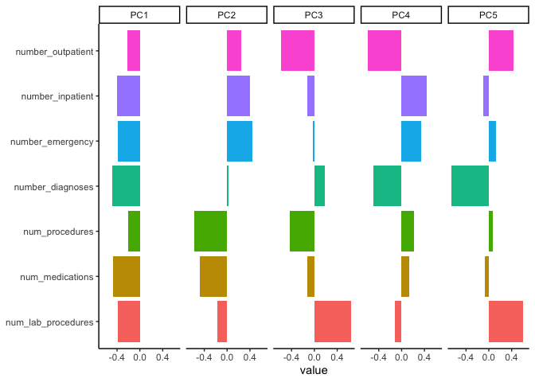<!-- -->

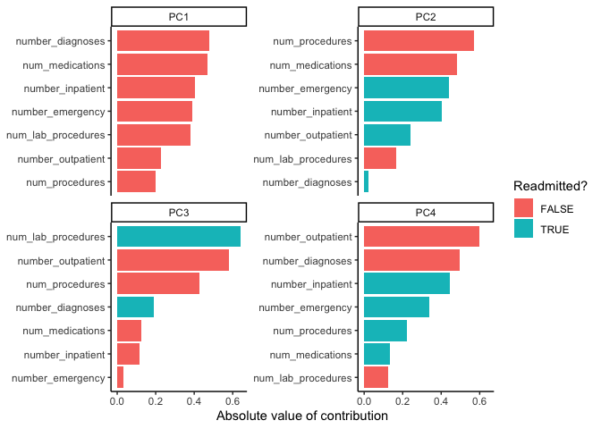<!-- -->

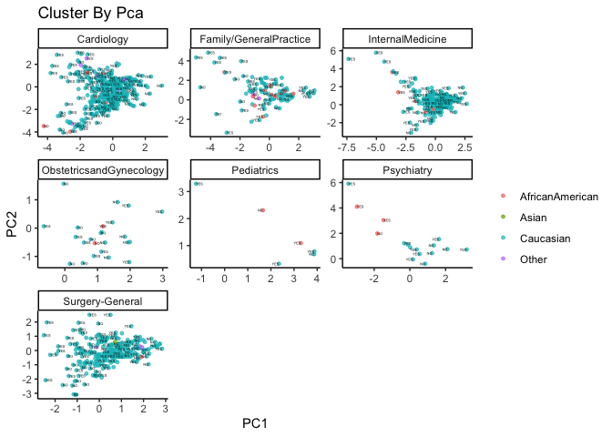<!-- -->

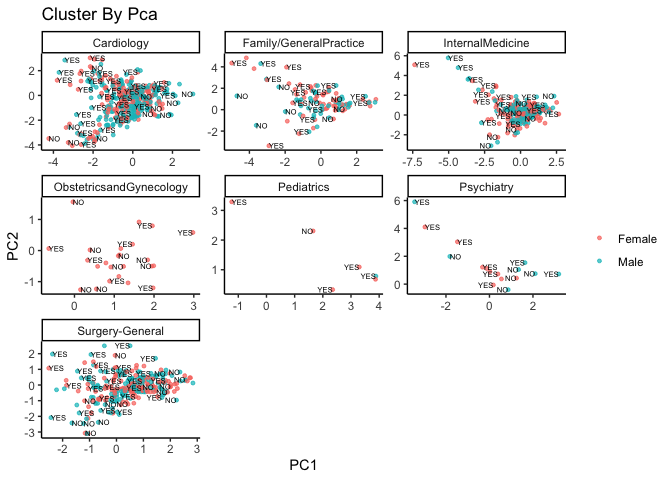<!-- -->

Final Comments:

  - There are four cluster with PCA’s;
  - With this informatio, the most important relevance are: Gender and
    medical\_specialty.
